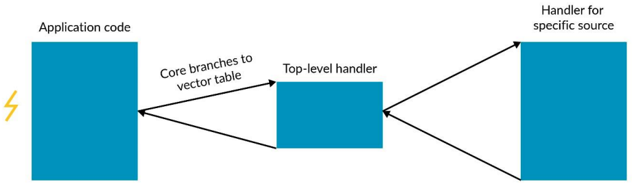

- [一、Intro to ARM Arch](#一intro-to-arm-arch)
- [二、Exception Model](#二exception-model)
  - [Exception Level](#exception-level)
  - [Change EL](#change-el)
  - [异常处理](#异常处理)
- [三、ISA](#三isa)
  - [Addressing](#addressing)
  - [函数调用约定（PCS）](#函数调用约定pcs)
  - [系统寄存器](#系统寄存器)
- [四、内存管理](#四内存管理)

## 一、Intro to ARM Arch

架构通常声明了：
- Intruction Set
- Register Set
- Exception Model
- Memory Model
- Debug,Trace,and Profiling

## 二、Exception Model

### Exception Level

- EL0: Application
- EL1: Rich OS
- EL2: Hypervisor
- EL3: Firmware

每个EL都有各自的独立寄存器组，高特权级能够访问低特权级的所有寄存器

### Change EL

切换特权级
- 通过 reset 进入 EL3
- 通过 Exception / Interruption 进入更高特权级
- 通过 ERT(Exception Return) 返回低特权级

切换Security State
- 只能在EL3，通过切换SCR_EL3寄存器来决定是否进入安全态

### 异常处理

VBAR_ELn (EL1-EL3) 寄存器指向对应特权级的异常向量表
- [linux_arm64_vector](https://elixir.bootlin.com/linux/v6.10.2/source/arch/arm64/kernel/entry.S#L519)

异常处理流程

## 三、ISA

Arm指令集一般包括: A32、T32、A64

Armv8-A

General-purpose Registers
- Integer Register(31,64-bit):
  - X0..X30: 64-bit
  - W0..W30: 32-bit
- Vector/Float Point Register(32,128-bit):
  - Q\D\S\H\B(128\64\32\16\8)

### Addressing

Simple: `LDR W0, [X1]` 直接寻址
Offset: `LDR W0, [X1, #12]` 偏移
Pre-indexed: `LDR W0, [X1, #12]!` 先计算地址并读取内存数据，再更新地址寄存器
Post-indexed: `LDR W0, [X1], #12` 先读取内存数据，再计算地址并更新地址寄存器

### 函数调用约定（PCS）

>PCS: Procedure Call Standard

### 系统寄存器

- SVC(Supervisor Call): 造成一个指向EL1的异常，用于从App切换到OS
- HVC(Hypervisor Call): 造成一个指向EL2的异常，用于从OS切换到Hypervisor，无法在EL0时使用
- SMC(Secure Monitor Call): 造成一个指向EL3的异常，用于从OS或Hypervisor请求EL3 Firmware的服务，无法在EL0时使用

## 四、内存管理

每个EL有自己的页表(EL1..EL3)

内存类型：
- Normal Memory: 大部分都是Cacheable的
- Device Memory

内存特性：
- Access Flag
- Dirty state

Alignment：
