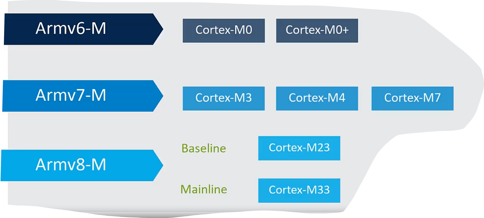

## Sec.02 M-Profile Architecture Overview

### History

> Profile：指为特定类型的应用或系统需求涉及的一组特性和功能
> M-profile: Microcontroller-profile，提供了一组标准的指令集和编程模型，针对嵌入式系统的低功耗、低延时、和高确定性进行优化

[arm_m-profile](https://developer.arm.com/Architectures/M-Profile%20Architecture)

Arm Profiles:
- A-profile: Application Profile, 拥有更多内存、更高时钟频率的复杂系统，如Linux、Android
- R-profile: Realtime Profile，与A-profile有许多相似之处，但更适用于实时系统，如自动驾驶系统
- M-profile：Microcontroller Profile，适用于嵌入式系统 

不同的Profile在硬件上也不同，如A-profile处理器中通常都会有MMU，但在M-profile处理器中则没有
同时，Armv8-M仅支持T32指令集（Thumb），包含16位和32位指令的混合指令，但不支持Arm指令集

### Data Types

Armv8-M是一个32位的 load/store 架构
- 内存访问仅能够通过 load 和 store 实现
- 大部分寄存器位宽为 32位

> C中long与int同为32位，long定义中期望至少为32位

| Data types |         |     C     |
| :--------: | :-----: | :-------: |
|    Byte    | 8 bits  |   char    |
|  Halfword  | 16 bits |   short   |
|    Word    | 32 bits |    int    |
| Doubleword | 64 bits | long long |

### Mainline Registers

Registers RO-R7
- Accessible to all instructions

Registers R8-R12
- Not available to all (16-bit) instructions

R13 is the stack pointer (SP)
- Armv8-M PEs have two banked versions

R14 is the link register (LR)
- 从函数返回的地址

R15 is the program counter (PC)

> PABTI：Pointer Authentication Branch Target Identification

Special-purpose Registers
- Program Status Registers (xPSR)
  - APSR, EPSR, IPSR
  - Application/Exception/Interrupt Program Status Register
- CONTROL
  - FP usage, Stacks and Privilege, PACBTI enable bits
- MSPLIM, PSPLIM
  - Stack Pointer limit registers
- PRIMASK, FAULTMASK, BASEPRI
  - Exception Handling