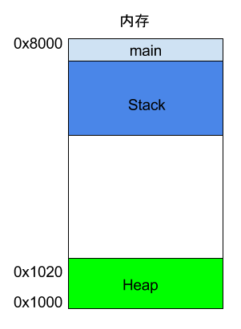

# 汇编语言入门

- [asm入门](http://c.biancheng.net/asm/)
- objdump反汇编

## 一、简介

- 程序本身是指令的集合，编译器的作用在于将高级语言翻译为一条条及指令指令，由于二进制的指令不可读，为方便阅读与编辑，使用文字指令与二进制指令一一对应
  - 汇编代码即是机器指令的文本表示

- 将文字指令翻译为二进制的过程，就称为**汇编**，完成这一过程的工具称为**汇编器**，标准化的文字指令称为**汇编语言**
  - CPU的指令集不同，因此所对的汇编语言也不同

## 二、寄存器

### (1) 概念

- 为减少访存对整体CPU运行效率产生影响，CPU使用寄存器来保存指令与数据，并进行计算
  - 寄存器的读写速度与CPU时钟周期相同
- 寄存器不使用地址而依靠名称进行区分，CPU通过寄存器名称找到对应的寄存器并获得数据

### (2) 常用寄存器

- x86 CPU 常用寄存器名称

- EAX、EBX、ECX、EDX、EDI、ESI、EBP、ESP
  - ESP寄存器有特定用途，用来保存当前 Stack 的地址


## 三、内存模型:

- OS会为运行的程序分配一段内存，用来存储指令与数据


### (1) 堆 Heap

- 用户程序运行的过程中，对于内存的动态占用请求(新建对象、使用 malloc 命令)，OS就会从预先分配给进程的内存中，划出一部分给用户程序
  - 从起始地址开始划分(低位地址)
- 由用户程序主动请求而划分出来的内存区域，称为 堆
  - 由起始地址开始，从低位（地址）向高位（地址）增长
  - Heap 的一个重要特点就是不会自动消失，必须手动释放，或者由垃圾回收机制来回收


### (2) 栈 Stack

- 除 Heap 以外其他的内存占用称为 栈(Stack) , 可以简单地认为栈时由于函数运行而临时占用的内存区域
  - 栈 是由内存区域的结束地址开始，从高位（地址）向低位（地址）分配


- 进程中的每执行一个函数，OS就会在内存中建立一个帧，并且将函数中的内部变量都存储在这个帧里面，函数执行结束以后，帧就会被回收，并释放所有的内部变量
  - 一般来说，调用栈有多少层，就有多少帧
  - 被调用函数完成时，就会回到函数被调用的位置，也就是上一层的函数中继续执行
- 生成新的帧，叫做入栈(push),栈的回收叫做出栈(pop), 栈的特征是晚入栈的早出栈(后进后出),
- 每次函数执行完毕，都会自动地释放一个帧，所有函数执行完毕，则整个栈都被释放



## 四、CPU指令


### (1) 简单示例


rbp 与 ebp
- 64位栈指针与32位栈指针

**add-demo.c**

```c++
int add(int a, int b){
  return a+b;
}

int main(){
  return add(1, 2);
}
```

**add-demo.s**

- .cfi
  - Call Frame Information, 是 DWARF 2.0 定义的函数栈信息
  - .cfi_startproc 定义函数开始, .cfi_endproc 定义函数结束
  - [cfi其他定义](https://sourceware.org/binutils/docs-2.31/as/CFI-directives.html)

- .LFB, LFE
- 汇编语言从 main 开始
- [汇编语言中的字](https://blog.csdn.net/weixin_44395686/article/details/108628301)

```s

add:
      pushq   %rbp
      movq    %rsp, %rbp
      movl    %edi, -4(%rbp)
      movl    %esi, -8(%rbp)
      movl    -8(%rbp), %eax
      movl    -4(%rbp), %edx
      addl    %edx, %eax
      popq    %rbp
      ret

main:
      pushq   %rbp
      movq    %rsp, %rbp
      movl    $2, %esi
      movl    $1, %edi
      call    add
      popq    %rbp
      ret
```

### (2) 分析

- 汇编程序从 main函数 处开始执行, OS在栈上创建一个帧, 

**push指令**

q: 声明操作数大小为4字(64Byte)

```s
pushq   %rbp
movq    %rsp, %rbp
```


