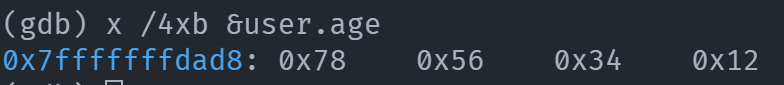

# Gdb内存分析

## 变量地址打印

```
(gdb) print &user
```

## 查看内存

```
(gdb) x /4xb &user.age
```

```
x/<n/f/u>  <addr>

n:是正整数，表示需要显示的内存单元的个数，即从当前地址向后显示n个内存单元的内容，
一个内存单元的大小由第三个参数u定义。

f:表示addr指向的内存内容的输出格式，s对应输出字符串，此处需特别注意输出整型数据的格式：
  x 按十六进制格式显示变量.
  d 按十进制格式显示变量。
  u 按十进制格式显示无符号整型。
  o 按八进制格式显示变量。
  t 按二进制格式显示变量。
  a 按十六进制格式显示变量。
  c 按字符格式显示变量。
  f 按浮点数格式显示变量。

u:就是指以多少个字节作为一个内存单元-unit,默认为4。u还可以用被一些字符表示:
  如b=1 byte, h=2 bytes,w=4 bytes,g=8 bytes.

<addr>:表示内存地址。
```

- 大小端判断
  - 大端: 数字高位存放在低地址
  - 小端: 数字低位存放在低地址




- [gdb查看内存](http://c.biancheng.net/view/7470.html)
- [gdb内存分析](https://www.cnblogs.com/azhao/p/12074656.html)

## 反汇编

- `x/10i $pc`
  - 从当前PC值的位置开始，在内存中反汇编10条指令

- `p/x $t0`
  - 以16进制打印寄存器 t0 的值
- `p/d $x1`
  - 以10进制打印寄存器 t0 的值