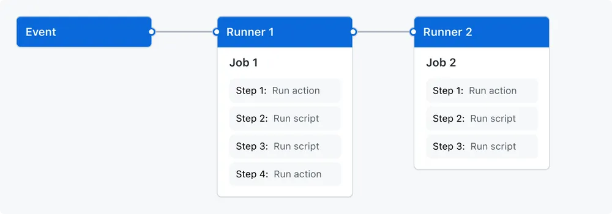

# GitHub Actions

- [GitHub Actions](#github-actions)
  - [Components](#components)
    - [Workflows](#workflows)
    - [Events](#events)
    - [Jobs](#jobs)
    - [Actions](#actions)
    - [Runners](#runners)

github actions是github提供的一种ci/cd方案，与gitlab类似，可用来进行软件构建、测试、打包、通过git pages部署等
## Components

Actions的核心是workflow，一个workflow中包含有多个job, 每个job都将在自己的虚拟机或容器中允许，并包含有多个步骤，这些步骤可以是预先定义好的脚本，也可以是可运行的一些操作

### Workflows

workflows通过仓库中的yaml文件定义，并由仓库中的event进行触发，当然也可以通过手动或定时的方式进行触发

workflows保存在仓库的`.github/workflows`文件夹中，同时一个仓库中可以包含多个workflow, 每个都可以执行一组不同的任务，如设置对test和deploy可设置不同的workflows

### Events

event是仓库中的特定动作，能够触发workflow的执行，如pr提交，push等

workflow也可通过REST API进行定时或手动触发

### Jobs

job是一组执行在同一个runner中的步骤，每个step可以是shell命令或者action。steps顺序执行且存在相互依赖，当runner中的steps运行完成之后，就可以在不同的runner中共享结果，如build完成之后，与test共享编译好的文件

### Actions

Actions是GitHub Actions平台中提供的自定义app, 能够执行一些复杂但常用的重复任务。Actions可以从GitHub Actions平台中指定，也可以自己编写

### Runners

Runners是一个服务器，它在触发工作流时运行工作流。每个Runners一次可以运行一个作业

[^1]: [git_actions](https://docs.github.com/en/actions/learn-github-actions/understanding-github-actions)
[^2]: [rust_pj_action](https://dzfrias.dev/blog/deploy-rust-cross-platform-github-actions)
