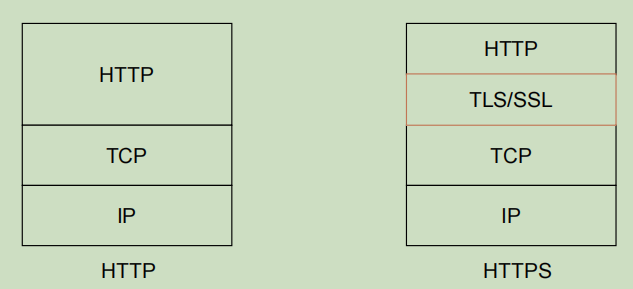

# 网络传输

## Https流程分析

- http 与 https 在协议使用上的区分

**TLS/SSL的功能**

- 三类基本算法
  - 对称加密
    - 加密/解密使用同样的密钥
  - 非对称加密
    - 使用一对非对称的密钥对，公钥与私钥。使用密钥对中的其中一个进行加密，则解密需要另一个密钥
      - 私钥加密的密文只要式公钥都可以解密，公钥加密只能够被私钥解开
  - 摘要算法

**HTTPS解决HTTP安全问题**

- 使用混合加密解决明文传输问题
  - 发送方使用对方的公钥对"对称密钥"进行加密，然后对方用自己的私钥解密获得"对称密钥"
  - 之后双方使用对称加密方式进行通信
- 使用数字签名解决数据篡改问题
  - 数字签名: 仅信息发送方能够产生其他人无法伪造的一段数字串，用这段数字串能够对信息发送者发送信息的真实性进行证明
    - 使用私钥加密的密文，只能用公钥解开，这样的密文就是数字签名
- 使用CA证书解决身份伪装问题
  - CA证书: 由第三方签发，证书中包含公钥，签名，申请者与颁发者信息

**HTTPS请求流程**

- [http通信原理](https://zhuanlan.zhihu.com/p/56663184)