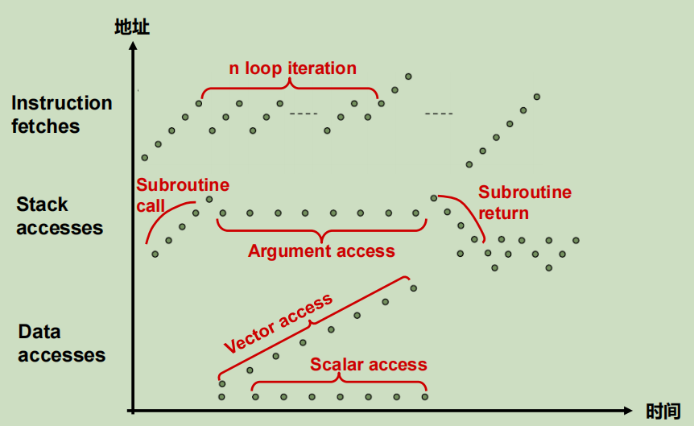
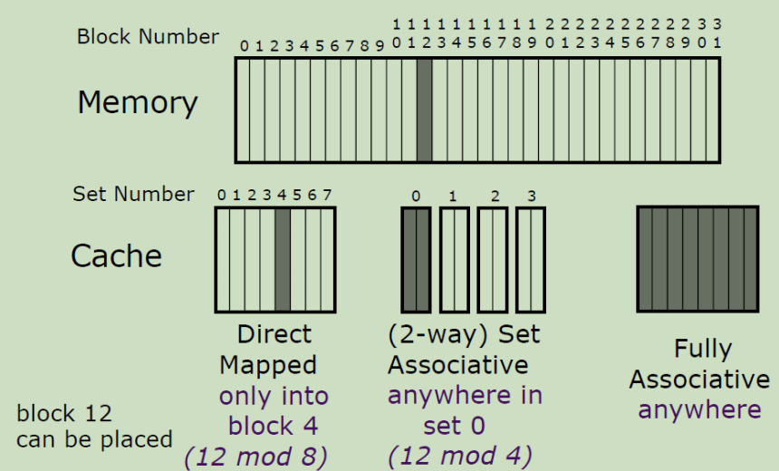

# 内存和Cache

- CPU访问存储器的指标
  - 延迟时间
    - 单次存储器访问的延迟时间
  - 带宽
    - 单位时间对存储器的访问次数
  - 能耗
    - 单次存储器访问消耗的能量

- Little's Law
  - 吞吐率(Throughput) = 访存飞行数(N) * 延迟时间(Latency)
    - 有效抵达 * 平均等待时间
    - 排队论

- 数据编排技术
  - 采用两种技术来控制数据再层次化存储器系统中的移动过程
    - 显式: 程序员使用指令手动控制数据的移动方向
      - 小容量、高速存储器，如寄存器
    - 隐式: 当指令发出访存请求时，硬件自动实现数据的移动和响应过程，对程序员透明
      - 大容量、慢速存储器，如主存

- 存储器访问的两种可预测模式
  - 时间局部性（Temporal Locality）: 如果一个地址被访问过，在不久的将来很可能还会被访问
  - 空间局部性（Spatial Locality）: 如果一个地址被访问过，在不久的将来该地址的临近地址很可能会被访问到

## Cache

- Cache由多条line组成
  - line中有 Address Tag 与 Data Block
  - line 并没有地址，但可以被索引(通过块号等)
  - 一条line中，保存着从某个内存地址开始的 多个数据块

- 内存数据在Cache中的存放方法: 直接映射、组相联、全相联
  - Cache结构复杂，占据晶片的绝大部分面积

