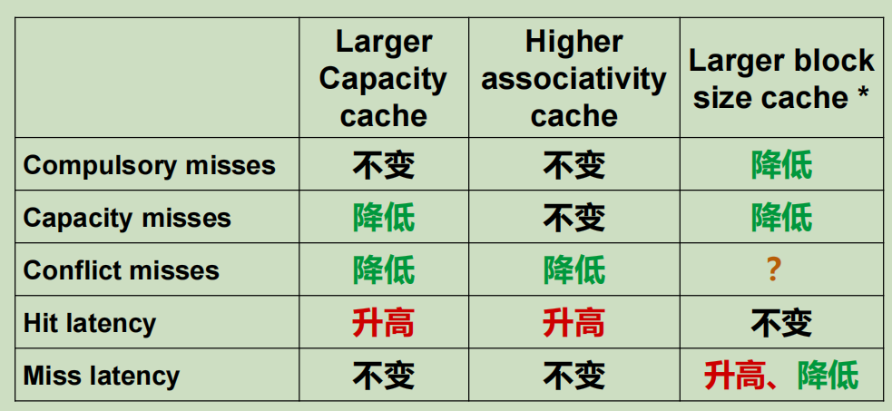

# 内存和Cache

- CPU访问存储器的指标
  - 延迟时间
    - 单次存储器访问的延迟时间
  - 带宽
    - 单位时间对存储器的访问次数
  - 能耗
    - 单次存储器访问消耗的能量

- Little's Law
  - 吞吐率(Throughput) = 访存飞行数(N) * 延迟时间(Latency)
    - 有效抵达 * 平均等待时间
    - 排队论

- 数据编排技术
  - 采用两种技术来控制数据再层次化存储器系统中的移动过程
    - 显式: 程序员使用指令手动控制数据的移动方向
      - 小容量、高速存储器，如寄存器
    - 隐式: 当指令发出访存请求时，硬件自动实现数据的移动和响应过程，对程序员透明
      - 大容量、慢速存储器，如主存

- 存储器访问的两种可预测模式
  - 时间局部性（Temporal Locality）: 如果一个地址被访问过，在不久的将来很可能还会被访问
  - 空间局部性（Spatial Locality）: 如果一个地址被访问过，在不久的将来该地址的临近地址很可能会被访问到

## Cache

- Cache由多条line组成
  - line中有 Address Tag 与 Data Block
  - line 并没有地址，但可以被索引(通过块号等)
  - 一条line中，保存着从某个内存地址开始的 多个数据块

- 内存数据在Cache中的存放方法: 直接映射、组相连、全相连
  - Cache结构复杂，占据晶片的绝大部分面积

- n路组相连, Cache被分为n列，m/n 组(m为原总line数), 一个数据块可以存储在特定组的任意列中，与此同时，Cache中需要增加 n 个比较器用来进行并行地tag比较
- 相比于 直接映射，tag位更多，index位更少
- 直接映射即 1 路组相连， 全相连即 m 路组相连
  - index 与Cache中的 组数 相同

**Cache 性能**

$$Average\ memory\ access\ time\ (AMAT) = Hit\ time + Miss\ rate * Miss\ penalty$$

- 提高平均访存性能的方法
  - 降低Cache命中时的数据读取延时
  - 降低Cache缺失率，如增大Cache容量、使用更好的Cache策略
  - 降低Cache缺失时访存开销的延迟时间，如使用 L2 cache

- Cache Miss 的原因
  - 强制性(Compulsory)
    - 某个数据块首次被访问到时，必然miss，因而又称为冷启动缺失(Cold start misses)
  - 容量(Capacity)
    - Cache容量不足以容纳整个程序所需要的数据
  - 冲突(Confilct)
    - 由于数据块在Cache中的放置策略会产生冲突，因而造成缺失
      - 如全相连，必然不会有冲突缺失

**替换策略**

- Random
- LRU(Least Recently Used)
- FIFO
- NLRU(Not Least Recently Used)
- One-bit LRU

**多级Cache**

- 通过增加Cache层级数，来降低Cache Miss产生的延迟开销
- 包含策略
  - 包含的多级Cache策略(Inclusive multilevel cache)
    - 内层Cache保存外层Cache的数据备份
    - 发生miss时，Cache行同时插入内层和外层Cache；替换外层Cache的相应行时，置内层Cache对应行"无效"
    - 外层数据访问只需要检查外层Cache的状态
  - 非包含的多级Cache策略（Non-inclusive multilevel caches)
    - 内层Cache可以保存外层Cache中没有的数据
    - 替换外层Cache数据，无需将内层Cache行无效
  - 独占多级Cache(Exclusive multilevel caches)
    - 内层Cache和外层Cache保存不同的数据
    - Cache行数据可以在内外层Cache之间进行交换(Swap)

- Victim Cache
  - 一个小组相联备份Cache，添加到直接映射的缓存中，用于保存近期被替换出去的Cache行数据
    - 被挤出来的Cache line就是 victim(受害者)
    - CPU首先查看直接映射的Cache
    - 缺失，则在victim cache中检擦
    - 如果victim cache命中，把L1当前行与victim cache中的命中行互换
      - ？如果victim cache缺失， L1 victim -> VC