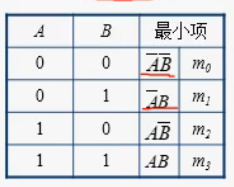

# 数电基础

## 一、逻辑代数基础

### 基本逻辑门电路

**与**

$$Y = A\ AND\ B = A·B = AB$$

**或**

$$Y = A\ OR\ B = A+B$$

**非**

$$Y = NOT\ A = A^{'}$$

**与非**

$$Y = A\ NAND\ B = (AB)^{'}$$

**或非**

$$Y = A\ NOR\ B = (A+B)^{'}$$

**异或**

$$Y = A\ XOR\ B = A^{'}B + AB^{'} = A\oplus B$$
>X:Exclusive(排他地)

**同或**

$$Y = A\ XNOR\ B = A^{'}B^{'} + AB = A\odot B$$

### 常用逻辑公式

**摩根定理**

$$ (AB)^{'} = A^{'} + B^{'}\\ (A+B)^{'} = A^{'}B^{'}$$

### 最小项

- n个变量的最小项是这个n个变量的与，其中变量都以原变量或反变量的形式出现一次
  - 因而，n给个变量的最小项个数的为$2^{n}$
- 最小项编号
  - 使得 与 的结果为1的变量取值唯一(及使得原变量或反变量为1的变量值)，因而可以使用使得 与 结果为1 的变量取值来对最小项进行编号
  - 习惯从全取反开始, 及变量的取值表现成 二进制 的累增来进行编号
    - 技巧: 取反之后，要是的相与为1，则原值必须为1，这反映出最小项与原值取值之间的关系，从而可以将原值从全取0开始，依次累增，按此映射写出最小项即可
    - 这样依次排列的最小项都是相邻的
      - 相邻即两个最小项只有一个变量不同

- 性质
  - 全体最小项之和为1
    - 之和即取 或, 使得最小项为1 覆盖了所有变量的取值, 即无论变量取何值，总有一个最小项是1，故或的结果必然为1
  - 任何两个最小项之积为0
    - 不可能有这样的变量取值，使得两个不同的最小项同时为1
  - 两个相邻的最小项之和可以合并，消去一对因子，只留下公共因子

## 二、逻辑代数化简

### 卡诺图

- 实质
  - 将逻辑函数的最小项以图形的方式表现出来
- 以$2^{n}$个小方块分别代表n变量所有的最小项，并排列成矩阵，使得几何上相邻的两个最小项在逻辑上也是相邻的
  - 矩阵中，几何相邻表现为 左右、上下，以及从右向左折叠，从下向上折叠，空间上的前后
  - 实际构造时，对于 2变量，3变量、4变量，可以采用 2*2, 2*4 , 4*4 矩阵，向下，向右的方向使用格雷码

- 卡诺图表示逻辑函数
  - 根据变量个数，构造卡诺图
    - 直接根据卡诺图中的取值，带入逻辑函数求出对于最小项的值
    - 将函数化为最小项之和，然后假设每项都是最小项，缺省用*代替，令此项为1，则有唯一的变量取值, 将卡诺图中，符合此"坐标"的值置1
      - 原逻辑函数，可以写成卡诺图中置1的最小项之和

- 理解:
  - 由变量个数可以得到一个卡诺图
    - 坐标
  - 由真值表，可以得到卡诺图中的值
    - 坐标值
  - 逻辑函数即时图中，值为1的最小项之和
    - 理解:
      - 最小项考虑到了变量的所有取值，即每个最小项可以唯一代表一种变量取值(坐标)
      - 卡诺图中，1或0表示逻辑函数中有或没有这样的最小项，即表明哪些最小项为1对应的变量取值能够让输出为1，由于最小项的唯一性，剩余的就是不能让输出为1的最小项，即对应取值下，输出为0
### 卡诺图化简

- 利用最小项的性质，找到为1且相邻的最小项，合并即可消去一个变量

