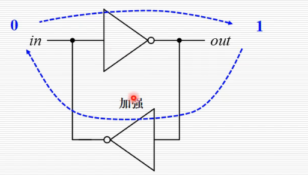
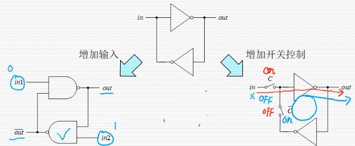
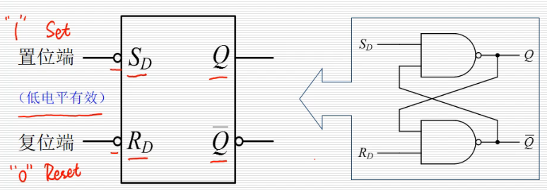
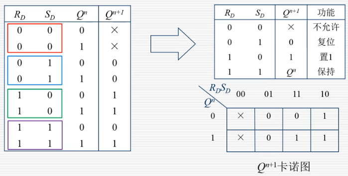

# 时序逻辑电路

- [时序逻辑电路](#时序逻辑电路)
  - [一、基础概念](#一基础概念)
    - [(1) 定义](#1-定义)
    - [(2) 触发器](#2-触发器)
  - [二、基本触发器](#二基本触发器)
    - [(1) 双稳态电路](#1-双稳态电路)
    - [(2) 基本RS触发器](#2-基本rs触发器)
      - [工作原理](#工作原理)
      - [描述方法](#描述方法)

## 一、基础概念

### (1) 定义

- 当前的状态与电路现在的输入和过去的状态都有关

### (2) 触发器

- Flip-Flop
  - 构成时序逻辑电路的基本单元
  - 具有记忆功能，可以存储二进制信息
- 基本特点
  - 维持: 自行保持稳定的"1"或"0"状态 （保持/存储）
  - 接收: 根据输入信号置"1"或"0"
- 分类
  - 按电路功能
    - 基本RS触发器、锁存器(电位触发)、寄存器(边沿触发)等
  - 按逻辑功能
    - RS触发器、JK触发器、T触发器、D触发器
  - 按存储原理
    - 静态触发器(双稳态电路)、动态触发器(电容)

## 二、基本触发器

### (1) 双稳态电路

**双稳态电路**

- 输入状态经过偶数个反向器之后得到强化，一旦进入某个状态，则改变状态变得困难
- 可以说是一种稳定状态，这使得输出端总是一个稳定的值，即能够存储1位二进制
- 能够实现触发器所要求的 "保持" 功能, 但还不能够 "接收"

**增加"接收"的方法**

1. 增加成对的开关
   - 输入导通时，是一个反相器
   - 输入断开时，是一个双稳态电路，能够保存刚刚输入的值
2. 将反相器更换为与非门
   - 两个输入端同时输入1时，与非门实际是反相器(0得1，1得0)，即此时时一个双稳态电路
   - 两个输入端不同时为1时，能够进行接收

### (2) 基本RS触发器

#### 工作原理

- 基本定义
  - $Q=1, \overline{Q}=0为触发器的"1"状态$
  - $Q=0, \overline{Q}=1为触发器的"0"状态$
  - $Q^{n} —— 现态, Q^{n+1} —— 次态$

- 工作原理
  1. $R_{D}=1, S_{D}=0; Q=1, \overline{Q}=0$ 触发器的"1"状态(置位或置"1")
  2. $R_{D}=0, S_{D}=1; Q=0, \overline{Q}=1$ 触发器的"0"状态(复位或清"0")
  3. $R_{D}=1, S_{D}=1; Q=Q, \overline{Q}=\overline{Q}$ 保持(状态由$Q、\overline{Q}$决定)
  4. $R_{D}=0, S_{D}=0; Q=1, \overline{Q}=1$ 破坏互补输出关系
    - 如果从同时0 -> 同时1 ，则次态不稳定
    - 因此有约束条件 $R_{D} + S_{D}=1$
- 理解
  - R-> reset(清零); S-> set(置1), D代表低电平有效(0时有效)
  - $R_{D}=1, S_{D}=0$ 即"置1"有效而"清0"无效，此时状态为1
  - $R_{D}=0, S_{D}=1$ 即"清0"有效而"置1"无效，此时状态为0
  - $R_{D}=1, S_{D}=1$ 即"清0"和"置1"均无效，就是既不"清0"也不"置1", 此时状态为保持
    - 与非们实际变为非门，即此时是一个双稳态电路
  - $R_{D}=0, S_{D}=0$ 即"清0"和"置1"均有效，就是既"清0"又"置1", 因此这种状态不允许

#### 描述方法

1. 状态转移真值表(状态表)
   - 将触发器的次态与现态及输入信号之间的逻辑关系用表格的形式表示出来
   - 卡诺图: $Q_{n+1}$由$Q_{n}、R_{D}、S_{D}$决定，故用3变量卡诺图表示

1. 特征方程(状态方程)
   - 描述触发器(时序电路)逻辑功能的函数表达式

