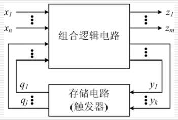
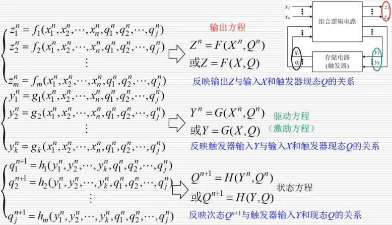
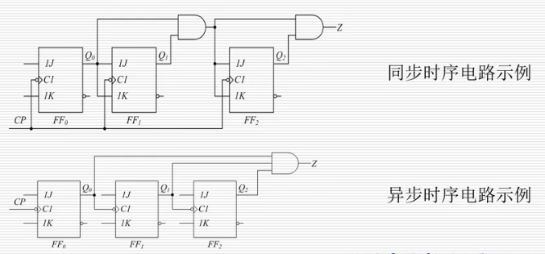
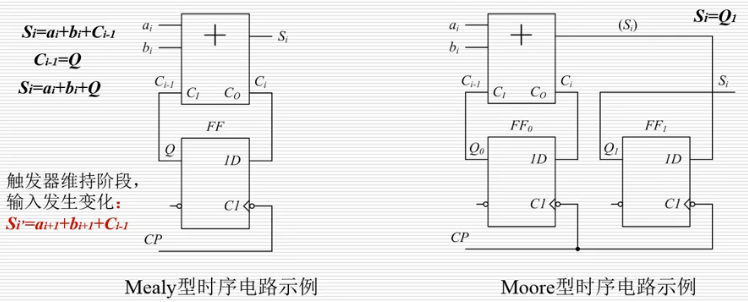
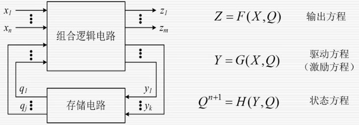
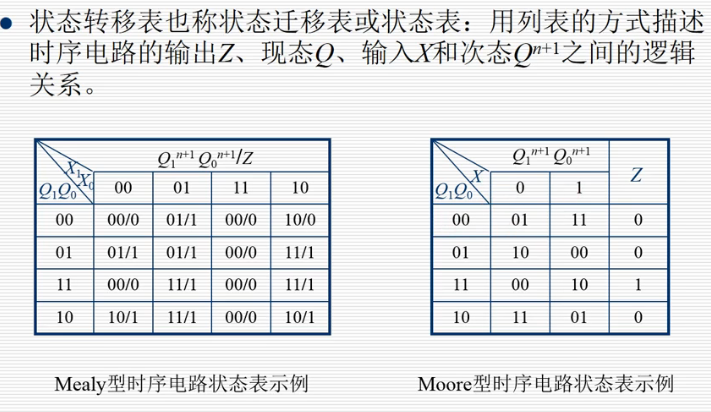
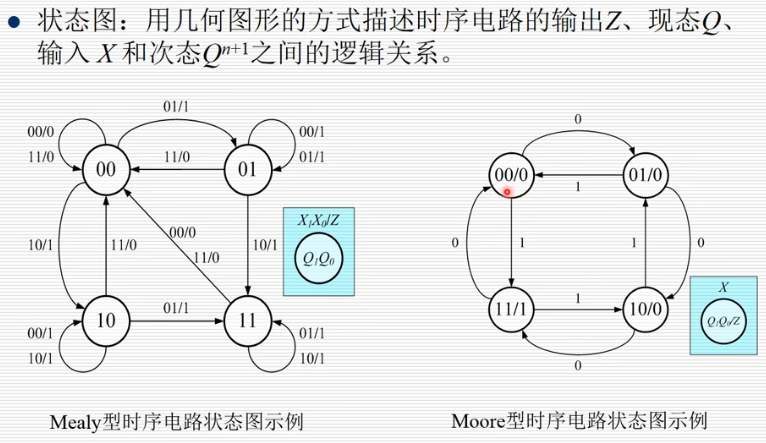

# 时序逻辑电路

## 一、基本概述

### 特点

- 组合逻辑电路: 任一时刻的输出仅与该时刻的输入情况有关，与电路原来的状态无关
- 时序逻辑电路: 任一时刻的输出不仅与该时刻的输入情况有关，而且与电路原来的状态(过去的输入)有关

- 特点一
  - 时序逻辑电路包含组合逻辑电路和存储电路(触发器)两部分
- 特点二
  - 存储电路的状态反馈到组合逻辑电路的输入端，与外部输入信号共同决定最终输出

- 三大方程
  - 输出方程
    - 反映输出Z与输入X和触发器现态Q的关系
  - 驱动方程(激励方程)
    - 反映触发器输入Y与输入X和触发器现态Q的关系
  - 状态方程
    - 反应次态$Q^{n+1}$与触发器输入Y和现态Q的关系

### 分类

- 按状态分类: 
  - 同步时序电路
    - 电路状态的变化在同一始终脉冲作用下发生(触发器状态转换同步完成)
  - 异步时序电路
    - 触发器钟控端所接时钟脉冲信号不同(触发器状态异步完成)
    - 状态变化并不是同时进行的

- 按输出信号分类:
  - 米里(Mealy)型时序电路
    - 某时刻输出取决于该时刻外部输入X和内部状态Q
    - Z=F(X,Q)
  - 摩尔(Moore)型时序电路
    - 某时刻输出只取决于该时刻内部状态Q，而与该时刻外部输入X无关
    - Z=F(Q)
    - 相比于 Mealy 型电路会晚一个时钟周期

### 描述

- 逻辑方程式

- 状态转移表
  - 分为Mealy与Moore两类

- 状态图

- 时序图