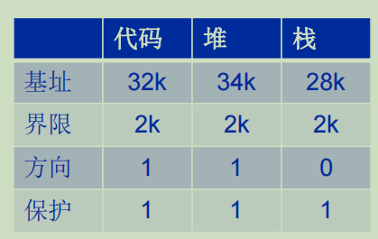
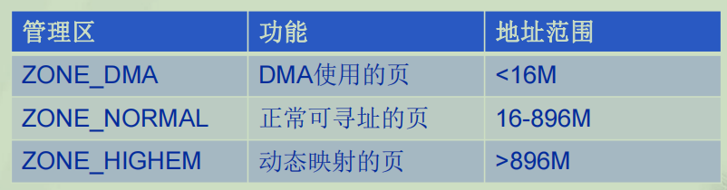
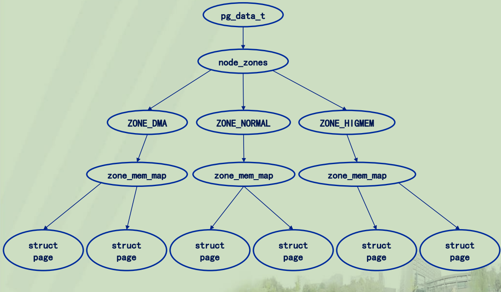
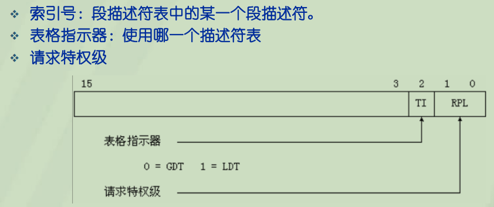
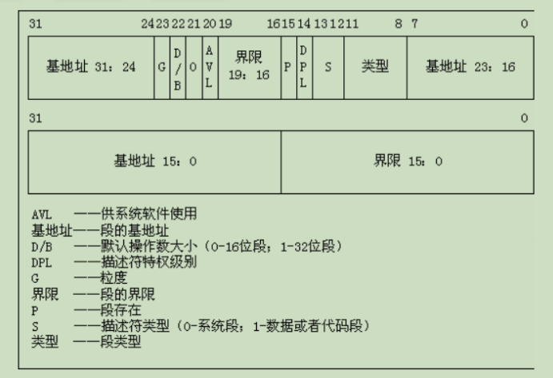
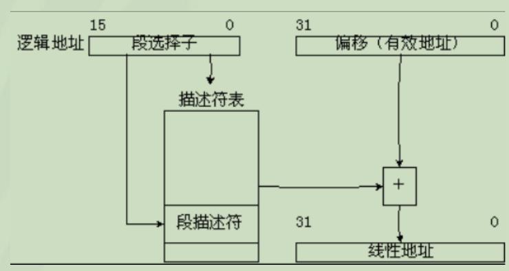
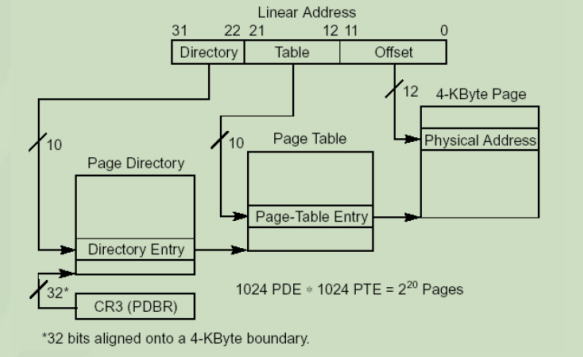
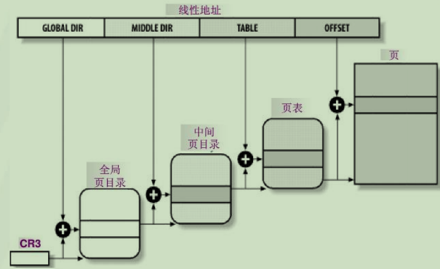

# 内存寻址与内存模型

## 一、 内存模型

- 内存从0开始按字节编址，地址小为低地址，地址大为高地址
- 一般而言，系统代码(OS)在低地址区，用户代码在高地址区

## 二、虚拟地址空间

- 虚拟地址同样从0开始按字节编址
- 虚拟地址空间可分为3个部分
  - 代码段: 存储需要执行的程序指令
    - 位于低地址
  - 数据段:
    - 位于低地址 
    - 分为 只读数据段、已初始化的读写数据段、未初始化段
      - 只读数据段: 存放不会更改的数据，如常量
      - 已初始化的读写数据段: 有初值的变量，如已经初始化的全局变量、静态局部变量
      - 未初始化段: 程序中声明，但没有初始化的变量, 如没有初始化的全局变量、静态局部变量
  - 堆段: 由用户分配，且需要手动释放
    - 从低地址向高地址增长
  - 栈段: 由编译器自动分配与释放，存放函数的参数值、局部变量等值
    - 从高地址向低地址增长

- 通过 基址 与 界限 能够映射一段虚拟地址到物理地址
- 通过方向 能够区分 堆 与 栈

### NUMA

- Non-Uniform Memory Architecture 非一致性内存访问架构

**节点 Nodes**

- 在NUMA模型中，系统的物理内存被划分为几个节点(Nodes), 在一个单独的节点内，任意一个CPU访问页面所需的时间都是一样的

**管理区 Zones**

- 每个节点被划分为多个管理区，每个管理区的地址范围不一样
  - ZONE_DMA: 包含的页能够用来执行DMA操作
  - ZONE_NORMAL: 包含的页都是能够正常映射的也
  - ZONE_HIGHEM: 包含"高端内存"，其中的页不能永久地映射到内核地址空间

**物理页**

- 每个管理区再进一步被划分为许多4K大小的物理页

- 管理区水印
  - 管理区包含三个水印: pages_min、pages_low、pages_high
  - 三个水印相当于三个阈值，由于触发 kswapd 进程以及相应的物理页释放策略

## 三、寻址过程

- x86架构地址类型
  - 逻辑地址
    - 机器语言指令中，用来指定一个操作数或者是一条指令的地址, 每个逻辑地址由一个段和偏移量组成，偏移量指明了从段开始的地方到实际地址之间的距离
  - 线性地址
    - 即是虚拟地址
  - 物理地址
    - 即是物理地址

### 逻辑地址转换

- MMU通过 分段单元硬件电路 把一个逻辑地址转换成线性地址
- MMU通过 分页单元硬件电路 把线性地址转换成一个物理地址
- 逻辑地址 -> 分段单元 -> 线性地址 -> 分页单元 -> 物理地址

#### 分段寻址

- CPU支持不同的方式来进行地址转换
  - 实模式
  - 保护模式

**实模式分段寻址**

- 程序可以有多个独立的地址空间，叫做段，一个程序可以分别把它的指令和数据保存在指令段和数据段中，这些段的起始地址都被保存在段寄存器中
  - CS: 代码段寄存器，指向代码段
  - SS: 堆栈寄存器，指向堆栈段
  - DS: 数据段寄存器，指向数据段
- 段地址访问方式
  - 段寄存器: 段内偏移

- 实模式下，16位段寄存器只记录段基址的高16位，段基址4位对齐，且末4位为0 
  - 不采用虚拟地址空间，直接采用物理地址空间
  - 物理地址 = 段寄存器 << 4 + 段内偏移

**保护模式分段寻址**

- 保护模式下，段寄存器中存储的不是段基地址，而是段选择符(段选择子)，段选择符不直接指向段，而是指向定义段的段描述符，段描述符存储在段描述符表中
  - 逻辑地址 = 段选择符: 偏移量
  - 段选择子索引号为 13 位
  - 通过 ti 指示应该使用 GDT 还是 LDT

- 段描述表
  - 存储段描述符
  - 13位索引号说明一个段描述表中能够存储8192个段描述符
  - OS中有两种段描述符表
    - GDT: global descriptor table, 全局描述符表
      - 所有进程共享
    - LDT：local descriptor table, 局部描述符表
  - 通常只有一个GDT，每个进程如果有除了在GDT中的段，就需要创建附加段，附加段的段描述符就存放在LDT中
  - GDT/LDT 在内存中的地址和大小存放在 gdtr/ldtr 控制寄存器中
- 段描述符
  - 64位的段描述符能够提供一个基地址，指向代码段/堆段/栈段 的其实地址

- 逻辑地址 -> 线性地址

#### 分页机制

- 逻辑地址 -> 分段机制 -> 线性地址 -> 分页机制 -> 物理地址
- 分页机制中，处理器将线性地址分成固定的尺寸大小
  - 4KB、2MB、4MB
    - 页越大，越不容易出现缺页，但与此同时，空闲也更多
    - pentium处理器引进了扩展分页，运行页框的大小为4k或者4M

- 页表
  - 一个由32位页表项(PTE)组成的数组，放置在一个4KB的页中，一张页表最多包括1024个页表项
    - 4KB = 4 * 1024 * 8 bit = 1024 * 32 bit
  - 每个页表项指向一个 4KB 大小的页
    - 一个页表 = 1024 * 4KB = 4MB

- 线性地址(32位)
  - 22:31，页目录表项在页目录表中的偏移, 提供所指页表的物理基地址
  - 12:21，页表项在所选页表中的偏移，提供所选物理内存页的物理基地址
  - 0:11 , 提供地址在所选物理页中的偏移

- Linux的分页
  - 同时采用了适用于32位和64位系统的普通分页模型
  - 采用3级分页模式
    - 页全局目录(Page Global Directory)
    - 页中间目录(Page Middle Directory)
    - 页表(Page Table)

