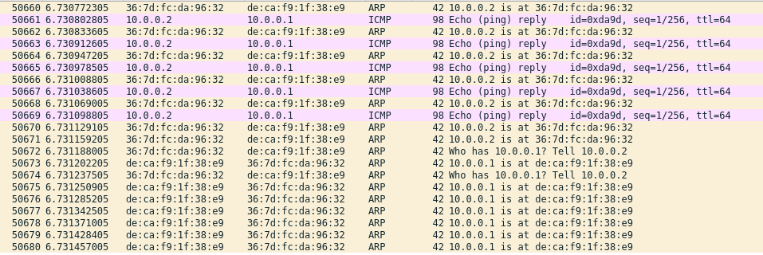

# 广播网络实验

<p align="right">学号: 2021E8013282148</p>
<p align="right">姓名: 方浩镭</p>

- [广播网络实验](#广播网络实验)
  - [一、实验内容](#一实验内容)
  - [二、实验流程](#二实验流程)
    - [(1) 实现节点广播函数](#1-实现节点广播函数)
    - [(2) 验证广播网络运行](#2-验证广播网络运行)
    - [(3) 验证广播网络效率](#3-验证广播网络效率)
    - [(4) 验证广播网络数据包环路](#4-验证广播网络数据包环路)
  - [三、实验结果及分析](#三实验结果及分析)
    - [广播网络效率分析](#广播网络效率分析)
    - [数据包环路](#数据包环路)
## 一、实验内容

- 实现节点广播的broadcast_packet函数
- 验证广播网络能够正常运行
   - 从一个端节点ping另一个端节点
- 验证广播网络的效率
   - 在three_nodes_bw.py进行iperf测量
   - 两种场景：
      - H1: iperf client; H2, H3: servers （h1同时向h2和h3测量）
      - H1: iperf server; H2, H3: clients （ h2和h3 同时向h1测量）
- 自己动手构建环形拓扑，验证该拓扑下节点广播会产生数据包环路
## 二、实验流程

### (1) 实现节点广播函数

**broadcast_packet**

```c++
void broadcast_packet(iface_info_t *iface, const char *packet, int len)
{
        iface_info_t *entry;
	list_for_each_entry(entry, &instance->iface_list, list) {
             if (entry->index != iface->index) { // 通过index判断，转发数据包到其他端口
                     iface_send_packet(entry, packet, len);
             }  
	}
}
```

### (2) 验证广播网络运行

运行mininet, 开启h1、h2、h3 与 b1 的虚拟shell

b1 中执行 hub 程序

```shell
$b1 ./hub
```

h1/h2/h3 中风别执行 ping 命令

```shell
$h1 ping 10.0.0.2 -c 4
PING 10.0.0.2 (10.0.0.2) 56(84) bytes of data
64 bytes from 10.0.0.2: icmp_seq=1 ttl=64 time=0.535 ms
64 bytes from 10.0.0.2: icmp_seq=2 ttl=64 time=0.156 ms
...
```

ping 命令正常返回，广播网络运行无误

### (3) 验证广播网络效率

使用iperf工具验证网络效率

- client: h1, server: h2、h3

h2 & h3 作为server 

```shell
$h2 iperf -s
```

h1 向 h2、h3发送请求

```shell
$h1 iperf -c 10.0.0.2 -t 30 & iperf -c 10.0.0.3 -t 30
```

| client | 带宽(Mb/s) | Server | 带宽(Mb/s) |
| -- | -- | -- | -- |
| h1 -> h2 | 4.71 | h2 | 4.85 |
| h1 -> h3 | 4.85 | h3 | 4.59 |


- client: h2, h3, server: h1

h1 作为server

```shell
$h1 iperf -s
```

h2 & h3 作为client, 向 h1 发送请求 

```shell
$h2 iperf -c 10.0.0.1 -t 30 

$h3 iperf -c 10.0.0.1 -t 30
```

| client | 带宽(Mb/s) | Server | 带宽(Mb/s) |
| -- | -- | -- | -- |
| h2 -> h1 | 10.1 | h1 | 8.87 |
| h3 -> h1 | 9.91 | h1 | 8.87 |

### (4) 验证广播网络数据包环路

构建环形topu
   - b1、b2、b3 构成环路

```python
def build(self):
   h1 = self.addHost('h1')
   h2 = self.addHost('h2')

   b1 = self.addHost('b1')
   b2 = self.addHost('b2')
   b3 = self.addHost('b3')

   self.addLink(h1, b1, bw=10)
   self.addLink(h2, b2, bw=10)

   self.addLink(b1, b2, bw=10)
   self.addLink(b1, b3, bw=10)
   self.addLink(b2, b3, bw=10)

...
# 网桥启动时自动执行 hub 程序
for b in [b1, b2, b3]:
   b.cmd('./hub &')
...
```

wireshark查看数据包



观察到看到有大量的重复包在链路中不断传播

## 三、实验结果及分析


### 广播网络效率分析

设计实现的广播函数，每收到一个数据包后，就向除当前端口以外的所有端口进行转发，这意味着
   - 单个节点向通过广播网络分别向多个节点发送数据时，由于网桥广播，导致分别发送的数据包会被所有目标节点接收到，尽管目标节点会丢弃多余的数据包，但这些包对网络资源的消耗，导致网络效率大大降低，从 h1 向 h2、h3 发送数据的实验中就能够看出，广播网络下多余的数据包，使得各网段上的网络效率都减少的50%之多
   - 而在多个节点向单节点发送数据时，由于发送方向没有多余的数据包，因此对发送网络效率的影响不大，但是由于仍然有冗余数据包，这会对发送节点接收方向的网络效率产生影响

| client | 带宽(Mb/s) | Server | 带宽(Mb/s) |
| -- | -- | -- | -- |
| h1 -> h2 | 4.71 | h2 | 4.85 |
| h1 -> h3 | 4.85 | h3 | 4.59 |
| h2 -> h1 | 10.1 | h1 | 8.87 |
| h3 -> h1 | 9.91 | h1 | 8.87 |

### 数据包环路

环路中，由于广播网络的特性，重复的网络包会在环路中一直重复传播，占用大量的网络资源，严重影响网络效率


