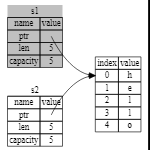

# Ownership

- 有别于其他语言，提供内存安全保证
  - 栈
    - 先进后出，存储在栈上的数据都必须具有已知的固定大小
  - 堆
    - 在堆上存放数据时，首先需要申请一定的内存空间，内存分配器在堆中找到一个足够大的空间，标记其为正在使用，并返回一个指向该地址的指针
      - 栈的数据一定时大小固定，且已知的，但堆的数据并不固定，且分配之后也未必立刻使用
  - 堆上分配数据和访问数据的速度都慢于栈
  - 所有权需要解决的问题
    - 追踪使用堆上数据的部分，减小数据重复
    - 清理未使用的数据

## 所有权规则

- Rust中的每一个值，都有对应的一个变量，称为它的所有者
- 任意时刻，每个值只能有一个所有者
- 当所有者超出范围时，值就会被丢弃

## 变量范围

- 与其他语言类似，变量被声明赋值后，只要仍然在scope中，就依然有效
  - 类似局部变量
- String 与 literal 不同，后者一旦创建完成，就不可更改，一般分配在栈上，而String可变，分配在堆上

- 内存分配
  - string literal 在编译时已知，因此文本内容被硬编码到可执行代码中
    - 硬编码之后内容不可更改，这点不同于字符串数组
  - String 用来支持可变的、可增长的文本
    - 因此需要从堆上申请内存来存储这些内容，这些数量在编译时不可知
      - 内存需要在运行时向内存分配器请求
      - 使用完毕后，需要将内存返还给分配器
    - `String::from`用来完成这项工作
    - 在rust中，一旦所有者超出范围，则内存就会自动回收
      - rust会在 `}` 处自动调用 drop 进行内存回收

## 变量与数据交互的方式

**Move**

- 浅拷贝与深拷贝
  - String对象本身有三个部分组成，这些被存储在栈上
    - 指向数据的指针
      - 指向的数据存储在堆上
    - 长度
    - 容量
  - 浅拷贝只会复制栈上的内容，即两者指向同一份数据
    - rust中，为避免重复释放同一份数据，对于浅拷贝，会将原数据视为无效数据，这种操作在rust中被称为 `move`
  - 深拷贝不仅会复制栈上的内容，还同时复制堆上的内容
    - rust中永远不会自动创建数据的深拷贝副本，因此任何自动复制在运行时的性能消耗都很小

**Clone**

- 使用 `clone()` 方法对 String 数据进行深拷贝

**Copy**

- 编译时大小已知的类型存放在栈上，如 integers
  - 对于这类数据，深拷贝和浅拷贝没有任何区别，这样的过程，在rust中称为 Copy
  - 已实现 Copy 的类型，在赋值给其他变量之后，原变量依然有效
    - 如果该类型已经实现 Drop ，则不可以再实现 Copy

- All the integer types, such as u32.
T- he Boolean type, bool, with values true and false.
- All the floating point types, such as f64.
- The character type, char.
- Tuples, if they only contain types that also implement Copy
  - For example, (i32, i32) implements Copy, but (i32, String) does not.

## Ownership and Functions

- 将变量在方法中传递时，会进行数据的 move 或 copy 操作，即发生所有权的变化，因而原变量的有效与否，会在方法调用时变动，依据数据的类型
  - 移交所有权后，变量的Drop会在新的Scope中进行判定

- 通过返回值，也可以进行所有权的传递

- 变量所有权模式
  - 将值分配给另一个变量进行所有权的移交
  - 当包含堆上数据的变量超出范围时，除非数据的所有权已移至另一个变量，否则该值将通过 drop 清除
