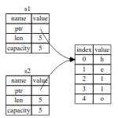

# Ownership

## Stack and Heap

堆与栈都是程序能够在运行时访问的内存
- 栈：存取方式是先进后出，同时存储在栈上的数据都必须具有 *编译时已知且固定的* 大小， 编译时大小未知，或大小会动态变化的数据必须存放在堆上
- 堆：存放数据时，首先需要申请一定大小的内存空间，memory allocator 在堆中找到一个足够大的 empty spot，标记其为正在使用，并返回一个指向该地址的 *指针*，这个过程称为 allocating，由于指向堆的指针已知且大小固定(usize), 因此可以将指针存放在栈上
- 栈的数据一定是大小固定，且已知的，但堆的数据并不固定，且分配之后也未必立刻使用，并且考虑程序局部性，存储相对分散的堆与存储较为固定的栈，堆上分配数据和访问数据的速度都慢于栈

当代码调用函数时，传递到函数中的值（可能包括指向堆上数据的指针）和函数的局部变量会被推送到堆栈中。当函数结束时，这些值将从堆栈中弹出

所有权需要解决的问题
- 追踪使用堆上数据的部分，减小数据重复
- 清理未使用的数据

## 所有权规则

1. Rust中的每一个值，都有对应的一个变量，称为它的所有者
2. 任意时刻，每个值只能有一个所有者
3. 当所有者超出范围时，值就会被丢弃

## 变量范围

与其他语言类似，变量被声明赋值后，只要仍然在scope中，就依然有效(类似局部变量)

String 与 literal 不同，后者一旦创建完成，就不可更改，一般分配在栈上，而String可变，分配在堆上

**内存分配**

string literal 在编译时已知，因此文本内容被硬编码到可执行代码中, 这也是为什么 string literal 迅速且高效，但根本原因在于 string literal 的不可变性
  - 硬编码之后内容不可更改，这点不同于字符串数组

String 用来支持可变的、可增长的文本
- 需要从堆上申请内存来存储这些内容，这些数量在编译时不可知
  - 所需存储空间在运行时向内存分配器请求，使用完毕后，需要将内存返还给分配器
- `String::from`用来完成这项工作
  - 在rust中，一旦所有者超出范围，则内存就会自动回收(rust会在 `}` 处自动调用 drop 进行内存回收)

## 变量与数据交互的方式

### Move

Rust中，多个变量可以使用不同的方式来与相同的数据进行交互

```rust
let x = 5;
let y = x;
```
将数据 5 绑定到变量 x, 然后 copy x所绑定的值，将其绑定到 y, 此时存在两个变量 x 与 y, 他们都有相同的值 5, 由于 interger 大小已知且固定，因此此处两个 5 值都会 push 到栈上

```rust
let s1 = String::from("hello");
let s2 = s1;
```

Sring 由三部分组成，{指向包含string内容内存的指针，长度，容量}，这些数据保存在栈上(类似结构体)，右边则是堆中，保存string content 的内存空间
- length: how much memory, in bytes, the contents of the String is currently using
- capacity: the total amount of memory, in bytes, that the String has received from the allocator


当将 `s1` 赋值给 `s2` 时，String(区分content) 被 copy，即 copy 了栈上 String 的指针，长度与容量，而指针指向的堆上的 content 并没有被 copy



如果rust同时拷贝堆上的content, 则两个变量的内存布局如下，但是这回使得 `s1 = s2` 操作的代价非常昂贵


当变量超出 scope 时，rust会自动调用 drop 方法来清理堆上该变量的存储空间，而在 `s1 = s2` 之后，存在指向同一个堆上数据的两个指针，这会导致一个问题， 当 s1 与 s2 同时超出 scope 时，他们会尝试释放同一片内存空间，即 double free 问题。两次释放内存可能导致内存损坏，这可能导致安全漏洞

> rust中的赋值，函数参数传递都采用的是栈上数据逐位复制的方式，而当变量含有堆上数据时，这种复制会导致两个变量同时指向同一个数据的问题，因此需要move

为保证内存安全，在 `let s2 = s1` 之后，Rust会认为 s1 不再合法，因此当 s1 超出范围之后，rust不会释放任何空间

shallow copy(浅拷贝) 与 deep copy (深拷贝)
- 浅拷贝只复制变量在栈上的内容，而不复制变量在堆上的内容
- 深拷贝会同时复制变量在栈上的内容与在堆上的内容
- rust 对于含有堆上数据的变量(指针)，浅拷贝栈上数据的同时，还会将原变量视为无效, 这种操作称为 *move*
- rust中永远不会自动创建数据的深拷贝副本，因此任何自动复制在运行时的性能消耗都很小


### Clone

如果需要对堆上的数据进行复制，可以使用 `clone()` 方法对变量进行深拷贝，其产生的效果即 `copy content on the heap` , clone 操作本身代价非常昂贵，因此 `clone()` 方法可以做为性能的视觉提示

### Copy

对于仅保存在栈上的数据，浅拷贝与深拷贝的没有区别，因此也没有 move 的必要

rust提供特殊的 `Copy` annotation, 如果一种类型有 `Copy` annotation，使用这种类型的变量就不会进行 move，而是简单的复制栈上的内容，使得将其分配给另一个变量后，原变量仍然有效

如果某个类型实现了 `Drop` trait, 则rust不允许为该类型增加 `Copy` annotation，否则则会产生编译错误


实现 Copy 的类型
- All the integer types, such as u32.
- The Boolean type, bool, with values true and false.
- All the floating point types, such as f64.
- The character type, char.
- Tuples, if they only contain types that also implement Copy
  - For example, (i32, i32) implements Copy, but (i32, String) does not.

## Ownership and Functions

将变量在方法中传递时所有权机制与赋值类似，向函数传递变量，会进行 move 或 copy
- 可以认为是将当前scope中的变量，分配给函数参数中的变量
- Move之后，变量的Drop会在新的Scope中进行判定

函数返回值也可以传递所有权，可以认为是将当前scope中的返回值，分配给函数调用处的变量

变量所有权模式遵循相同的模式
- 将值分配给另一个变量进行所有权的移交
- 当包含堆上数据的变量超出范围时，除非数据的所有权已移至另一个变量，否则该值将通过 drop 清除
