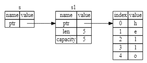

# 引用与借用

- 基本规定
  - 在任何给定时间，可以拥有一个可变引用或任意数量的不可变引用
  - 引用必须始终有效

## 引用

- rust中可以为变量创建引用
  - 类似于指针，reference也是一个address，通过address可以访问存放在这个地址上的数据
  - 不同于指针，reference必须指向一个类型明确且有效的数据
  - reference允许引用某些值而不必获取所有权

- rust中，创建引用的行为即是 borrowing
  - 即为变量创建引用，从而借走改变量所拥有的数据

- rust中默认不允许对引用的对象进行修改 

```rust
let s1 = String::from("hello") // s1's value type String
let r1 = &s1 // r1's value type &String

```



## 可变引用

- 若要使用引用来对原值进行修改
  - 原变量必须可变
  - 必须创建可变引用
  - 一个scope中，可变引用的创建只有一次
    - 在编译时避免数据竞争

```rust
let mut s1 = String::from("hello");
change(&mut s);
```

- 不可变引用与可变引用不可同时创建
  - 允许创建多个不可变引用
    - 不可变引用：只读
    - 可变引用：可读可写
  - 为避免数据竞争，rust中不允许同时创建可变引用与不可变引用
    - 依然可以在一个scope中进行创建，但必须保证可变引用的创建在不可变引用使用之后，或者不可变引用的创建在可变引用使用之后
      - 理解: 避免读后写，写后读等数据冲突
      - 同时创建可能存在数据竞争，但严格限制使用/创建的顺序，可以在编译时避免数据竞争

```rust
let mut s = String::from("hello");

let r1 = &s; // no problem
let r2 = &s; // no problem
println!("{} and {}", r1, r2);
// variables r1 and r2 will not be used after this point

let r3 = &mut s; // no problem
println!("{}", r3);
```
## 悬空引用

- 悬空引用
  - 指向已经分配给其他变量的地址的指针
    - 其他语言中，通过释放内存但同时保留指向该内存的指针，就可以创建一个悬空指针
- rust中保证不存在悬空引用