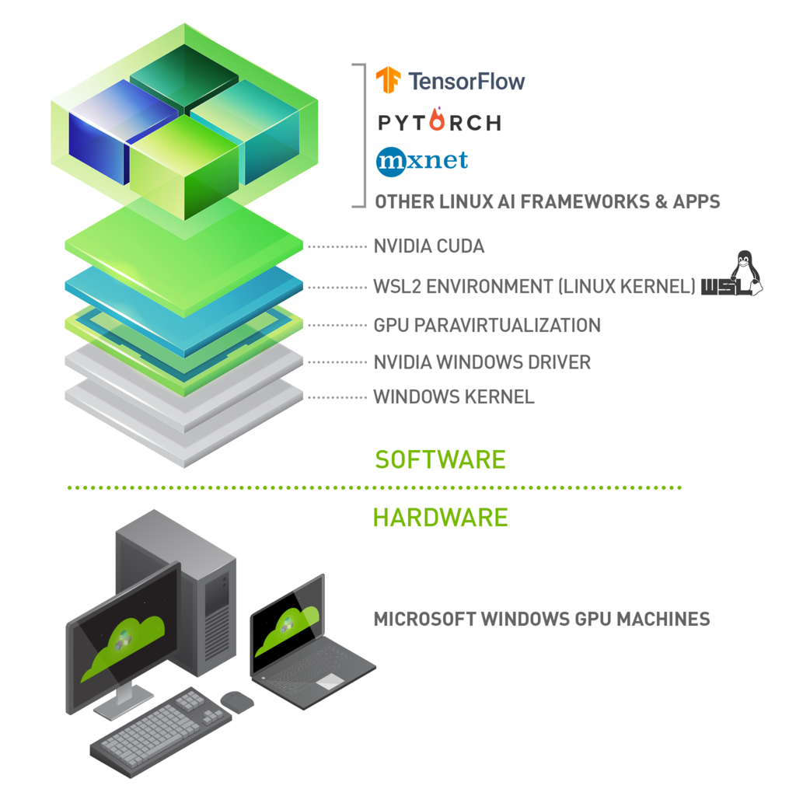

# Drivers

1. 判断当前GPU是否支持CUDA编程
2. 从 release note 中找到与当前 GPU 相匹配的驱动版本即对应最高支持的CUDA版本[^1]
3. 从 nvidia driver 仓库中选择合适的driver进行安装[^2], 对于 WSL 而言，在host上安装驱动即可，随后安装所需要支持的平台即当前驱动选择正确的 cuda_toolkit 并根据所选平台的安装命令安装相应程序 [^3]
4. 使用对应的机器学习框架验证cuda的可用性[^4]

```python
torch.cuda.is_available()
```



[^1]: [nvidia_relase_note](https://docs.nvidia.com/cuda/cuda-toolkit-release-notes/index.html)
[^2]: [nvidia_drivers](https://www.nvidia.com/Download/index.aspx)
[^3]: [cuda_toolkit_list](https://developer.nvidia.com/cuda-toolkit-archive)
[^4]: [pytorch](https://pytorch.org/get-started/locally/)
[^5]: [cuda_on_wsl](https://docs.nvidia.com/cuda/wsl-user-guide/index.html)
