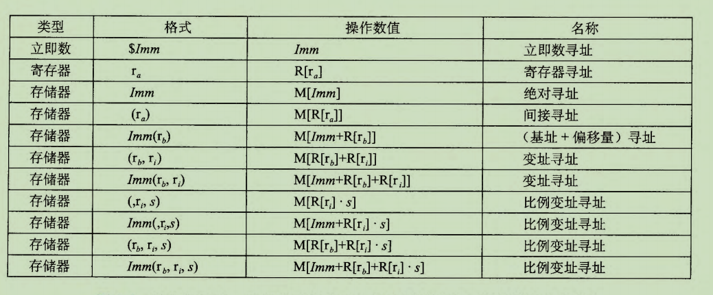
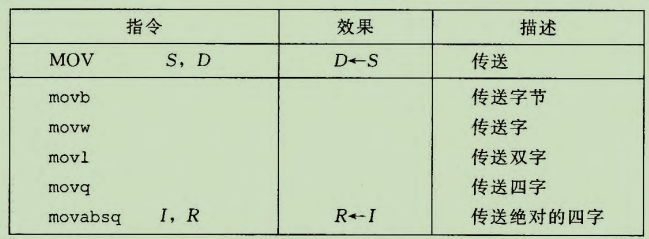
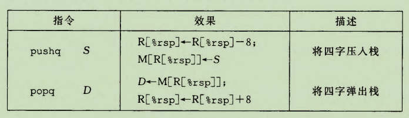
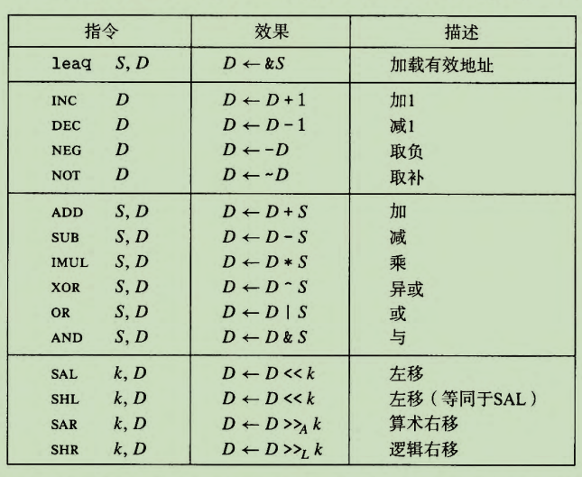
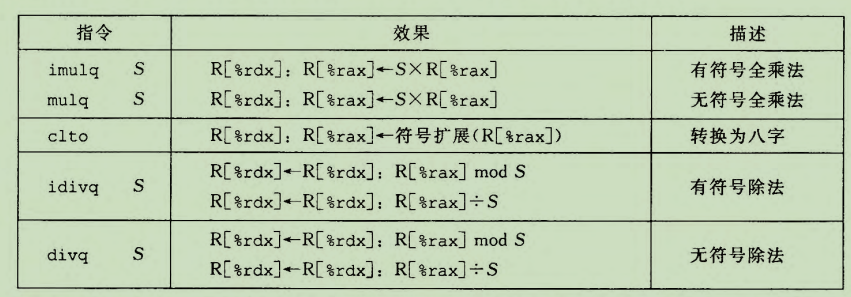
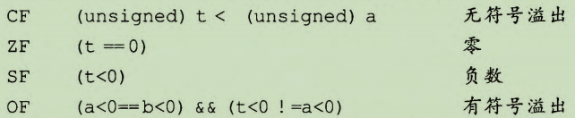
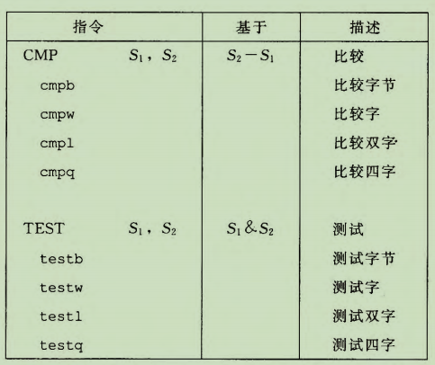
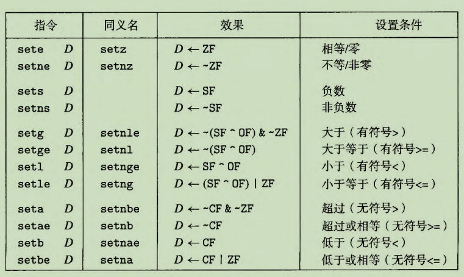
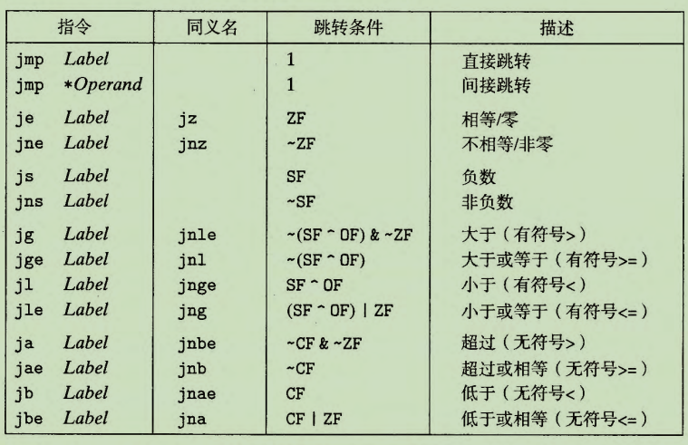
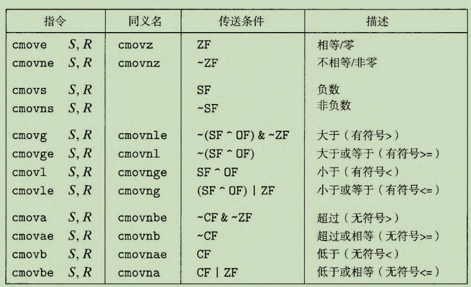

# 程序的机器级表示

## 3.4 访问信息
### 3.4.1 操作数指示符

- 大多数指令有 个或多个操作数 (operand),
  - 指示出执行一个操作中要使用的**源数据值**
    - 源数据值可以以常数形式给出，或是存放在寄存器或内存中
  - 放置结果的**目的位置**

- 操作数通过源数据的来源进行分类
  - 如给出寄存器名称，则源数据就在该寄存器中
  - 我们用符号$M_{b}[Addr]$ 表示对存储在内存中从地址 Addr 开始的 b 个字节值的引用, 为了简便，我们通常省去下标b

|操作数类型|作用||
|-|-|-|
|立即数|用来表示常数值||
|寄存器|表示某个寄存器的内容|16个寄存器的低位1字节、2字节、4节或8字节中一个作为操作|
|存储器|通过有效地址访问内存相应的位置||

### 3.4.2 数据传输指令

- MOV类指令
  - movb、movw、movl、movq
  - 范式：MOV S, D  (D <- S)
- 规范
  - 源操作数指定的值是一个立即数，存储在寄存器中或者内存中
  - 目的操作数指定一个位置，要么是一个寄存器，要么是一个内存地址
  - x86-64中传送指令的两个操作数不能都指向内存位置，将一一个值从一个内存位置复制到另一个内存位置需要两条指令
    - 将源值加载到寄存器中 -> 将寄存器值写入目的位置
  - movl 指令以寄存器作为目的时，会将该寄存器的高位4字节设置为0

- MOVZ & MOVS
  - 将较小的源值复制到较大的目的时使用
  - MOVZ类指令把目的中剩余的字节填充为0
  - MOVS类指令通过符号扩展来填充

### 3.4.4 压入和弹出栈数据

- push
  - 先改变栈顶，再存数据
- pop
  - 先取数据，再改变栈顶

## 3.5 算数与逻辑操作

- 每个指令都有对应不同大小数据的指令
- 操作分为四组: 加载有效地址，一元操作，二元操作和移位

### 3.5.1 加载有效地址

- leaq(load effective address) 实际是 movq指令的变形
  - 指令形式是从内存读取数据到寄存器，但实际上根本没有引用内存
  - 实际是将有效地址写到目的操作数
  - 目的操作数必须是一个寄存器
  - 编译器中leaq指令的运用更为灵活，即利用其计算地址的范式，来进行一些算数运算

### 3.5.2 一元和二元操作

- 一元操作
  - 只有一个操作数，即使源又是目的
  - 这个操作数可以是一个寄存器，也可以是一个内存位置
  - 如: x++
- 二元操作
  - 第一个操作数是源操作数，第二个操作数即使源又是目的
  - 第一个操作数可以是一个立即数、寄存器或者内存位置，第二给操作数可以是寄存器或捏成位置
    - 若第二个操作数是内存地址，则处理器必须从内存读出值，执行操作，再将结果写回内存
  - 如 x+=y

### 3.5.3 移位操作

- 第一个是移位量，第二个是要移位的数
  - 移位量可以是一个立即数，或者放在单字寄存器%cl中
    - 只允许以此特定寄存器作为操作数
  - 目的操作数可以是一个寄存器或是一个内存位置
- 左移指令有两个名字 SAL 与 SHL，两者效果相同，均是在右边填上0
- 右移指令不同
  - SAR执行算数位移(填上符号位)
  - SHR执行逻辑移位(填上0)

### 3.5.5 特殊的算术操作

- 支持产生两个64位数字的全128位乘积及整数除法的指令
  - 乘法要求其中一个操作数必须在 %rax 中，另一个则作为指令的源操作数给出
    - 乘积存放在寄存器%rdx(积的高64位)和%rax(积的低64位)中
    - 存储乘积到内存需要两个movq指令
  - 除法将寄存器%rdx(高64位)和%rax(低64位)中的128位作为被除数，而除数作为指令的操作数给出
    - 指令将商存储在寄存器%rax中，将余数存储在寄存器%rdx中
    - 被除数存放在%rax中，%rdx应设置为全0(无符号运算)或者%rax的符号位(有符号运算)
    - cqto指令: 隐含读出%rax的符号位，并将其复制到%rdx的所有位

## 3.6 控制

- 机器代码提供两种基本的低级机制来实现有条件的行为
  - 测试数据值，然后根据测试的结果来改变控制流或者数据流

### 3.6.1 条件码

- 除整数寄存器，CPU还维护一组单个位的条件码(condition code)寄存器，用来对最近的算术或逻辑操作的属性进行描述
  - 检测这些寄存器来执行分支条件命令
- 常用条件码
  - CF: 进位标志。最近的操作使最高位产生了进位，可用来检查无符号操作的溢出
  - ZF: 零标志。最近的操作得出的结果为0
  - SF: 符号标志。最近的操作得到的结果为负数
  - OF: 溢出标志。最近的操作导致一个补码溢出, 正溢出或负溢出

- OF溢出标志判断: 加法操作中，操作数符号相同，而结果符号不同

- leaq指令不改变任何条件码，其余的算术逻辑指令都会设置条件码
- CMP与TEST类指令也会设置条件码，但仅设置而不改变其他寄存器
  - CMP指令的行为与SUB相同，但只是设置条件码
    - ATT格式中列出的操作数相反
  - TEST指令的行为与AND指令相同，但只是设置条件吗
    - 检测是负数、零还是正数，或进行掩码操作

### 3.6.2 访问条件码

- 条件码通常不会直接读取，常用的使用方法有三种
  1. 可以根据条件码的某种组合，将一个字节设置为0或者1
  2. 可以条件跳转到程序的某个其他的部分
  3. 可以有条件地传送数据

- SET类指令
  - 对于第一种情况
  - setl与setb表示 小于时设置 和 低于时设置，而非指操作数大小
    - cmp第二个操作数 (set) 第一个操作数
  - SET指令的目的操作数是低位单字节寄存器元素之一，或者是一个字节的内存位置
    - 指令会将这个字节设置成0或1，而为得到32位或64位的结果，就必须对高位清零

### 3.6.3 跳转指令

- 跳转指令会导致执行切换到程序中的一个全新的位置
  - 汇编指令中，跳转的目的通常用一个标号(label)指明
  - 在产生目标代码文件时，汇编器会确定所有带标号指令的地址，并将跳转目标(目的指令的地址)编码位跳转指令的一部分
- jmp指令是无条件跳转
  - 跳转目标可以从寄存器或内存位置中读出
- 其余跳转指令都是有条件的
  - 依赖条件码的某种组合，或者跳转，或继续执行

### 3.6.4 跳转指令的编码

- 汇编代码中，跳转目标用符号标号书写
  - 汇编器以及后来的链接器，会产生跳转目标的适当编码
- 常用编码方式
  - PC-relative(PC相对)
    - 将目标指令的地址与紧跟在跳转指令后面那条指令的地址之间的差作为编码
      - 这些地址偏移量可以编码为1、2或4个字节
      - 即编码时，指令后跟的操作数作为相对位置，通过与小一条指令地址运算，得到新的下一条地址
        - 执行PC相对寻址时，此刻程序计数器的值是 跳转指令 后面的那条指令的地址，而不是当前 跳转指令 的地址，这是因为CPU会将更新程序计数器作为执行指令的第一条指令的第一步
  - 给出"绝对"地址
    - 用4个字节直接指定目标，汇编器和链接器会选择适当的跳转目的编码

- AMD建议在rep后面跟上ret的组合来避免使ret指令称为条件跳转指令的目标

### 3.6.5 用条件控制来实现条件分支

- 汇编器会位 then-statement 和 eles-statement 产生各自的代码块，它会插入条件和无条件分支，以保证能执行正确的代码块

### 3.6.6 用条件传送来实现条件分支

- 实现条件操作的传统方法是通过使用 控制 的条件转移，然而这对于现代处理器来说并不高效
  - 通过条件, 判断程序是否应当执行分支，对于流水线处理器而言，分支预测错误，则会使得流水线之前正在运行的结果失效，这无法发挥流水线的全部性能
- 使用 数据 的条件转移实现条件操作，程序会执行所有可能的结果，只在返回结果时，判断应当返回的值
  - 降低了分支预测错误的惩罚，能够利用流水线性能
- 控制流不依赖于数据，这使得处理器更容易保持流水线是满的
- 使用条件传送指令并非总是能够提高代码效率
  - 如果每个条件分支中的计算量非常大，对应条件不满足时，就会造成浪费
  - 只有当计算量不大时，GCC编译器才会选择使用 条件传送指令 进行优化

### 3.6.7 循环