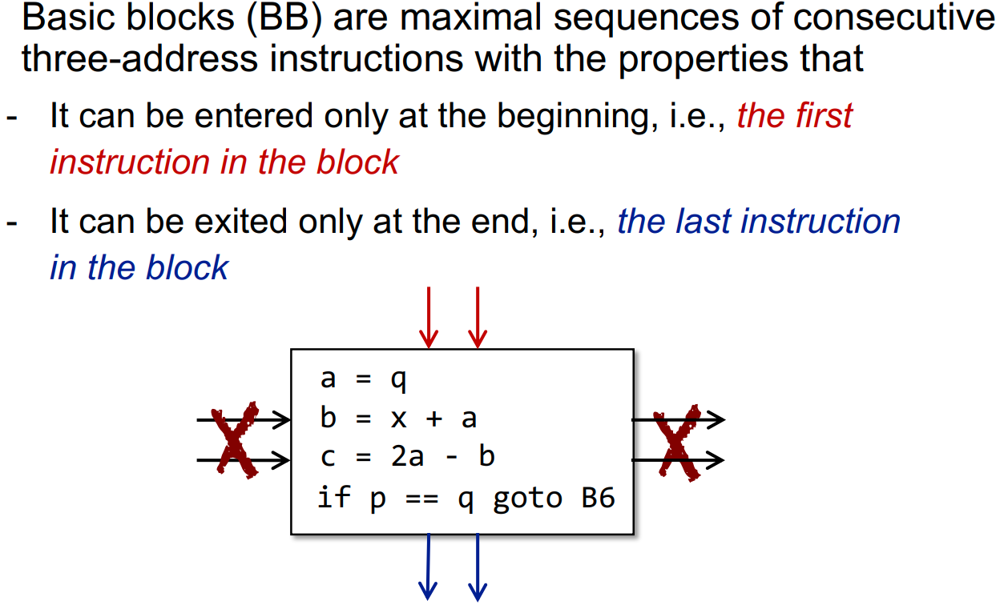

## IR

### 编译与静态分析

**AST与三地址码IR**

**3AC**

三地址码并没有形式化的描述，主要概念
- 右边最多只有一个操作符
- 地址可以是：名称、常量、编译器生成的临时变量

**SSA**

每个变量都只有一次定义

条件语句中，变量的值存在多个可能，而为保证每个变量只有一次定义，引入了 $\phi$ 运算符

SSA优势与劣势: 

### 控制流分析（CFA）

**Basic Block（BB）**

> 指令通常是statement

BB是CF中的节点

1. 只有一个入口，且入口必须是第一条指令
2. 只有一个出口（出口仅针对BB而言，可以有多个方向），且出口必须是最后一条指令
3. 满足如上指令的最大的连续指令集合

BB算法：
1. 找到所有的leader：
   - 第一个指令
   - 条件或非条件跳转的目标
   - 跳转指令之后紧接着的指令
2. 构建BB：从leader开始，到下一个leader之前的作为一个BB

**Control Flow Graph**

构建完BB之后，还需要建立边

边构建算法：
1. 存在从A的最后一条指令到B的第一条指令的条件或非条件跳转
2. B紧接着A执行，且A的最后一条指令不是无条件跳转（不是跳转到B）

边建立完成之后，再将指令粒度的跳转替换为BB粒度的跳转

同时，如AB之间有一条从A到B的边，则A是B的前驱（predecessor），而B是A的后继（successor）

此外，还需要增加`Entry`和`Exit`两个节点

