## Data Flow Analysis

### 基本概念

**Input and Output States**

作为data flow分析中所需要关注的部分，也是Domain

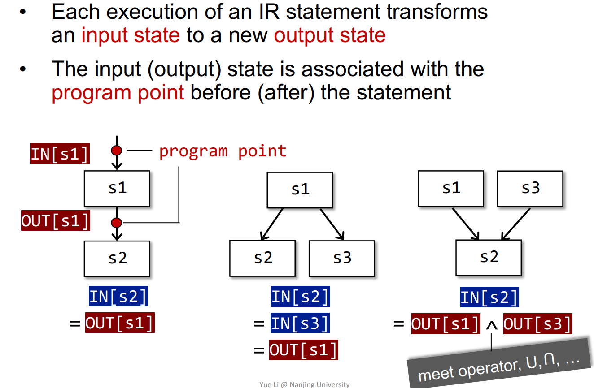

分析目标：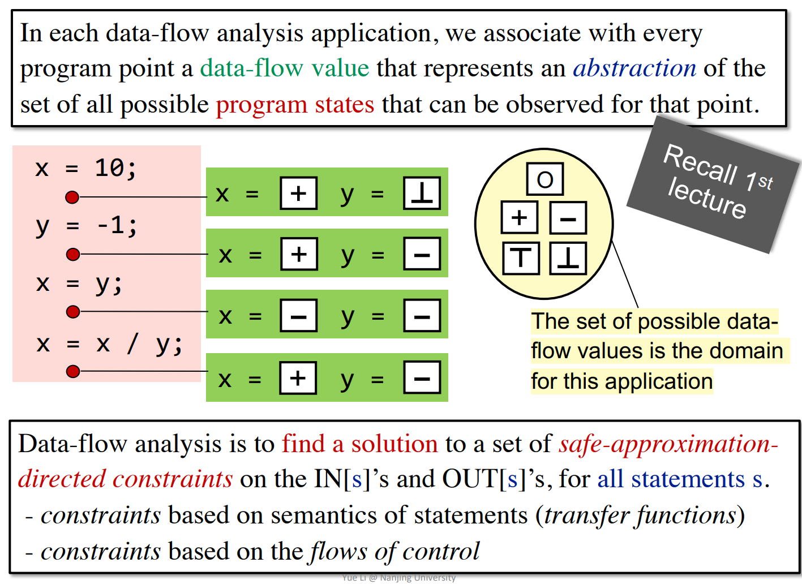

**Forward Analysis & Backward Analysis**

- 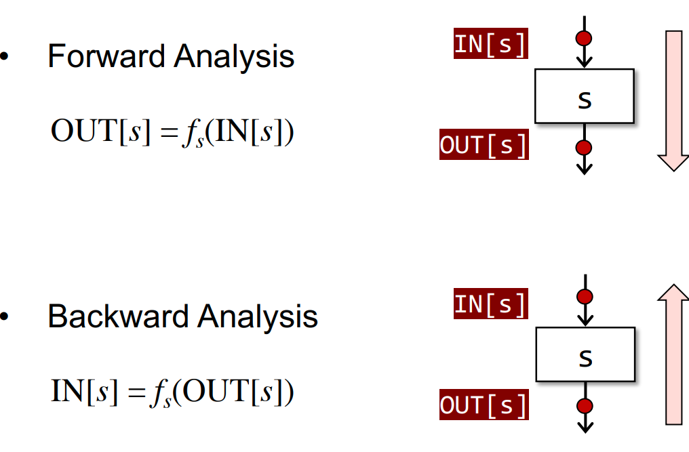
- 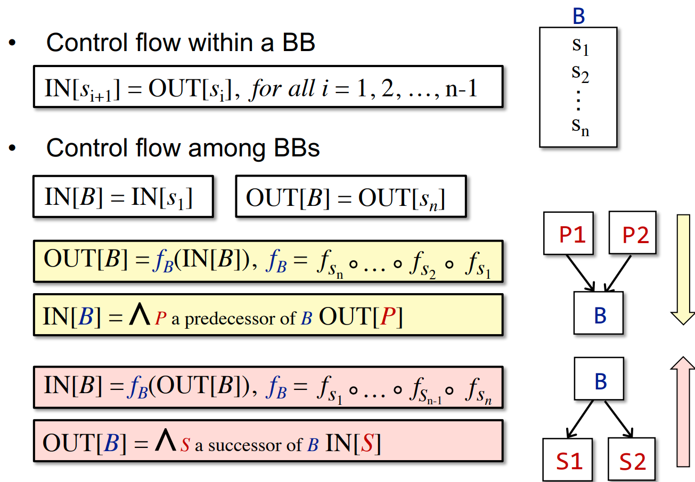

### 1. Reaching Definitions Analysis

关注点在于Definition，以BB为粒度，分析每个BB In中的Definition，并通过Transfer计算得到Out的Definition
- 使用一个bit vector来表示Definition，每个BB的bit vector记录了能够到达此BB的变量声明
- BB Out State即表明 definition 能否到达此BB

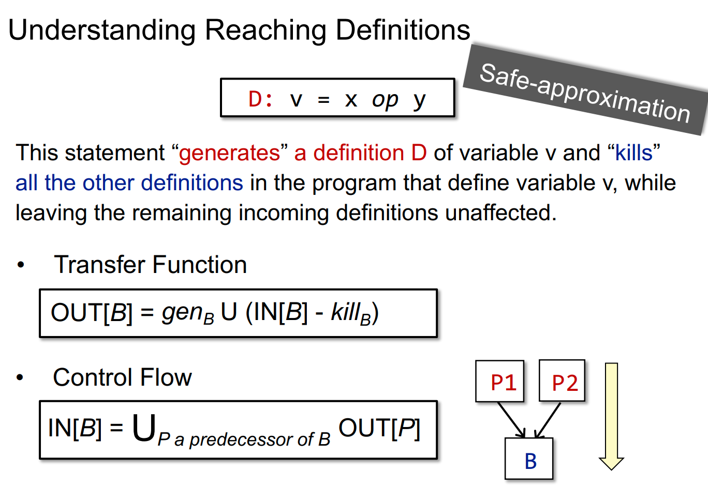

算法结果：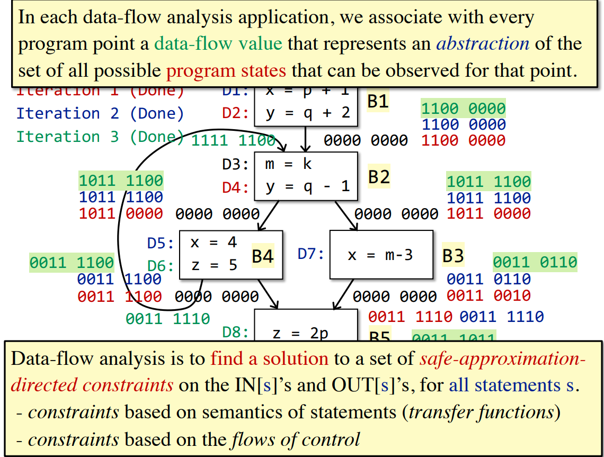

**迭代的收敛**

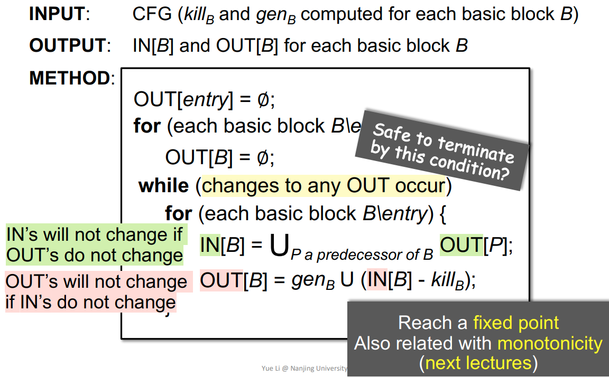

### 2. Live Variable Analysis

分析变量在BB的IN/OUT处是否live（在使用之前没有被重新赋值）

- 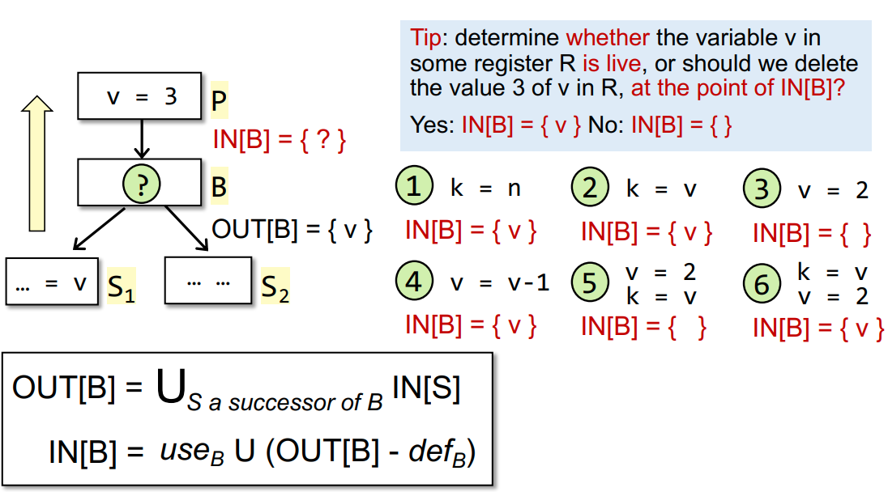
- 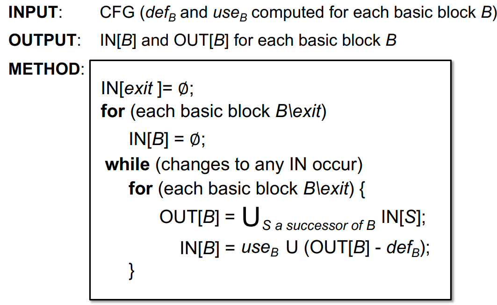

### 3. Avaliable Expressions Analysis

Expression is avaliable at program point p when:
1. 从entry到p的所有路径都必须传递`x op y` expression的执行
2. 所有Path中，最后一次执行 `x op y` 之前，都没有x或y的重定义

Usage:
1. 在p点处，可以将先前所有的`x op y` expression替换为最后一次的执行
2. 用于探测全局的公共 subexpression

> under-approximation: 存在漏报，false-negative

**Domain**: set of expressions: 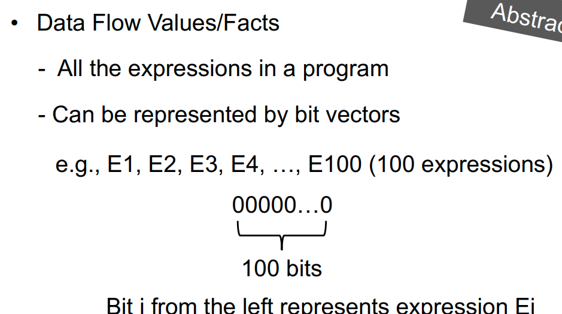

transformer: 定义中要求所有Path都传递因此BB的In中应当取并
- 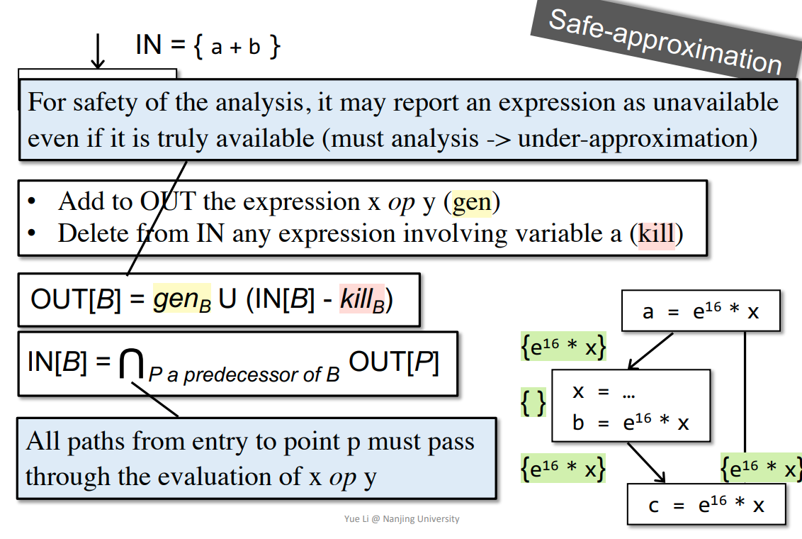

算法：
- BB初始化为All
- 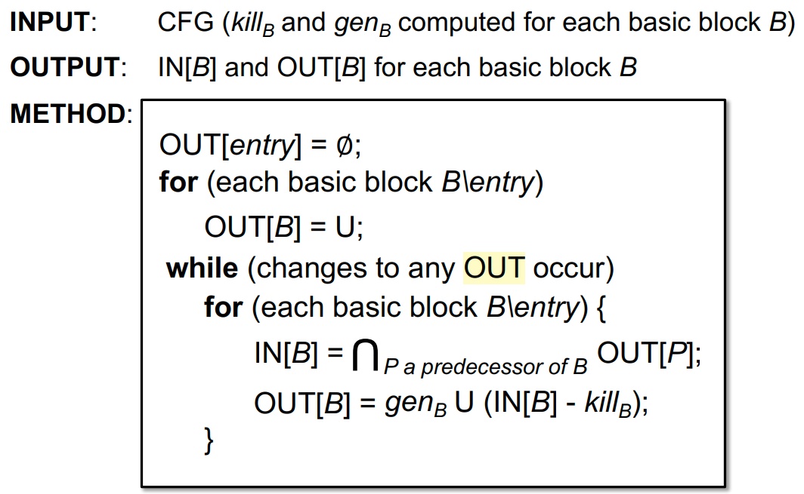

### 小结

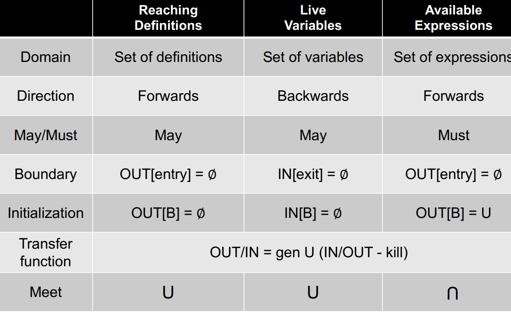