## Data Flow Analysis Foundation

不动点：给定任意一个函数F，对于点X，如果输入与输出相同，则X是函数的不动点

### Partial Order

> partial的含义在于允许集合中存在没有关系的两个元素

- x: 集合中的元素
- $\sqsubseteq$: 在此处表示元素之间的关系（注意不是$\subseteq$），如 "<=", "substring"

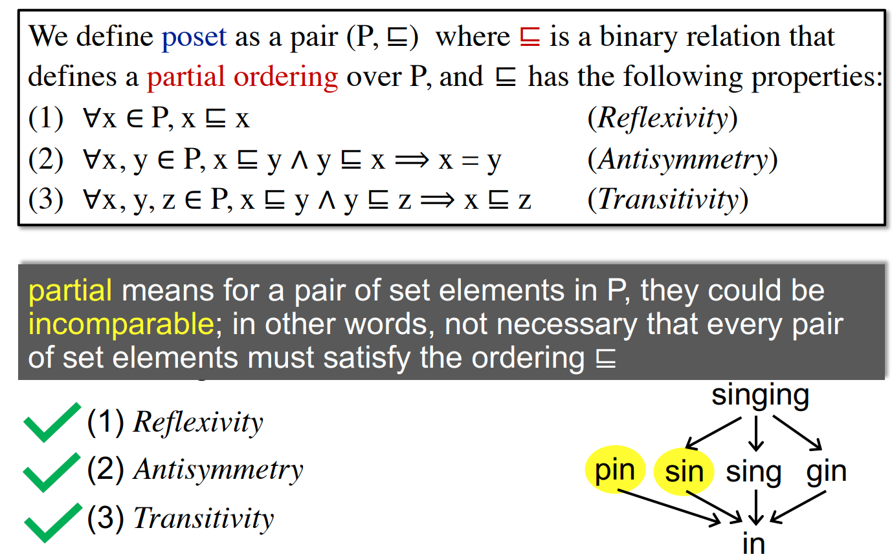

### Upper and Lower Bound

- S的Upper/Lower Bound: 都可以是S中的元素（符合条件的情况下）
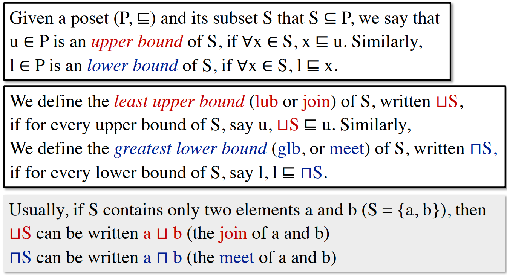

- properties
- 1. 
- 2. 如有glb/lub, 则此b必然是唯一的，即不能同时存在两个或两个以上的glb/lub

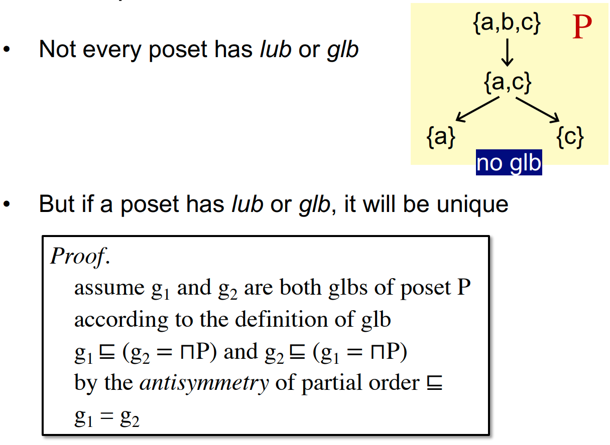

### Lattice & Semilattice

一个poset是lattice的前提是，其中**任意**两个元素组成的pair，都有lub和glb

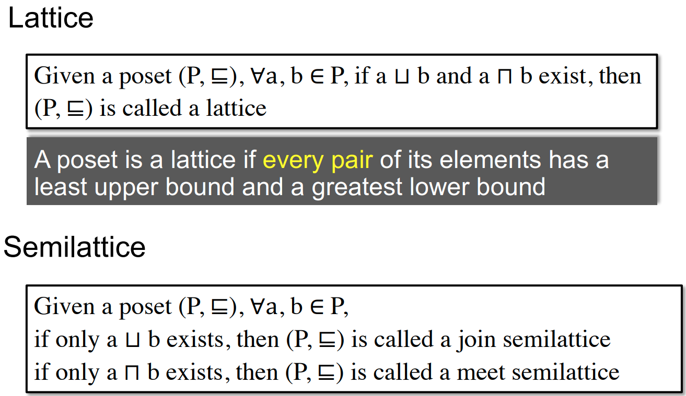

### Complete Lattice

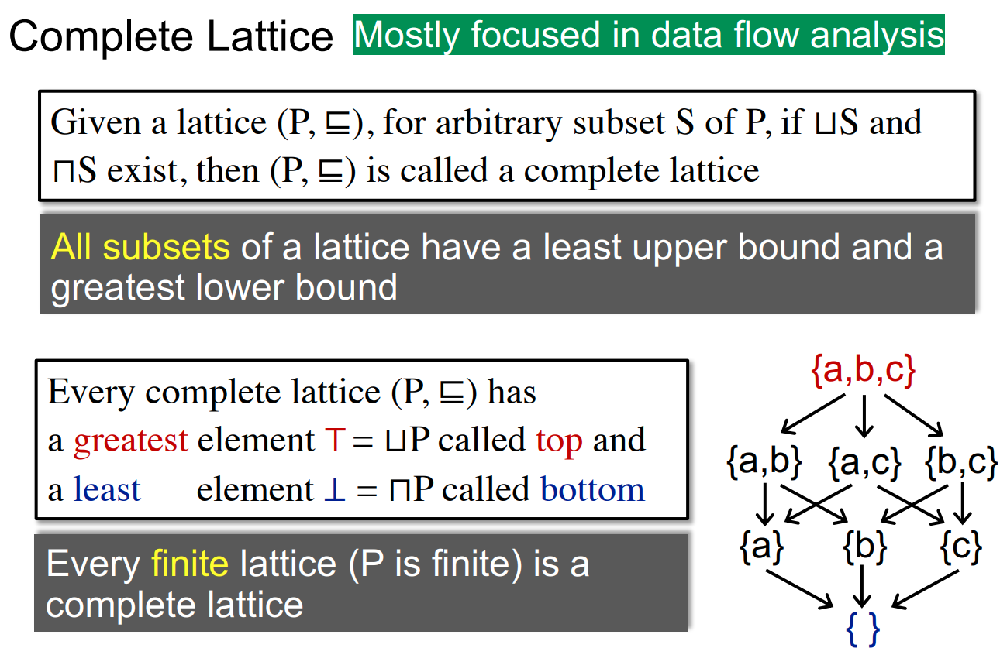

### Product Lattice

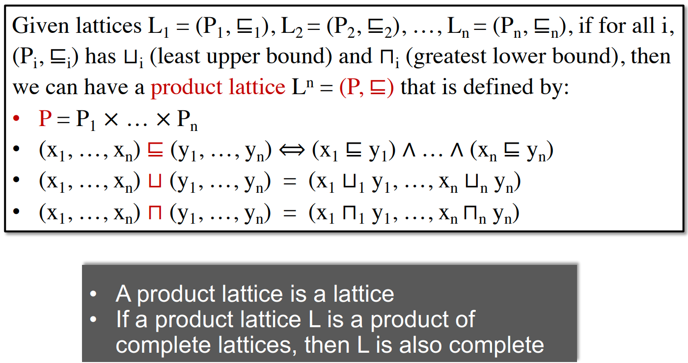

### DFA Framework via Lattice

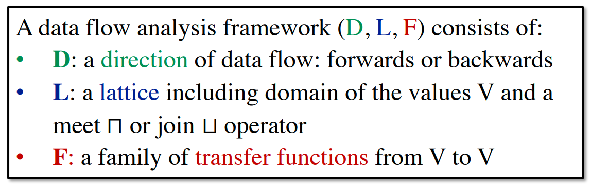

### FPT & Lattice

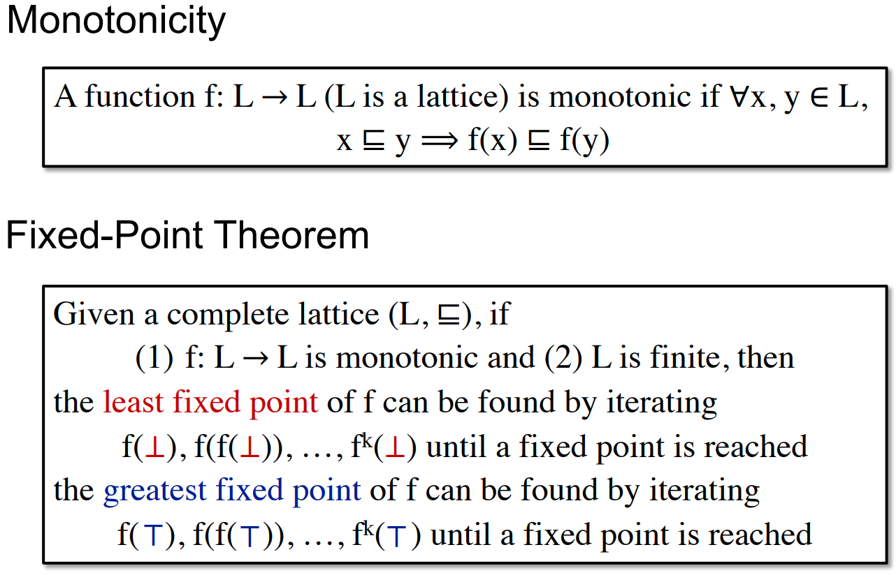

Proof:
- 鸽笼定理（抽屉定理）：如果有 n+1 个或更多的物体放入 n 个盒子（抽屉）里，那么至少有一个盒子里包含两个或更多的物体
- height of lattice：自底向上的高度（底为0）

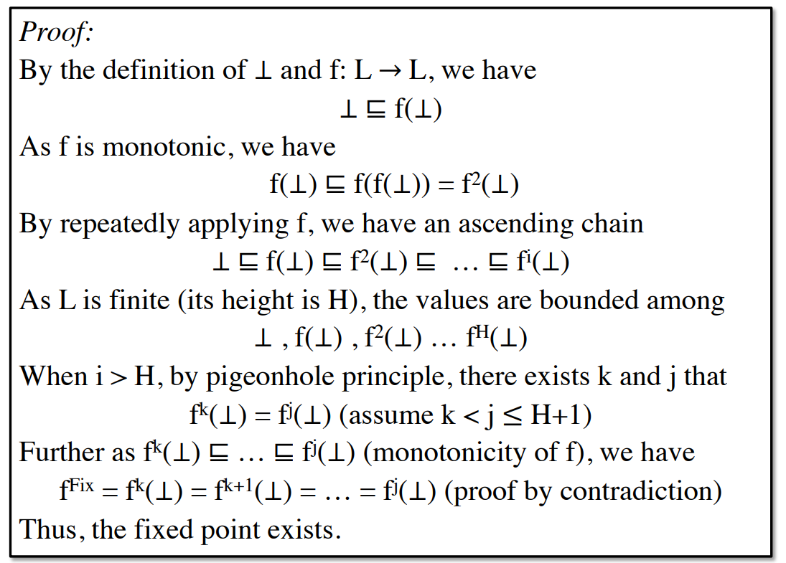

- 最小不动点
  - 最大不动点证明类似
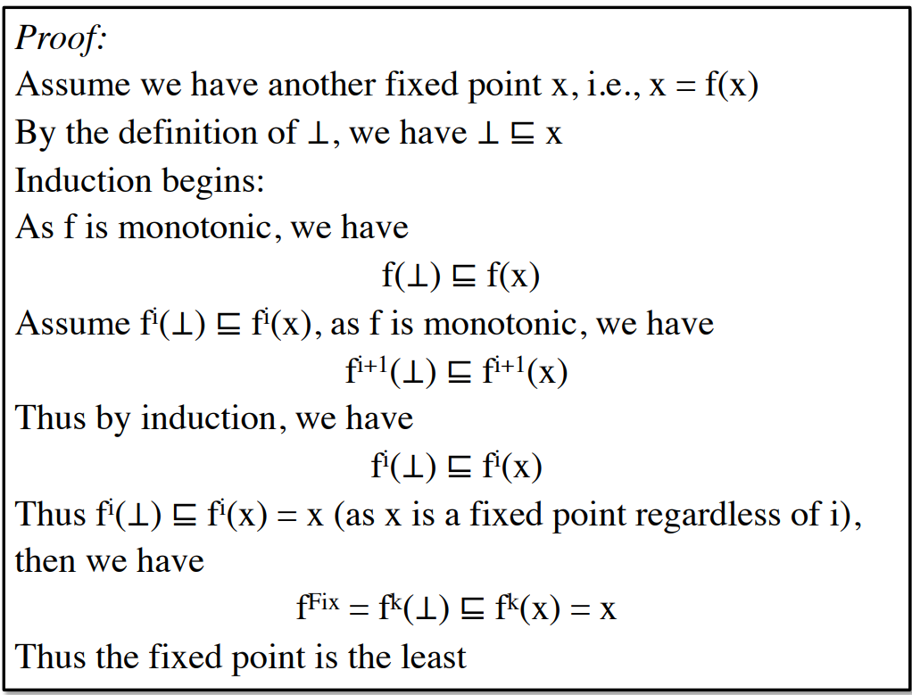

### 迭代算法与不动点定理

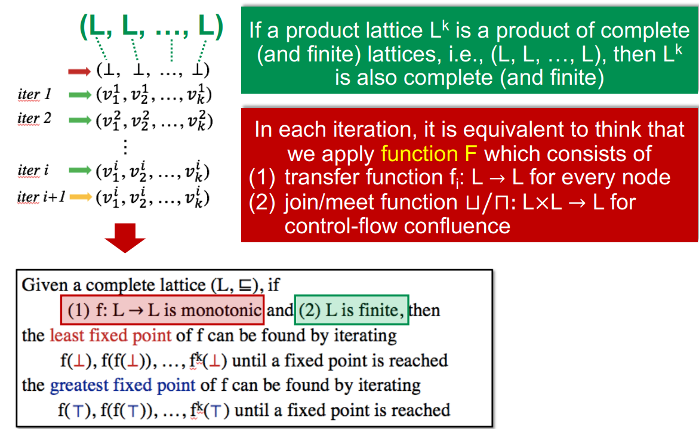

转换函数的单调性证明
- Gen/Kill操作证明了f执行的单调性

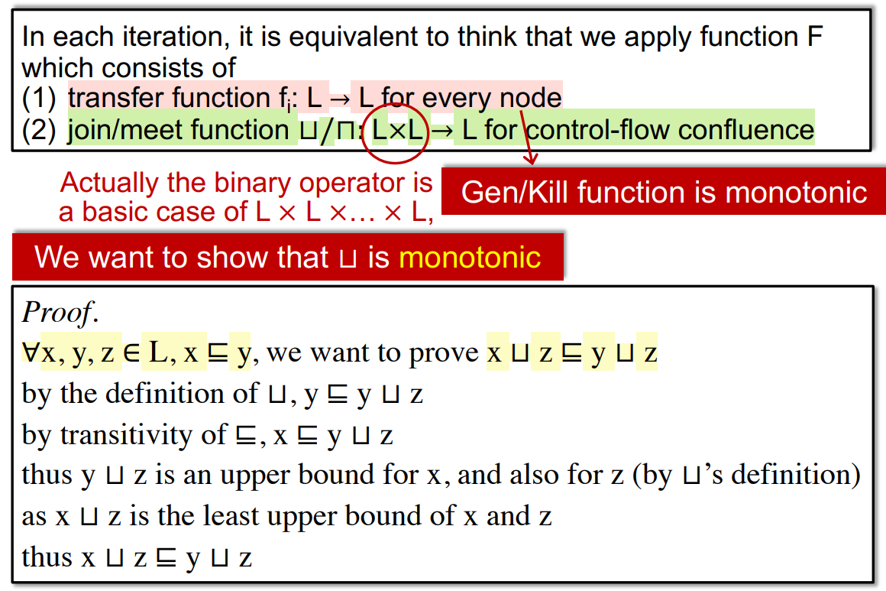