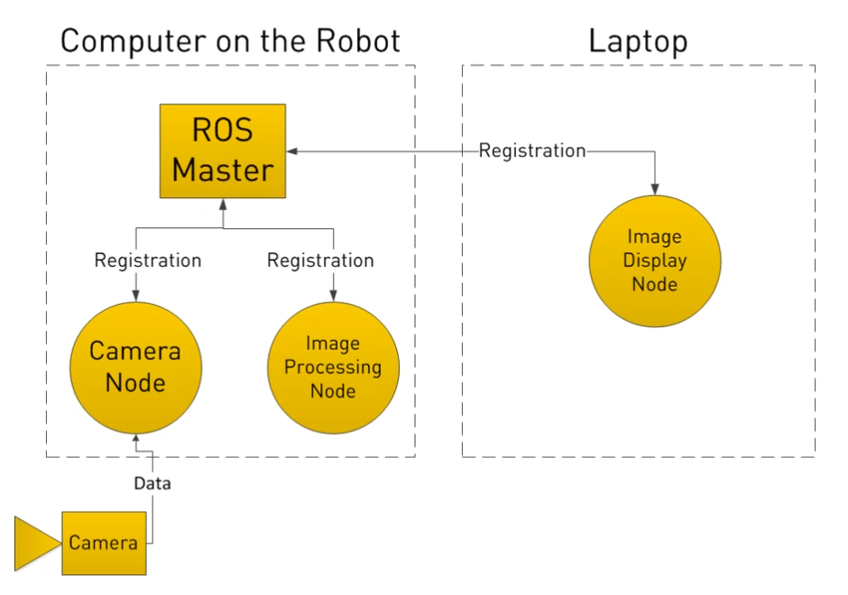
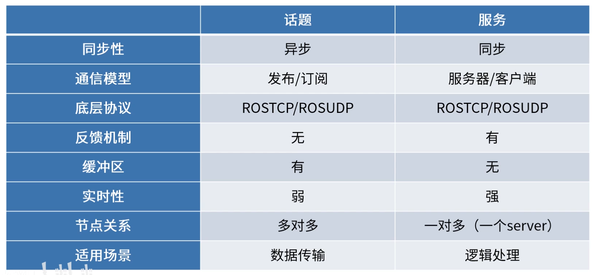
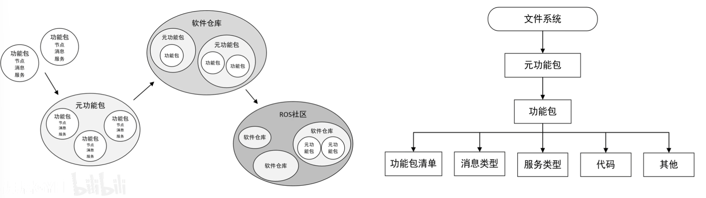

# 安装 Ros

# Ros基本概念

## 架构

- Node
  - 节点: 执行单元
  - 执行具体任务的进程/可独立运行的可执行文件
  - 节点是软件概念，可分布式运行在不同主机
  - 节点名称在系统中唯一
- Master
  - 节点管理器: 控制中心
  - 提供节点命名与注册服务
  - 跟踪和记录Topic，进行服务通信，辅助节点相互查找与建立连接
  - 提供参数服务器，节点使用此服务器存储和检索运行时参数

## 通信模式

### 异步通信

- 采用 pub/sub 通信模式

- Topic
  - 通信总线
  - 基于 pub/sub
- Message
  - 具有一定的类型和数据结构，包括ROS提供的标准类型和用户自定义类型
  - 使用编程语言无关的.msg文件消息格式，编译生成不同代码文件

### 同步通信

- 采用 C/S 模型

- 使用编程语言无关的 .srv 文件定义请求与应答的数据结构，编译生成不同代码文件

### 小结

## 参数

- Parameter
  - 全局共享字典：可通过网络访问的共享、多变量字典
  - Node使用此服务来存储和检索*运行时参数*
  - 适合存储静态、非二进制的*配置参数*，不适合存储动态配置的数据

- 动态参数配置需要ROS的其他功能

## 文件系统

- Package
- Package manifest
- Meta Packages

- 代码结构

