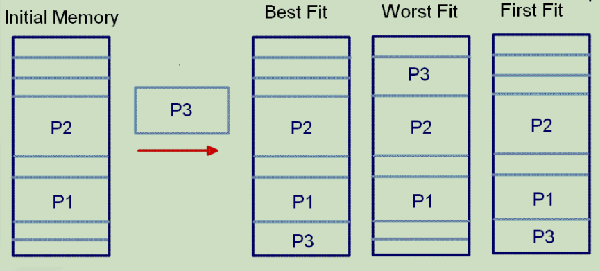
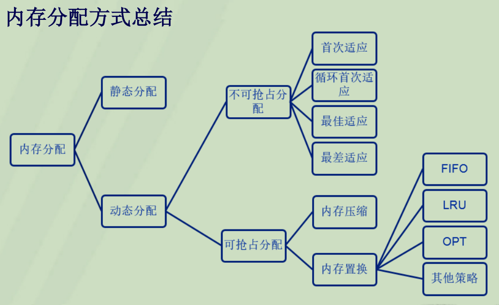

# 内存操作的常见问题

## 内存分配标志

|标志|描述|
|:-|:-|
|**GFP_ATOMIC**| 这个标志用在中断处理程序、持有自旋锁以及其他不能睡眠的地方。|
|GFP_NOWAIT| 与GFP_ATOMIC类似，不同之处在于，调用不会退给紧急内存池。这就增加了内存分配失败的可能性。|
|GFP_NOIO| 这种分配可以阻塞，但不会启动磁盘I/O。这个标志在不能引发更多磁盘I/O时阻塞I/O代码，这可能导致令人不愉快的递归。|
|GFP_NOFS| 这种分配在必要时可能阻塞，但不会启动文件系统操作。这个标志在你不能再启动另一个文件系统的操作时，用在文件系统部分的代码中。|
|**GFP_KERNEL**| 这是一种常规分配方式，可能会阻塞。这个标志在睡眠安全时用在进程上下文代码中。为了获得调用者所需的内存，内核会尽力而为，这个标志应当是首选标志。|
|GFP_USER| 这是一种常规分配方式，可能会阻塞。这个标志用于为用户空间进程分配内存。|
|GFP_HIGHUSER| 这是从ZONE_HIGHMEM进行分配，可能会阻塞。这个标志用于为用户空间进程分配内存。|
|GFP_DMA| 这是从ZONE_DMA进行分配，需要获取能供DMA使用的内存的设备驱动程序使用这个标志，通常与以上某个标志组合在一起使用。|

> GFP: Get Free Pages, 获取空闲页

- 不同情况下应使用的标志

|情形|相应标志|
|:-|:-|
|进程上下文，可以睡眠| GFP_KERNEL|
|进程上下文，不可以睡眠| GFP_ATOMIC|
|中断处理程序| GFP_ATOMIC|
|软中断| GFP_ATOMIC|
|tasklet| GFP_ATOMIC|
|需要用于DMA的内存，可以睡眠| （GFP_DMA | GFP_KERNEL）|
|需要用于DMA的内存，不可以睡眠| （GFP_DMA | GFP_ATOMIC）|

## 原子分配

- 普通分配(GFP_KERNEL)
  - 获取新页面时可能设计页的换入换出，进程会等待对换完成，此时内核可以调度其他任务执行
- 原子分配(GFP_ATOMIC)
  - 此时内核不允许通过换出数据或缩减文件系统缓冲区来满足原子分配的请求，因此必须还有一些真正可以获得的空闲内存
  - 保留的页框池
    - 为尽量保证原子请求不失败而保留的页框池，仅在内存不足时使用
    - 同样有数量限制，因此无法保证原子分配的成功

## 不可抢占分配和可抢占分配

- 静态内存分配
  - 内存地址和大小在程序加载和执行时就已经确定，无法变更
- 动态内存分配
  - 不可抢占：首次适应、循环首次适应、最佳适应、最差适应
  - 可抢占: 重新分配正在使用的内存，以获得更大的连续内存空间

### (1) 不可抢占分配

### (2) 可抢占分配

- 策略
  - 压缩
    - 已经存在的内存块重新分配，为新程序提供更大的连续空闲空间
  - 替换
    - 利用已分配的空间，区分dirty与clean，dirty块被覆盖时，需要进行备份
      - Dirty块: 多次被改写，如数据部分
      - Clean: 没有被改写，如指令部分
- 内存置换
  - 评价标准: 引用内存块时命中率尽可能高, 即最少的缺页

**FIFO**

- 先进先出

**LRU**

- 最近最久未使用，即替换当前内存页中，最久没有使用过的页
  - 类似于栈，空闲时按栈的方式依次入栈，命中时，将对应元素提升至栈顶，置换时选择栈底元素

**OPT**

- OPTimal replacement
  - 空闲时依次装入，置换时检查之后要装入的页(对比已存的), 选择最晚被装入的页替换
  - 最优算法，可用来评价其他算法的性能

**其他**

- 引入明确的时间概念
  - 最近未使用
    - 设置引用位R，每次调用时置R=1，系统每隔一段时间将R=0(每个页单独算)，置换时选择R=0的页进行替换
  - 时钟页面置换
    - 设置引用位R，同时记录装入内存的时间，首先检查时间最长项，若R=0则换出，否则继续检查时间长度次之的下一项并将当前R=0，若全部R=1，则按照FIFO进行置换

### (3)小结

## 文件映射

- 内存映射文件
  - 类似虚拟内存(映射物理地址)
  - 映射文件到内存后，可以直接操作这段虚拟地址进行文件的读写操作，而不必使用read/write等系统调用

- 传统的文件访问
  - 每个进程在自己的地址空间中都保有同一个文件的副本
- 共享存储映射
  - 文件映射到内存，进程A与进程B都将都将该页映射到自己的地址空间，进程A首次访问时，内核将页真正读入内存并更新A的页表指向它，而当B访问时，只需要改变页表指向即可

- 内存映射步骤
  1. 在用户*虚拟地址空间*中寻找空闲的满足要求的一段连续的虚拟地址空间，为映射做准备
     - 通过mmap系统调用准备这样一段虚存空间,并建立一个结构体,将其传给具体的设备驱动程序
  2. 建立虚拟地址空间和文件或设备的物理地址之间的映射
  3. 当实际访问新映射的页面时操作
     - 由缺页中断完成

<!-- TODO: 细节分析 -->