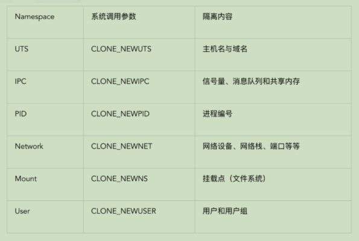
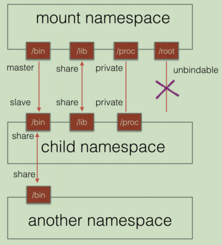

# 内核进程隔离

## 进程隔离

- 进程隔离式为保护操作系统中进程互不干扰而设计的一组不同硬件和软件的技术
  - 虚拟地址空间
    - 进程之间使用不同的虚拟地址，防止错误写入
  - 安全性
    - 禁止进程之间的内存访问，不允许一个进程修改另一个进程的内存
  
## Namespace

- 目的
  - 让每个进程组具有独立的PID、IPC和网络空间
    - 进程组: 一组进程的集合
- 命名空间提供了系统虚拟化的新思路，即让一台主机同时运行多个内核，即同时运行多个同种操作系统

- nsproxy指针
  - 每个进程所包含的命名空间都抽象为一个nsproxy指针，共享同一个命名空间的进程指向同一个指针
    - 指针的结构通过引用计数来确定使用者的数目
  - 一个进程用户空间变化时发生分裂，通过复制旧命名空间数据结构并作出一些修改，再赋值给相应的进程

- 命名空间本身只是一个框架
  - 需要其他实行虚拟化的子系统实现自己的命名空间
  - 子系统的对象不是全局维护的结构，而和进程的用户空间数目一致，每一个命名空间都会有对象的一个具体实例
    - 子系统如PID不再是全局维护的，而是每个Namespace中都有一个
  - 目前Linux实现的命名空间子系统
    - UST、IPC、MNT、PID、NET
- [参考](https://blog.csdn.net/gatieme/article/details/51383322)

- Namespace API
  - Clone(), setns(), unshare()
    - Clone()
      - 在创建新进程的同时，创建Namespace
    - setns()
      - 加入一个已存在的Namespace
    - unshare()
      - 在原进程进行namespace隔离
      - 使用与父进程不共享的namespace运行程序
  - /proc 下的部分文件
    - `ls -l /proc/<PID>/ns` 可查看进程的命名空间
  - 父进程可以通过系统调用，指定子系统的命名空间

## 子系统

### UTS

- UTS 
  - UNIX Time-sharing System
  - UTS 提供了主机名和域名的隔离，使得每个容器拥有独立的主机名和域名，因此在网络上可被视为一个独立的节点

### IPC

- IPC
  - Interprocess Communication
  - 容器中进程间通信的方式
    - 管道、信号量、信息队列、共享内存
  - 容器间通信，即在相同 pid namespace 中进行IPC

### PID

- PID 
  - Linux为 PID namespace 维护一个树状结构
    - 初始化时创建的为root namespace
    - 类似于进程ID，pid namespace存在父子关系
    - *父节点能够看到子节点的进程，并通过信号等方式进行影响，反之则不可*
      - 这也是能够从os对容器中的进程进行观察和控制的前提
  - 内核新建一个进程
    - 在全局内创建一个唯一的描述符来描述该进程
      - 没有命名空间的情况下，使用一个单增的数字作为进程号即可
      - 有命名空间时，由于子空间中的所有进程在父空间中都可见，因此子空间中每新建一个进程，上层的每层命名空间都要有一个唯一的进程号描述
        - 因此，一个进程在整个系统中可能有多个进程描述符
    - 一般使用时，显示的进程号往往是该进程对应到顶层命名空间的进程号
  - init进程
    - 负责创建第一个pid namespace
    - init进程负责回收资源和监控，并维护后续启动进程的运行状态
  - 信号
    - 如果init没有对某个信号进行处理，则于init在同一个pid namespace中的进程发送该信号则会被屏蔽
  - unshare()、setns()
    - 调用者不进入进行的pid namespace

### Mount

- Mount
  - 隔离文件系统挂载点来对文件系统提供支持
    - 进程创建mount namespace
      - 复制当前的文件结构到新namespace
      - 新namespace中的所有mount操作，只影响自身的文件系统
  - mount propagation
    - 共享关系(share relationship)
      - 一个挂载对象中的挂载事件会传播到另一个挂载对象，反之亦然
    - 从属关系(slave relationship)
      - 一个挂载对象中的挂载事件会传播到另一个挂载对象，但是反过来不行
  - 挂载状态
    - 共享挂载
    - 从属挂载
    - 私有挂载(private)
      - 既不传播也不接收传播事件的挂载对象
    - 不可绑定挂载(unbindable)
      - 不允许绑定挂载，即创建mount namespace时改文件不可以被复制

### NetWork

- NetWork
  - 提供了关于网络资源的隔离
    - 包括网络设备、IPv4和IPv6协议栈，IP路由表、防火墙、/proc/net目录
    - 一个物理网络设备最多存在在一个network namespace中
  - veth pair(虚拟网络设备对)
    - 在不同 network namespace 间创建通道，以达到通信的目的
    - 一端放在新的namespace中，命名为 eth0，另一端放在原先的namespace中链接物理设备，通过网桥将别的设备连接进来或进行路由转发

### User
