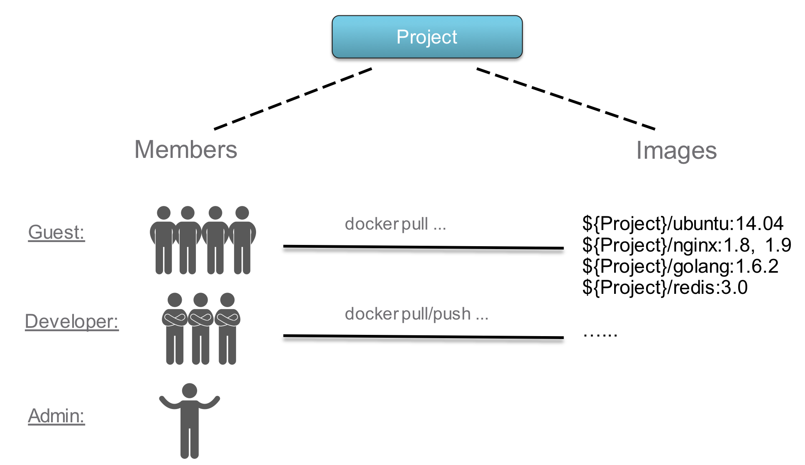

# 项目管理

- [项目管理](#项目管理)
  - [Project](#project)
  - [RBAC](#rbac)
    - [角色](#角色)
    - [角色权限列表](#角色权限列表)
  - [一般流程](#一般流程)
  - [相关api](#相关api)
    - [Project](#project-1)
    - [Member](#member)


## Project

Harbor 中的 Project 包含了所有应用存储库, 但是需注意：不允许在 Project 创建之前 Push 镜像到 Harbor

Harbor 提供一套应用于 Project 的 RBAC,

Habor 支持全局 CVE 以及项目级别的CVE，分别由 Harbor Admin 指定 / Project Admin在创建时指定

[其他详细说明](https://goharbor.io/docs/2.7.0/working-with-projects/create-projects/)

> CVE（Common Vulnerabilities and Exposures）的全称是公共漏洞和暴露，是公开披露的网络安全漏洞列表, 通过设置 CVE list 可以一定程度上提供安全保证

Project 类型
- Public: 任何用户都可以从此 project 中拉取镜像
- Private: 只能被 project 中的成员拉取

> 除此之外，Harbor v2.1.1 还支持 proxy cache project, 允许通过指定一个其他仓库中的项目地址，来创建在 Harbor中的 proxy cache
> 只有 Harbor Admin 可以创建 proxy cache project
> [参考](https://goharbor.io/docs/2.7.0/administration/configure-proxy-cache/)

## RBAC

### 角色

Limited Guest:
- 没有对于 project 读的完全权限。能够 pull 镜像但不能 push，同时也无法查看 log  或者 project 中的其他成员
- A Limited Guest does not have full read privileges for a project. They can pull images but cannot push, and they cannot see logs or the other members of a project. For example, you can create limited guests for users from different organizations who share access to a project.

Guest:
- 有对特定 project 的只读权限。可以 pull 或者 retag 镜像，但不能 push
- Guest has read-only privilege for a specified project. They can pull and retag images, but cannot push.

Developer:
- 拥有对 project 的读/写权限
- Developer has read and write privileges for a project.

Maintainer:
- 拥有比 Developer 更高的权限，包括扫描镜像、查看副本作业以及删除镜像与helm charts
- Maintainer has elevated permissions beyond those of ‘Developer’ including the ability to scan images, view replications jobs, and delete images and helm charts.

ProjectAdmin:
- 创建项目时自动成为 ProjectAdmin。除 读写权限 以外，还有管理权限，如成员管理，启动漏洞扫描等
- When creating a new project, you will be assigned the “ProjectAdmin” role to the project. Besides read-write privileges, the “ProjectAdmin” also has some management privileges, such as adding and removing members, starting a vulnerability scan.

Harbor system administrator:
- 拥有最高权限，能够查看任何 project，或对普通用户赋予 admin 权限
- “Harbor system administrator” has the most privileges. In addition to the privileges mentioned above, “Harbor system administrator” can also list all projects, set an ordinary user as administrator, delete users and set vulnerability scan policy for all images. The public project “library” is also owned by the administrator.

Anonymous: 
- 未登陆的用户可以匿名访问，但只能访问 public projects
- When a user is not logged in, the user is considered as an “Anonymous” user. An anonymous user has no access to private projects and has read-only access to public projects



**角色编号对照**

|     Role      | Code  |
| :-----------: | :---: |
| Limited Guest |   5   |
|  Maintainer   |   4   |
|     Guest     |   3   |
|   Developer   |   2   |
| Project Admin |   1   |

### 角色权限列表

|                  Action                  | Limited Guest | Guest | Developer | Maintainer | Project Admin |
| :--------------------------------------: | :-----------: | :---: | :-------: | :--------: | :-----------: |
|      See the project configurations      |       ✓       |   ✓   |     ✓     |     ✓      |       ✓       |
|     Edit the project configurations      |               |       |           |            |       ✓       |
|      See a list of project members       |               |   ✓   |     ✓     |     ✓      |       ✓       |
|    Create/edit/delete project members    |               |       |           |            |       ✓       |
|        See a list of project logs        |               |   ✓   |     ✓     |     ✓      |       ✓       |
|    See a list of project replications    |               |       |           |     ✓      |       ✓       |
|  See a list of project replication jobs  |               |       |           |            |       ✓       |
|       See a list of project labels       |               |       |           |     ✓      |       ✓       |
|    Create/edit/delete project labels     |               |       |           |     ✓      |       ✓       |
|        See a list of repositories        |       ✓       |   ✓   |     ✓     |     ✓      |       ✓       |
|           Create repositories            |               |       |     ✓     |     ✓      |       ✓       |
|         Edit/delete repositories         |               |       |           |     ✓      |       ✓       |
|           See a list of images           |       ✓       |   ✓   |     ✓     |     ✓      |       ✓       |
|               Retag image                |               |   ✓   |     ✓     |     ✓      |       ✓       |
|                Pull image                |       ✓       |   ✓   |     ✓     |     ✓      |       ✓       |
|                Push image                |               |       |     ✓     |     ✓      |       ✓       |
|            Scan/delete image             |               |       |           |     ✓      |       ✓       |
|          Add scanners to Harbor          |               |       |           |            |               |
|        Edit scanners in projects         |               |       |           |            |       ✓       |
|   See a list of image vulnerabilities    |       ✓       |   ✓   |     ✓     |     ✓      |       ✓       |
|  Create list of project vulnerabilities  |               |       |     ✓     |     ✓      |       ✓       |
|   Read list of project vulnerabilities   |               |       |     ✓     |     ✓      |       ✓       |
|  Export list of project vulnerabilities  |               |       |     ✓     |     ✓      |       ✓       |
|         See image build history          |       ✓       |   ✓   |     ✓     |     ✓      |       ✓       |
|        Add/Remove labels of image        |               |       |     ✓     |     ✓      |       ✓       |
|        See a list of helm charts         |       ✓       |   ✓   |     ✓     |     ✓      |       ✓       |
|           Download helm charts           |       ✓       |   ✓   |     ✓     |     ✓      |       ✓       |
|            Upload helm charts            |               |       |     ✓     |     ✓      |       ✓       |
|            Delete helm charts            |               |       |           |     ✓      |       ✓       |
|    See a list of helm chart versions     |       ✓       |   ✓   |     ✓     |     ✓      |       ✓       |
|       Download helm chart versions       |       ✓       |   ✓   |     ✓     |     ✓      |       ✓       |
|        Upload helm chart versions        |               |       |     ✓     |     ✓      |       ✓       |
|        Delete helm chart versions        |               |       |           |     ✓      |       ✓       |
| Add/Remove labels of helm chart version  |               |       |     ✓     |     ✓      |       ✓       |
|       See a list of project robots       |               |       |           |     ✓      |       ✓       |
|    Create/edit/delete project robots     |               |       |           |            |       ✓       |
|       See configured CVE allowlist       |       ✓       |   ✓   |     ✓     |     ✓      |       ✓       |
|     Create/edit/remove CVE allowlist     |               |       |           |            |       ✓       |
|           View webhook events            |               |       |           |     ✓      |       ✓       |
|          Add new webhook events          |               |       |           |            |       ✓       |
|        Enable/deactivate webhooks        |               |       |           |            |       ✓       |
|    Create/delete tag retention rules     |               |       |     ✓     |     ✓      |       ✓       |
|  Enable/deactivate tag retention rules   |    cluscl     |       |     ✓     |     ✓      |       ✓       |
|   Create/delete tag immutability rules   |               |       |           |     ✓      |       ✓       |
| Enable/deactivate tag immutability rules |               |       |           |     ✓      |       ✓       |
|            See project quotas            |       ✓       |   ✓   |     ✓     |     ✓      |       ✓       |
|          Edit project quotas *           |               |       |           |            |               |
|              Delete Project              |               |       |           |            |       ✓       |

## 一般流程

1. 用户创建 Project, 默认成为 Project Admin
2. Projecct Admin 可以将其他用户加入到当前 Project, 并赋予特定的权限
3. Project Admin 可以对Project进行管理，也可以对 Project 中的用户，用户的权限进行管理

## 相关api

### Project

**创建 Project**

```go
func TestCreatePublicProject(t *testing.T) {
	cli := newHarborUserCli(t, userBar, examplePassword)

	err := cli.NewProject(
		ctx,
		&model.ProjectReq{
			Metadata: &model.ProjectMetadata{
        // 是否公开
				Public: "true",
			},
			ProjectName: exampleProjectName,
		},
	)

	if err != nil {
		t.Fatal(err)
	}

}
```

**删除 Project**

```go
func TestDeleteProject(t *testing.T) {
	cli := newHarborUserCli(t, userBar, examplePassword)

	err := cli.DeleteProject(
		ctx,
		exampleProjectName,
	)

	if err != nil {
		t.Fatal(err)
	}

	bool, err := cli.ProjectExists(ctx, exampleProjectName)
	if err != nil {
		t.Fatal(err)
	}

	assert.Equal(t, false, bool)
}
```

**检索 Project**

```go
func TestGetProject(t *testing.T) {
	cli := newHarborUserCli(t, userBar, examplePassword)

	project, err := cli.GetProject(ctx, exampleProjectName)
	if err != nil {
		t.Fatal(err)
	}

	assert.Equal(t, project.Name, exampleProjectName)

	bt, _ := json.MarshalIndent(project, "", "	")
	fmt.Println(string(bt))
}
```

### Member

**增加成员**

```go
func TestAddMemeber(t *testing.T) {
	cli := newHarborUserCli(t, userBar, examplePassword)

	// The role id 1 for projectAdmin, 2 for developer, 3 for guest, 4 for maintainer, 5 for limited guest
	err := cli.AddProjectMember(
		ctx,
		exampleProjectName,
		&model.ProjectMember{
			MemberUser: &model.UserEntity{
				Username: userFoo,
			},
			RoleID: 5,
		},
	)

	if err != nil {
		t.Error(err)
	}
}
```

**移除成员**

```go
func TestDeleteProjectMemeber(t *testing.T) {
	cli := newHarborUserCli(t, userBar, examplePassword)

	err := cli.DeleteProjectMember(
		ctx,
		exampleProjectName,
		&model.ProjectMember{
			MemberUser: &model.UserEntity{
				Username: userFoo,
			},
		},
	)

	if err != nil {
		t.Error(err)
	}
}
```

**检索成员**

```go
func TestListProjectMembers(t *testing.T) {
	cli := newHarborUserCli(t, userBar, examplePassword)

	pmes, err := cli.ListProjectMembers(ctx, exampleProjectName, "")
	if err != nil {
		t.Fatal(err)
	}

	for _, pme := range pmes {
		bt, _ := json.MarshalIndent(pme, "", "	")
		fmt.Println(string(bt))
	}
}
```

**修改成员权限**

```go
func TestUpdateProjectMember(t *testing.T) {
	cli := newHarborUserCli(t, userBar, examplePassword)

	err := cli.UpdateProjectMember(
		ctx,
		exampleProjectName,
		&model.ProjectMember{
			MemberUser: &model.UserEntity{
				Username: userFoo,
			},
      // 重新设置成员权限
			RoleID: 4,
		},
	)

	if err != nil {
		t.Fatal(err)
	}
}
```


[project测试](https://github.com/mittwald/goharbor-client/blob/master/apiv2/pkg/clients/project/project_test.go)

