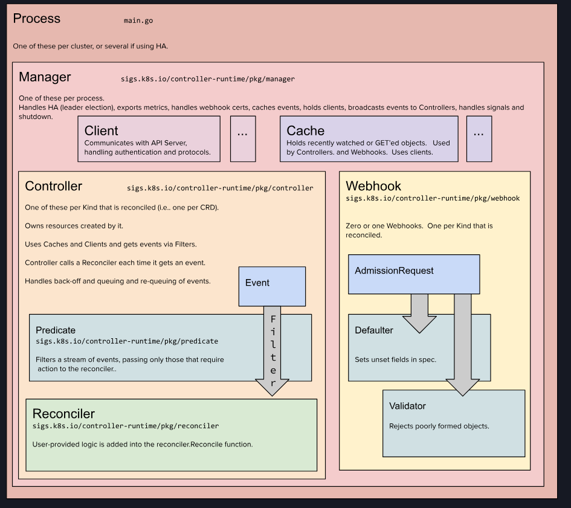

# kubebuilder

[kubebuilder github](https://github.com/kubernetes-sigs/kubebuilder)
[operator sdk](https://sdk.operatorframework.io/)

## quick start

下载 kubebuilder

```shell
curl -L -o kubebuilder https://go.kubebuilder.io/dl/latest/$(go env GOOS)/$(go env GOARCH)
```

Operator Arch



## Tutorial

k8s 使和谐 Resource 在 Spec 中定义的状态 与 集群中实际的状态(以及其他object的状态)和外部状态 来实现其功能。因此每个功能对象都包括了 spec 和 status。而一些对象如 configMap 则不遵从此模式，因为他们没有所期望的状态

```go
type CronJob struct {
    // 描述了 API verion 和 Kind
	metav1.TypeMeta   `json:",inline"`
    // 包括 name, namespace, labels 等
	metav1.ObjectMeta `json:"metadata,omitempty"`

	Spec   CronJobSpec   `json:"spec,omitempty"`
	Status CronJobStatus `json:"status,omitempty"`
}
``