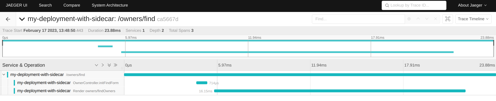
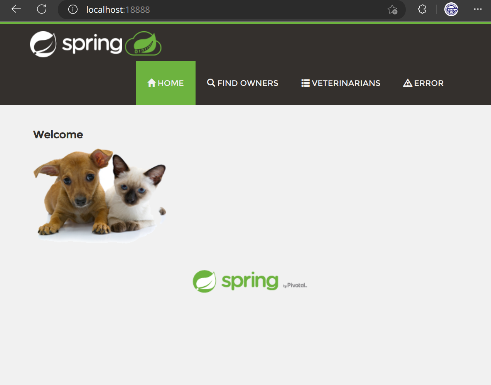

# OpenTelementry

## Helm部署

### CertManager

k8s 中的证书管理服务，为 https 提供基础支撑

[使用 helm 安装 cert-manager](https://cert-manager.io/docs/installation/helm/)

### Otel Operator

[helm-otel](https://github.com/open-telemetry/opentelemetry-helm-charts/tree/main/charts/opentelemetry-operator#opentelemetry-operator-helm-chart)

Otel Opertor (opentelemetry.io/v1alpha1) 管理两种 k8s crd
- OpenTelemetryCollector：定义 collector 收集/处理/转发 telemetry数据的逻辑
- Instrumentation: 为特定语言(Python, NodeJS and Java)设置 auto-instrumentation

#### Collector部署形式

[reference](https://dev.to/ashokan/otel-operator-to-simplify-observability-on-kubernetes-1eo7)

Deployment(default)
DaemonSet
SideCar


### 容器清单

**helm chart**

cert-manager-v1.11.0.tgz

**images**

|                                 orgin                                  |             replace             | version |
| :--------------------------------------------------------------------: | :-----------------------------: | :-----: |
|                 quay.io/jetstack/cert-manager-webhook                  |  tetrate/cert-manager-webhook   | v1.11.0 |
|                quay.io/jetstack/cert-manager-cainjector                | tetrate/cert-manager-cainjector | v1.11.0 |
|                quay.io/jetstack/cert-manager-controller                | tetrate/cert-manager-controller | v1.11.0 |
|                   quay.io/jetstack/cert-manager-ctl                    |    tetrate/cert-manager-ctl     | v1.11.0 |
|                                                                        |                                 |         |
|  ghcr.io/open-telemetry/opentelemetry-operator/opentelemetry-operator  |                -                | v0.69.0 |
| ghcr.io/open-telemetry/opentelemetry-operator/autoinstrumentation-java |                -                | 1.22.1  |
|                  otel/opentelemetry-collector-contrib                  |                -                | 0.71.0  |
|                                                                        |                                 |         |
|                  ghcr.io/pavolloffay/spring-petclinic                  |                -                | latest  |


## 配置

[otel-collector配置](https://opentelemetry.io/docs/collector/configuration/)

[otel-auto-instrumentation配置](https://opentelemetry.io/docs/k8s-operator/automatic/)

[auto-instrument支持列表](https://opentelemetry.io/docs/instrumentation/java/automatic/agent-config/#suppressing-specific-auto-instrumentation)

[otel-exporter配置](https://github.com/open-telemetry/opentelemetry-collector/blob/main/exporter/otlphttpexporter/README.md)
[otel-exporter-tls配置](https://github.com/open-telemetry/opentelemetry-collector/blob/main/config/configtls/README.md)

```yaml
# example collector
apiVersion: opentelemetry.io/v1alpha1
kind: OpenTelemetryCollector
metadata:
  name: sidecar
spec:
  mode: sidecar
  config: |
    receivers:
      otlp:
        protocols:
          grpc:
          http:
    processors:
    exporters:
      logging:
      jaeger:
        endpoint: "jaeger-all-in-one-svc:14250"
        tls:
          insecure: true
    service:
      pipelines:
        traces:
          receivers: [otlp]
          processors: []
          exporters: [logging,jaeger]

```

## 示例

[示例java应用](https://github.com/spring-projects/spring-petclinic)
[spring tracing](https://reflectoring.io/spring-boot-tracing)