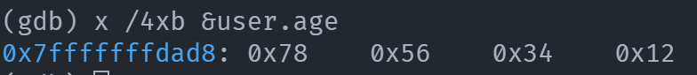

# Gdb内存分析

## 变量地址打印

```
(gdb) print &user
```

## 查看内存

```
(gdb) x /4xb &user.age
```

- 大小端判断
  - 大端: 数字低位存放在低地址
  - 小端: 数字低位存放在高地址




- [gdb查看内存](http://c.biancheng.net/view/7470.html)
- [gdb内存分析](https://www.cnblogs.com/azhao/p/12074656.html)