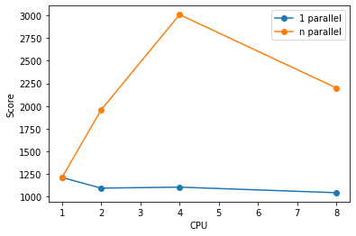

# BenchMark实验报告

- [BenchMark实验报告](#benchmark实验报告)
  - [一、实验内容](#一实验内容)
  - [二、实验准备](#二实验准备)
    - [(1) benchmark分析](#1-benchmark分析)
  - [三、实验记录](#三实验记录)
    - [(1) 宿主机 bench mark](#1-宿主机-bench-mark)
    - [(2) 嵌套虚拟化主机 bench mark](#2-嵌套虚拟化主机-bench-mark)
      - [1. 配置(VCPU:MM = 1:1024)](#1-配置vcpumm--11024)
      - [2. 配置(VCPU:MM = 2:2048)](#2-配置vcpumm--22048)
      - [3. 配置(VCPU:MM = 4:4096)](#3-配置vcpumm--44096)
      - [4. 配置(VCPU:MM = 8:8192)](#4-配置vcpumm--88192)
      - [5. 配置(VCPU:MM = 4:8192)](#5-配置vcpumm--48192)
    - [(3) 实验结果汇总](#3-实验结果汇总)
  - [四、实验分析](#四实验分析)
    - [(1) 宿主虚拟机与嵌套虚拟机性能比较](#1-宿主虚拟机与嵌套虚拟机性能比较)
    - [(2) 不同配置的嵌套虚拟机性能比较](#2-不同配置的嵌套虚拟机性能比较)

## 一、实验内容

- 分析嵌套虚拟化的benchmark
- 对比分析嵌套虚拟机和宿主机的benchmark测试结果
- 分析不同配置的CPU和内存虚拟机的unixbench

## 二、实验准备

### (1) benchmark分析

实验中使用的 Byte Unix Benchmarks 进行嵌套虚拟化虚拟机的性能评估, 其本身有多个测试项目组成，分别是

1. Dhrystone测试
  - 测试聚焦在字符串处理，没有浮点运算操作
  - 这个测试用于测试链接器编译、代码优化、内存缓存、等待状态、整数数据类型等，硬件和软件设计都会非常大的影响测试结果
2. Whetstone 测试
  - 这项测试项目用于测试浮点运算效率和速度
  - 这项测试项目包含若干个科学计算的典型性能模块，包含大量的C语言函数,sin cos sqrt exp和日志以及使用整数和浮点的数学操作
  - 包含数组访问、条件分支和过程调用
3. Execl Throughput测试
   - 这项测试测试每秒execl函数调用次数
   - execl是 exec函数家族的一部分，使用新的图形处理代替当前的图形处理
   - 有许多命令和前端的execve()函数命令非常相似
4. File Copy测试
   - 这项测试衡量文件数据从一个文件被传输到另外一个，使用大量的缓存
   - 包括文件的读、写、复制测试，测试指标是一定时间内（默认是10秒）被重写、读、复制的字符数量
5. Pipe Throughput（管道吞吐）测试
   - pipe是简单的进程之间的通讯
   - 管道吞吐测试是测试在一秒钟一个进程写512比特到一个管道中并且读回来的次数
   - 管道吞吐测试和实际编程有差距
6. Pipe-based Context Switching （基于管道的上下文交互）测试
   - 这项测试衡量两个进程通过管道交换和整数倍的增加吞吐的次数
   - 基于管道的上下文切换和真实程序很类似
   - 测试程序产生一个双向管道通讯的子线程。
7. Process Creation(进程创建)测试
   - 这项测试衡量一个进程能产生子线程并且立即退出的次数
   - 新进程真的创建进程阻塞和内存占用，所以测试程序直接使用内存带宽
   - 这项测试用于典型的比较大量的操作系统进程创建操作
8. Shell Scripts测试
   - shell脚本测试用于衡量在一分钟内，一个进程可以启动并停止shell脚本的次数
   - 通常会测试1，2， 3， 4， 8 个shell脚本的共同拷贝
   - shell脚本是一套转化数据文件的脚本
9. System Call Overhead （系统调用消耗）测试
   - 这项测试衡量进入和离开系统内核的消耗，例如，系统调用的消耗
   - 程序简单重复的执行getpid调用（返回调用的进程id）
   - 耗的指标是调用进入和离开内核的执行时间

所有测试项目完成之后能够得到一个综合测试结果的得分，一般而言，此分数高于1000则说明VPS性能较好

## 三、实验记录

### (1) 宿主机 bench mark

   BYTE UNIX Benchmarks (Version 5.1.3)

   System: server-agi7sigd: GNU/Linux
   OS: GNU/Linux -- 5.8.0-63-generic -- #71-Ubuntu SMP Tue Jul 13 15:59:12 UTC 2021
   Machine: x86_64 (x86_64)
   Language: en_US.utf8 (charmap="UTF-8", collate="UTF-8")
   CPU 0: Intel(R) Xeon(R) Platinum 8163 CPU @ 2.50GHz (5000.0 bogomips)
          x86-64, MMX, Physical Address Ext, SYSENTER/SYSEXIT, SYSCALL/SYSRET, Intel virtualization
   CPU 1: Intel(R) Xeon(R) Platinum 8163 CPU @ 2.50GHz (5000.0 bogomips)
          x86-64, MMX, Physical Address Ext, SYSENTER/SYSEXIT, SYSCALL/SYSRET, Intel virtualization
   CPU 2: Intel(R) Xeon(R) Platinum 8163 CPU @ 2.50GHz (5000.0 bogomips)
          x86-64, MMX, Physical Address Ext, SYSENTER/SYSEXIT, SYSCALL/SYSRET, Intel virtualization
   CPU 3: Intel(R) Xeon(R) Platinum 8163 CPU @ 2.50GHz (5000.0 bogomips)
          x86-64, MMX, Physical Address Ext, SYSENTER/SYSEXIT, SYSCALL/SYSRET, Intel virtualization
   14:26:31 up 5 days,  5:03,  1 user,  load average: 0.00, 0.00, 0.00; runlevel 2022-01-10

------------------------------------------------------------------------
Benchmark Run: 六 1月 15 2022 14:26:31 - 14:54:58
4 CPUs in system; running 1 parallel copy of tests

Dhrystone 2 using register variables       34053298.8 lps   (10.0 s, 7 samples)
Double-Precision Whetstone                     5806.4 MWIPS (9.5 s, 7 samples)
Execl Throughput                               2867.6 lps   (29.6 s, 2 samples)
File Copy 1024 bufsize 2000 maxblocks        534399.9 KBps  (30.0 s, 2 samples)
File Copy 256 bufsize 500 maxblocks          138947.1 KBps  (30.0 s, 2 samples)
File Copy 4096 bufsize 8000 maxblocks       1748545.7 KBps  (30.0 s, 2 samples)
Pipe Throughput                              704975.9 lps   (10.0 s, 7 samples)
Pipe-based Context Switching                 104907.9 lps   (10.0 s, 7 samples)
Process Creation                               7063.7 lps   (30.0 s, 2 samples)
Shell Scripts (1 concurrent)                   7044.0 lpm   (60.0 s, 2 samples)
Shell Scripts (8 concurrent)                   1659.5 lpm   (60.0 s, 2 samples)
System Call Overhead                         421055.0 lps   (10.0 s, 7 samples)

System Benchmarks Index Values               BASELINE       RESULT    INDEX
Dhrystone 2 using register variables         116700.0   34053298.8   2918.0
Double-Precision Whetstone                       55.0       5806.4   1055.7
Execl Throughput                                 43.0       2867.6    666.9
File Copy 1024 bufsize 2000 maxblocks          3960.0     534399.9   1349.5
File Copy 256 bufsize 500 maxblocks            1655.0     138947.1    839.6
File Copy 4096 bufsize 8000 maxblocks          5800.0    1748545.7   3014.7
Pipe Throughput                               12440.0     704975.9    566.7
Pipe-based Context Switching                   4000.0     104907.9    262.3
Process Creation                                126.0       7063.7    560.6
Shell Scripts (1 concurrent)                     42.4       7044.0   1661.3
Shell Scripts (8 concurrent)                      6.0       1659.5   2765.8
System Call Overhead                          15000.0     421055.0    280.7
                                                                   ========
System Benchmarks Index Score                                         976.8

------------------------------------------------------------------------
Benchmark Run: 六 1月 15 2022 14:54:58 - 15:23:29
4 CPUs in system; running 4 parallel copies of tests

Dhrystone 2 using register variables      138826197.5 lps   (10.0 s, 7 samples)
Double-Precision Whetstone                    23139.4 MWIPS (9.6 s, 7 samples)
Execl Throughput                               9665.5 lps   (29.8 s, 2 samples)
File Copy 1024 bufsize 2000 maxblocks        782234.5 KBps  (30.0 s, 2 samples)
File Copy 256 bufsize 500 maxblocks          231191.3 KBps  (30.0 s, 2 samples)
File Copy 4096 bufsize 8000 maxblocks       2578689.9 KBps  (30.0 s, 2 samples)
Pipe Throughput                             2829865.0 lps   (10.0 s, 7 samples)
Pipe-based Context Switching                 384213.3 lps   (10.0 s, 7 samples)
Process Creation                              26951.8 lps   (30.0 s, 2 samples)
Shell Scripts (1 concurrent)                  17194.3 lpm   (60.0 s, 2 samples)
Shell Scripts (8 concurrent)                   2463.3 lpm   (60.0 s, 2 samples)
System Call Overhead                        1505110.5 lps   (10.0 s, 7 samples)

System Benchmarks Index Values               BASELINE       RESULT    INDEX
Dhrystone 2 using register variables         116700.0  138826197.5  11896.0
Double-Precision Whetstone                       55.0      23139.4   4207.2
Execl Throughput                                 43.0       9665.5   2247.8
File Copy 1024 bufsize 2000 maxblocks          3960.0     782234.5   1975.3
File Copy 256 bufsize 500 maxblocks            1655.0     231191.3   1396.9
File Copy 4096 bufsize 8000 maxblocks          5800.0    2578689.9   4446.0
Pipe Throughput                               12440.0    2829865.0   2274.8
Pipe-based Context Switching                   4000.0     384213.3    960.5
Process Creation                                126.0      26951.8   2139.0
Shell Scripts (1 concurrent)                     42.4      17194.3   4055.3
Shell Scripts (8 concurrent)                      6.0       2463.3   4105.5
System Call Overhead                          15000.0    1505110.5   1003.4
                                                                   ========
System Benchmarks Index Score                                        2626.5

### (2) 嵌套虚拟化主机 bench mark

#### 1. 配置(VCPU:MM = 1:1024)

   BYTE UNIX Benchmarks (Version 5.1.3)

   System: (none): Linux
   OS: Linux -- 4.20.0 -- #5 SMP Wed Dec 22 14:54:01 CST 2021
   Machine: x86_64 (unknown)
   Language: en_US.utf8 (charmap=, collate=)
   CPU 0: Intel(R) Xeon(R) Processor @ 2.50GHz (5000.0 bogomips)
          x86-64, MMX, Physical Address Ext, SYSENTER/SYSEXIT, SYSCALL/SYSRET, Intel virtualization
   07:49:39 up 0 min,  load average: 0.00, 0.00, 0.00; runlevel 

------------------------------------------------------------------------
Benchmark Run: Sat Jan 15 2022 07:49:40 - 08:17:43
1 CPU in system; running 1 parallel copy of tests

Dhrystone 2 using register variables       25091876.2 lps   (10.0 s, 7 samples)
Double-Precision Whetstone                     5410.3 MWIPS (9.5 s, 7 samples)
Execl Throughput                               8310.1 lps   (29.8 s, 2 samples)
File Copy 1024 bufsize 2000 maxblocks        666291.5 KBps  (30.0 s, 2 samples)
File Copy 256 bufsize 500 maxblocks          179302.7 KBps  (30.0 s, 2 samples)
File Copy 4096 bufsize 8000 maxblocks       2113014.3 KBps  (30.0 s, 2 samples)
Pipe Throughput                              914140.7 lps   (10.0 s, 7 samples)
Pipe-based Context Switching                 106413.6 lps   (10.0 s, 7 samples)
Process Creation                              14230.3 lps   (30.0 s, 2 samples)
Shell Scripts (1 concurrent)                   8361.7 lpm   (60.0 s, 2 samples)
Shell Scripts (8 concurrent)                   1134.1 lpm   (60.0 s, 2 samples)
System Call Overhead                         657606.1 lps   (10.0 s, 7 samples)

System Benchmarks Index Values               BASELINE       RESULT    INDEX
Dhrystone 2 using register variables         116700.0   25091876.2   2150.1
Double-Precision Whetstone                       55.0       5410.3    983.7
Execl Throughput                                 43.0       8310.1   1932.6
File Copy 1024 bufsize 2000 maxblocks          3960.0     666291.5   1682.6
File Copy 256 bufsize 500 maxblocks            1655.0     179302.7   1083.4
File Copy 4096 bufsize 8000 maxblocks          5800.0    2113014.3   3643.1
Pipe Throughput                               12440.0     914140.7    734.8
Pipe-based Context Switching                   4000.0     106413.6    266.0
Process Creation                                126.0      14230.3   1129.4
Shell Scripts (1 concurrent)                     42.4       8361.7   1972.1
Shell Scripts (8 concurrent)                      6.0       1134.1   1890.2
System Call Overhead                          15000.0     657606.1    438.4
                                                                   ========
System Benchmarks Index Score                                        1209.4

#### 2. 配置(VCPU:MM = 2:2048)

   BYTE UNIX Benchmarks (Version 5.1.3)

   System: (none): Linux
   OS: Linux -- 4.20.0 -- #5 SMP Wed Dec 22 14:54:01 CST 2021
   Machine: x86_64 (unknown)
   Language: en_US.utf8 (charmap=, collate=)
   CPU 0: Intel(R) Xeon(R) Processor @ 2.50GHz (5000.0 bogomips)
          Hyper-Threading, x86-64, MMX, Physical Address Ext, SYSENTER/SYSEXIT, SYSCALL/SYSRET, Intel virtualization
   CPU 1: Intel(R) Xeon(R) Processor @ 2.50GHz (5000.0 bogomips)
          Hyper-Threading, x86-64, MMX, Physical Address Ext, SYSENTER/SYSEXIT, SYSCALL/SYSRET, Intel virtualization
   09:01:37 up 0 min,  load average: 0.00, 0.00, 0.00; runlevel 

------------------------------------------------------------------------
Benchmark Run: Sat Jan 15 2022 09:01:38 - 09:29:41
2 CPUs in system; running 1 parallel copy of tests

Dhrystone 2 using register variables       25192719.7 lps   (10.0 s, 7 samples)
Double-Precision Whetstone                     5481.9 MWIPS (9.3 s, 7 samples)
Execl Throughput                               7515.9 lps   (29.9 s, 2 samples)
File Copy 1024 bufsize 2000 maxblocks        631739.5 KBps  (30.0 s, 2 samples)
File Copy 256 bufsize 500 maxblocks          167517.6 KBps  (30.0 s, 2 samples)
File Copy 4096 bufsize 8000 maxblocks       1961336.6 KBps  (30.0 s, 2 samples)
Pipe Throughput                              861509.7 lps   (10.0 s, 7 samples)
Pipe-based Context Switching                  62130.1 lps   (10.0 s, 7 samples)
Process Creation                               6348.4 lps   (30.0 s, 2 samples)
Shell Scripts (1 concurrent)                   8119.0 lpm   (60.0 s, 2 samples)
Shell Scripts (8 concurrent)                   1836.6 lpm   (60.0 s, 2 samples)
System Call Overhead                         659359.7 lps   (10.0 s, 7 samples)

System Benchmarks Index Values               BASELINE       RESULT    INDEX
Dhrystone 2 using register variables         116700.0   25192719.7   2158.8
Double-Precision Whetstone                       55.0       5481.9    996.7
Execl Throughput                                 43.0       7515.9   1747.9
File Copy 1024 bufsize 2000 maxblocks          3960.0     631739.5   1595.3
File Copy 256 bufsize 500 maxblocks            1655.0     167517.6   1012.2
File Copy 4096 bufsize 8000 maxblocks          5800.0    1961336.6   3381.6
Pipe Throughput                               12440.0     861509.7    692.5
Pipe-based Context Switching                   4000.0      62130.1    155.3
Process Creation                                126.0       6348.4    503.8
Shell Scripts (1 concurrent)                     42.4       8119.0   1914.9
Shell Scripts (8 concurrent)                      6.0       1836.6   3061.0
System Call Overhead                          15000.0     659359.7    439.6
                                                                   ========
System Benchmarks Index Score                                        1091.8

------------------------------------------------------------------------
Benchmark Run: Sat Jan 15 2022 09:29:41 - 09:57:45
2 CPUs in system; running 2 parallel copies of tests

Dhrystone 2 using register variables       51000391.4 lps   (10.0 s, 7 samples)
Double-Precision Whetstone                    11027.8 MWIPS (9.5 s, 7 samples)
Execl Throughput                              13347.3 lps   (29.7 s, 2 samples)
File Copy 1024 bufsize 2000 maxblocks        948604.6 KBps  (30.0 s, 2 samples)
File Copy 256 bufsize 500 maxblocks          239048.0 KBps  (30.0 s, 2 samples)
File Copy 4096 bufsize 8000 maxblocks       3024500.7 KBps  (30.0 s, 2 samples)
Pipe Throughput                             1750151.2 lps   (10.0 s, 7 samples)
Pipe-based Context Switching                 208047.2 lps   (10.0 s, 7 samples)
Process Creation                              14806.4 lps   (30.0 s, 2 samples)
Shell Scripts (1 concurrent)                  12175.1 lpm   (60.0 s, 2 samples)
Shell Scripts (8 concurrent)                   1942.1 lpm   (60.0 s, 2 samples)
System Call Overhead                        1211906.5 lps   (10.0 s, 7 samples)

System Benchmarks Index Values               BASELINE       RESULT    INDEX
Dhrystone 2 using register variables         116700.0   51000391.4   4370.2
Double-Precision Whetstone                       55.0      11027.8   2005.1
Execl Throughput                                 43.0      13347.3   3104.0
File Copy 1024 bufsize 2000 maxblocks          3960.0     948604.6   2395.5
File Copy 256 bufsize 500 maxblocks            1655.0     239048.0   1444.4
File Copy 4096 bufsize 8000 maxblocks          5800.0    3024500.7   5214.7
Pipe Throughput                               12440.0    1750151.2   1406.9
Pipe-based Context Switching                   4000.0     208047.2    520.1
Process Creation                                126.0      14806.4   1175.1
Shell Scripts (1 concurrent)                     42.4      12175.1   2871.5
Shell Scripts (8 concurrent)                      6.0       1942.1   3236.8
System Call Overhead                          15000.0    1211906.5    807.9
                                                                   ========
System Benchmarks Index Score                                        1957.7

#### 3. 配置(VCPU:MM = 4:4096)

   BYTE UNIX Benchmarks (Version 5.1.3)

   System: (none): Linux
   OS: Linux -- 4.20.0 -- #5 SMP Wed Dec 22 14:54:01 CST 2021
   Machine: x86_64 (unknown)
   Language: en_US.utf8 (charmap=, collate=)
   CPU 0: Intel(R) Xeon(R) Processor @ 2.50GHz (5000.0 bogomips)
          Hyper-Threading, x86-64, MMX, Physical Address Ext, SYSENTER/SYSEXIT, SYSCALL/SYSRET, Intel virtualization
   CPU 1: Intel(R) Xeon(R) Processor @ 2.50GHz (5000.0 bogomips)
          Hyper-Threading, x86-64, MMX, Physical Address Ext, SYSENTER/SYSEXIT, SYSCALL/SYSRET, Intel virtualization
   CPU 2: Intel(R) Xeon(R) Processor @ 2.50GHz (5000.0 bogomips)
          Hyper-Threading, x86-64, MMX, Physical Address Ext, SYSENTER/SYSEXIT, SYSCALL/SYSRET, Intel virtualization
   CPU 3: Intel(R) Xeon(R) Processor @ 2.50GHz (5000.0 bogomips)
          Hyper-Threading, x86-64, MMX, Physical Address Ext, SYSENTER/SYSEXIT, SYSCALL/SYSRET, Intel virtualization
   14:19:01 up 0 min,  load average: 0.00, 0.00, 0.00; runlevel 

------------------------------------------------------------------------
Benchmark Run: Sat Jan 15 2022 14:19:01 - 14:47:07
4 CPUs in system; running 1 parallel copy of tests

Dhrystone 2 using register variables       25185487.4 lps   (10.0 s, 7 samples)
Double-Precision Whetstone                     5419.4 MWIPS (9.8 s, 7 samples)
Execl Throughput                               7667.0 lps   (30.0 s, 2 samples)
File Copy 1024 bufsize 2000 maxblocks        622904.7 KBps  (30.0 s, 2 samples)
File Copy 256 bufsize 500 maxblocks          162423.6 KBps  (30.0 s, 2 samples)
File Copy 4096 bufsize 8000 maxblocks       1964216.8 KBps  (30.0 s, 2 samples)
Pipe Throughput                              860504.9 lps   (10.0 s, 7 samples)
Pipe-based Context Switching                  80655.8 lps   (10.0 s, 7 samples)
Process Creation                               5007.7 lps   (30.0 s, 2 samples)
Shell Scripts (1 concurrent)                   6216.2 lpm   (60.0 s, 2 samples)
Shell Scripts (8 concurrent)                   2703.6 lpm   (60.0 s, 2 samples)
System Call Overhead                         666279.6 lps   (10.0 s, 7 samples)

System Benchmarks Index Values               BASELINE       RESULT    INDEX
Dhrystone 2 using register variables         116700.0   25185487.4   2158.1
Double-Precision Whetstone                       55.0       5419.4    985.4
Execl Throughput                                 43.0       7667.0   1783.0
File Copy 1024 bufsize 2000 maxblocks          3960.0     622904.7   1573.0
File Copy 256 bufsize 500 maxblocks            1655.0     162423.6    981.4
File Copy 4096 bufsize 8000 maxblocks          5800.0    1964216.8   3386.6
Pipe Throughput                               12440.0     860504.9    691.7
Pipe-based Context Switching                   4000.0      80655.8    201.6
Process Creation                                126.0       5007.7    397.4
Shell Scripts (1 concurrent)                     42.4       6216.2   1466.1
Shell Scripts (8 concurrent)                      6.0       2703.6   4506.1
System Call Overhead                          15000.0     666279.6    444.2
                                                                   ========
System Benchmarks Index Score                                        1102.5

------------------------------------------------------------------------
Benchmark Run: Sat Jan 15 2022 14:47:07 - 15:15:13
4 CPUs in system; running 4 parallel copies of tests

Dhrystone 2 using register variables      102395724.7 lps   (10.0 s, 7 samples)
Double-Precision Whetstone                    22218.4 MWIPS (9.8 s, 7 samples)
Execl Throughput                              25721.6 lps   (29.5 s, 2 samples)
File Copy 1024 bufsize 2000 maxblocks        775050.4 KBps  (30.0 s, 2 samples)
File Copy 256 bufsize 500 maxblocks          215413.6 KBps  (30.0 s, 2 samples)
File Copy 4096 bufsize 8000 maxblocks       2675006.5 KBps  (30.0 s, 2 samples)
Pipe Throughput                             3513892.8 lps   (10.0 s, 7 samples)
Pipe-based Context Switching                 407817.5 lps   (10.0 s, 7 samples)
Process Creation                              20090.3 lps   (30.0 s, 2 samples)
Shell Scripts (1 concurrent)                  21424.9 lpm   (60.0 s, 2 samples)
Shell Scripts (8 concurrent)                   3611.7 lpm   (60.0 s, 2 samples)
System Call Overhead                        2387222.7 lps   (10.0 s, 7 samples)

System Benchmarks Index Values               BASELINE       RESULT    INDEX
Dhrystone 2 using register variables         116700.0  102395724.7   8774.3
Double-Precision Whetstone                       55.0      22218.4   4039.7
Execl Throughput                                 43.0      25721.6   5981.8
File Copy 1024 bufsize 2000 maxblocks          3960.0     775050.4   1957.2
File Copy 256 bufsize 500 maxblocks            1655.0     215413.6   1301.6
File Copy 4096 bufsize 8000 maxblocks          5800.0    2675006.5   4612.1
Pipe Throughput                               12440.0    3513892.8   2824.7
Pipe-based Context Switching                   4000.0     407817.5   1019.5
Process Creation                                126.0      20090.3   1594.5
Shell Scripts (1 concurrent)                     42.4      21424.9   5053.0
Shell Scripts (8 concurrent)                      6.0       3611.7   6019.6
System Call Overhead                          15000.0    2387222.7   1591.5
                                                                   ========
System Benchmarks Index Score                                        3010.3

#### 4. 配置(VCPU:MM = 8:8192)

   BYTE UNIX Benchmarks (Version 5.1.3)

   System: (none): Linux
   OS: Linux -- 4.20.0 -- #5 SMP Wed Dec 22 14:54:01 CST 2021
   Machine: x86_64 (unknown)
   Language: en_US.utf8 (charmap=, collate=)
   CPU 0: Intel(R) Xeon(R) Processor @ 2.50GHz (5000.0 bogomips)
          Hyper-Threading, x86-64, MMX, Physical Address Ext, SYSENTER/SYSEXIT, SYSCALL/SYSRET, Intel virtualization
   CPU 1: Intel(R) Xeon(R) Processor @ 2.50GHz (5000.0 bogomips)
          Hyper-Threading, x86-64, MMX, Physical Address Ext, SYSENTER/SYSEXIT, SYSCALL/SYSRET, Intel virtualization
   CPU 2: Intel(R) Xeon(R) Processor @ 2.50GHz (5000.0 bogomips)
          Hyper-Threading, x86-64, MMX, Physical Address Ext, SYSENTER/SYSEXIT, SYSCALL/SYSRET, Intel virtualization
   CPU 3: Intel(R) Xeon(R) Processor @ 2.50GHz (5000.0 bogomips)
          Hyper-Threading, x86-64, MMX, Physical Address Ext, SYSENTER/SYSEXIT, SYSCALL/SYSRET, Intel virtualization
   CPU 4: Intel(R) Xeon(R) Processor @ 2.50GHz (5000.0 bogomips)
          Hyper-Threading, x86-64, MMX, Physical Address Ext, SYSENTER/SYSEXIT, SYSCALL/SYSRET, Intel virtualization
   CPU 5: Intel(R) Xeon(R) Processor @ 2.50GHz (5000.0 bogomips)
          Hyper-Threading, x86-64, MMX, Physical Address Ext, SYSENTER/SYSEXIT, SYSCALL/SYSRET, Intel virtualization
   CPU 6: Intel(R) Xeon(R) Processor @ 2.50GHz (5000.0 bogomips)
          Hyper-Threading, x86-64, MMX, Physical Address Ext, SYSENTER/SYSEXIT, SYSCALL/SYSRET, Intel virtualization
   CPU 7: Intel(R) Xeon(R) Processor @ 2.50GHz (5000.0 bogomips)
          Hyper-Threading, x86-64, MMX, Physical Address Ext, SYSENTER/SYSEXIT, SYSCALL/SYSRET, Intel virtualization
   15:46:53 up 0 min,  load average: 0.00, 0.00, 0.00; runlevel 

------------------------------------------------------------------------
Benchmark Run: Sat Jan 15 2022 15:46:53 - 16:14:58
8 CPUs in system; running 1 parallel copy of tests

Dhrystone 2 using register variables       25960610.5 lps   (10.0 s, 7 samples)
Double-Precision Whetstone                     5571.8 MWIPS (9.7 s, 7 samples)
Execl Throughput                               7841.0 lps   (30.0 s, 2 samples)
File Copy 1024 bufsize 2000 maxblocks        636266.3 KBps  (30.0 s, 2 samples)
File Copy 256 bufsize 500 maxblocks          169084.1 KBps  (30.0 s, 2 samples)
File Copy 4096 bufsize 8000 maxblocks       1970571.0 KBps  (30.0 s, 2 samples)
Pipe Throughput                              881144.8 lps   (10.0 s, 7 samples)
Pipe-based Context Switching                  87473.7 lps   (10.0 s, 7 samples)
Process Creation                               3960.7 lps   (30.0 s, 2 samples)
Shell Scripts (1 concurrent)                   5868.1 lpm   (60.0 s, 2 samples)
Shell Scripts (8 concurrent)                   1419.2 lpm   (60.0 s, 2 samples)
System Call Overhead                         666497.1 lps   (10.0 s, 7 samples)

System Benchmarks Index Values               BASELINE       RESULT    INDEX
Dhrystone 2 using register variables         116700.0   25960610.5   2224.6
Double-Precision Whetstone                       55.0       5571.8   1013.0
Execl Throughput                                 43.0       7841.0   1823.5
File Copy 1024 bufsize 2000 maxblocks          3960.0     636266.3   1606.7
File Copy 256 bufsize 500 maxblocks            1655.0     169084.1   1021.7
File Copy 4096 bufsize 8000 maxblocks          5800.0    1970571.0   3397.5
Pipe Throughput                               12440.0     881144.8    708.3
Pipe-based Context Switching                   4000.0      87473.7    218.7
Process Creation                                126.0       3960.7    314.3
Shell Scripts (1 concurrent)                     42.4       5868.1   1384.0
Shell Scripts (8 concurrent)                      6.0       1419.2   2365.3
System Call Overhead                          15000.0     666497.1    444.3
                                                                   ========
System Benchmarks Index Score                                        1041.2

------------------------------------------------------------------------
Benchmark Run: Sat Jan 15 2022 16:14:58 - 16:43:01
8 CPUs in system; running 8 parallel copies of tests

Dhrystone 2 using register variables      101538057.5 lps   (10.0 s, 7 samples)
Double-Precision Whetstone                    23093.4 MWIPS (8.6 s, 7 samples)
Execl Throughput                              20873.9 lps   (30.0 s, 2 samples)
File Copy 1024 bufsize 2000 maxblocks        682361.9 KBps  (30.0 s, 2 samples)
File Copy 256 bufsize 500 maxblocks          188193.5 KBps  (30.0 s, 2 samples)
File Copy 4096 bufsize 8000 maxblocks       2264222.0 KBps  (30.0 s, 2 samples)
Pipe Throughput                             3492508.8 lps   (10.0 s, 7 samples)
Pipe-based Context Switching                 404506.0 lps   (10.0 s, 7 samples)
Process Creation                               3609.1 lps   (30.0 s, 2 samples)
Shell Scripts (1 concurrent)                   9518.1 lpm   (60.1 s, 2 samples)
Shell Scripts (8 concurrent)                   1973.7 lpm   (60.1 s, 2 samples)
System Call Overhead                        2363903.1 lps   (10.0 s, 7 samples)

System Benchmarks Index Values               BASELINE       RESULT    INDEX
Dhrystone 2 using register variables         116700.0  101538057.5   8700.8
Double-Precision Whetstone                       55.0      23093.4   4198.8
Execl Throughput                                 43.0      20873.9   4854.4
File Copy 1024 bufsize 2000 maxblocks          3960.0     682361.9   1723.1
File Copy 256 bufsize 500 maxblocks            1655.0     188193.5   1137.1
File Copy 4096 bufsize 8000 maxblocks          5800.0    2264222.0   3903.8
Pipe Throughput                               12440.0    3492508.8   2807.5
Pipe-based Context Switching                   4000.0     404506.0   1011.3
Process Creation                                126.0       3609.1    286.4
Shell Scripts (1 concurrent)                     42.4       9518.1   2244.8
Shell Scripts (8 concurrent)                      6.0       1973.7   3289.5
System Call Overhead                          15000.0    2363903.1   1575.9
                                                                   ========
System Benchmarks Index Score                                        2199.8

#### 5. 配置(VCPU:MM = 4:8192)

   BYTE UNIX Benchmarks (Version 5.1.3)

   System: (none): Linux
   OS: Linux -- 4.20.0 -- #5 SMP Wed Dec 22 14:54:01 CST 2021
   Machine: x86_64 (unknown)
   Language: en_US.utf8 (charmap=, collate=)
   CPU 0: Intel(R) Xeon(R) Processor @ 2.50GHz (5000.0 bogomips)
          Hyper-Threading, x86-64, MMX, Physical Address Ext, SYSENTER/SYSEXIT, SYSCALL/SYSRET, Intel virtualization
   CPU 1: Intel(R) Xeon(R) Processor @ 2.50GHz (5000.0 bogomips)
          Hyper-Threading, x86-64, MMX, Physical Address Ext, SYSENTER/SYSEXIT, SYSCALL/SYSRET, Intel virtualization
   CPU 2: Intel(R) Xeon(R) Processor @ 2.50GHz (5000.0 bogomips)
          Hyper-Threading, x86-64, MMX, Physical Address Ext, SYSENTER/SYSEXIT, SYSCALL/SYSRET, Intel virtualization
   CPU 3: Intel(R) Xeon(R) Processor @ 2.50GHz (5000.0 bogomips)
          Hyper-Threading, x86-64, MMX, Physical Address Ext, SYSENTER/SYSEXIT, SYSCALL/SYSRET, Intel virtualization
   12:33:08 up 0 min,  load average: 0.00, 0.00, 0.00; runlevel 

------------------------------------------------------------------------
Benchmark Run: Sun Jan 16 2022 12:33:08 - 13:01:17
4 CPUs in system; running 1 parallel copy of tests

Dhrystone 2 using register variables       25154924.1 lps   (10.0 s, 7 samples)
Double-Precision Whetstone                     5398.8 MWIPS (9.9 s, 7 samples)
Execl Throughput                               7800.3 lps   (29.9 s, 2 samples)
File Copy 1024 bufsize 2000 maxblocks        632648.1 KBps  (30.0 s, 2 samples)
File Copy 256 bufsize 500 maxblocks          162613.1 KBps  (30.0 s, 2 samples)
File Copy 4096 bufsize 8000 maxblocks       1855106.8 KBps  (30.0 s, 2 samples)
Pipe Throughput                              839848.2 lps   (10.0 s, 7 samples)
Pipe-based Context Switching                  78876.6 lps   (10.0 s, 7 samples)
Process Creation                               4202.2 lps   (30.0 s, 2 samples)
Shell Scripts (1 concurrent)                   6070.5 lpm   (60.0 s, 2 samples)
Shell Scripts (8 concurrent)                   2680.1 lpm   (60.0 s, 2 samples)
System Call Overhead                         651979.9 lps   (10.0 s, 7 samples)

System Benchmarks Index Values               BASELINE       RESULT    INDEX
Dhrystone 2 using register variables         116700.0   25154924.1   2155.5
Double-Precision Whetstone                       55.0       5398.8    981.6
Execl Throughput                                 43.0       7800.3   1814.0
File Copy 1024 bufsize 2000 maxblocks          3960.0     632648.1   1597.6
File Copy 256 bufsize 500 maxblocks            1655.0     162613.1    982.6
File Copy 4096 bufsize 8000 maxblocks          5800.0    1855106.8   3198.5
Pipe Throughput                               12440.0     839848.2    675.1
Pipe-based Context Switching                   4000.0      78876.6    197.2
Process Creation                                126.0       4202.2    333.5
Shell Scripts (1 concurrent)                     42.4       6070.5   1431.7
Shell Scripts (8 concurrent)                      6.0       2680.1   4466.8
System Call Overhead                          15000.0     651979.9    434.7
                                                                   ========
System Benchmarks Index Score                                        1074.9

------------------------------------------------------------------------
Benchmark Run: Sun Jan 16 2022 13:01:17 - 13:29:25
4 CPUs in system; running 4 parallel copies of tests

Dhrystone 2 using register variables      101261175.2 lps   (10.0 s, 7 samples)
Double-Precision Whetstone                    22153.7 MWIPS (9.7 s, 7 samples)
Execl Throughput                              24215.8 lps   (30.0 s, 2 samples)
File Copy 1024 bufsize 2000 maxblocks        725079.5 KBps  (30.0 s, 2 samples)
File Copy 256 bufsize 500 maxblocks          165660.3 KBps  (30.0 s, 2 samples)
File Copy 4096 bufsize 8000 maxblocks       2050537.8 KBps  (30.0 s, 2 samples)
Pipe Throughput                             3466420.7 lps   (10.0 s, 7 samples)
Pipe-based Context Switching                 392919.2 lps   (10.0 s, 7 samples)
Process Creation                              19276.2 lps   (30.0 s, 2 samples)
Shell Scripts (1 concurrent)                  21067.7 lpm   (60.0 s, 2 samples)
Shell Scripts (8 concurrent)                   3472.6 lpm   (60.0 s, 2 samples)
System Call Overhead                        2258084.8 lps   (10.0 s, 7 samples)

System Benchmarks Index Values               BASELINE       RESULT    INDEX
Dhrystone 2 using register variables         116700.0  101261175.2   8677.1
Double-Precision Whetstone                       55.0      22153.7   4027.9
Execl Throughput                                 43.0      24215.8   5631.6
File Copy 1024 bufsize 2000 maxblocks          3960.0     725079.5   1831.0
File Copy 256 bufsize 500 maxblocks            1655.0     165660.3   1001.0
File Copy 4096 bufsize 8000 maxblocks          5800.0    2050537.8   3535.4
Pipe Throughput                               12440.0    3466420.7   2786.5
Pipe-based Context Switching                   4000.0     392919.2    982.3
Process Creation                                126.0      19276.2   1529.9
Shell Scripts (1 concurrent)                     42.4      21067.7   4968.8
Shell Scripts (8 concurrent)                      6.0       3472.6   5787.6
System Call Overhead                          15000.0    2258084.8   1505.4
                                                                   ========
System Benchmarks Index Score                                        2799.0

### (3) 实验结果汇总

| | CPU | Mem | 得分1 | 用时(min:s) | 得分2 | 用时(min:s) | 
| - | :-: | :-: | :-: | :-: | :-: | :-: |
| 宿主虚拟机 | 4 | 8192 | 976.8 | 28:27 | 2626.5 | 28:31 |
| 嵌套虚拟机 | 1 | 1024 | 1209.4 | 28:03 | - | - |
| 嵌套虚拟机 | 2 | 2048 | 1091.8 | 28:03 | 1957.7 | 28:04 |
| 嵌套虚拟机 | 4 | 4096 | 1102.5 | 28:06 | 3010.3 | 28:06 |
| 嵌套虚拟机 | 4 | 8192 | 1074.9 | 28:09 | 2799.0 | 28:08 |
| 嵌套虚拟机 | 8 | 8192 | 1041.2 | 28:05 | 2199.8 | 28:03 |

## 四、实验分析

### (1) 宿主虚拟机与嵌套虚拟机性能比较

嵌套虚拟机使用与宿主虚拟机相同的CPU与MEM配置进行测试, 对比BenchMark结果，能够发现两者在单并行度与多并行度上的性能差异不大，这说明嵌套虚拟化产生的性能损失非常小，保证了嵌套虚拟机的性能

| | CPU | Mem | 得分1 | 用时(min:s) | 得分2 | 用时(min:s) | 
| - | :-: | :-: | :-: | :-: | :-: | :-: |
| 宿主虚拟机 | 4 | 8192 | 976.8 | 28:27 | 2626.5 | 28:31 |
| 嵌套虚拟机 | 4 | 8192 | 1074.9 | 28:09 | 2799.0 | 28:08 |

### (2) 不同配置的嵌套虚拟机性能比较

对比不同配置下的嵌套虚拟机性能, 可以得到如下结果
- 增加虚拟机的CPU与MEM, 对于单并行度得分影响不大
  - 在单并行度测试中, 因为仅有一个线程运行, 所以即便分配更多的CPU, 也对结果不会有太大影响
- 增加虚拟机的CPU与MEM, 能够对多并行度得分产生影响，前提是配置需要在宿主虚拟机的范围之类
  - 图1中 CPU 为 1、2、4 的多并行度得分明显增加, 受制于RAM磁盘大小，cache等其他硬件因素, 得分的增加并非是完全线性的
  - 宿主虚拟机CPU个数为4, 当分配 CPU 为 8 时, 进行多并行度测试时由于CPU之间的竞争与抢占, 得分反而更低

