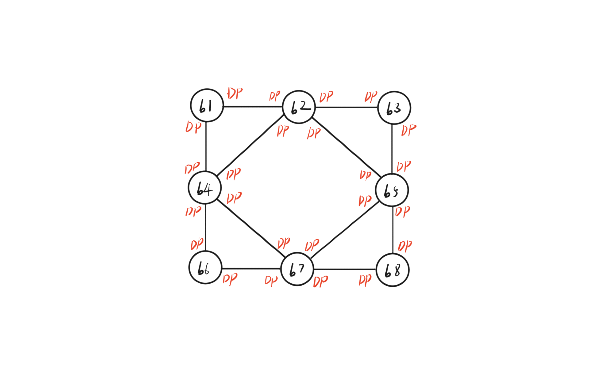
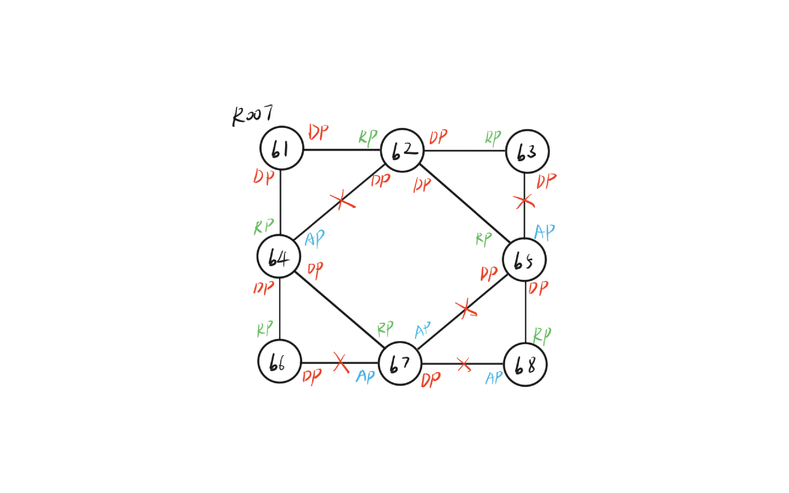

# 生成树机制实验

<p align="right">学号: 2021E8013282148</p>
<p align="right">姓名: 方浩镭</p>

- [生成树机制实验](#生成树机制实验)
	- [一、实验内容](#一实验内容)
	- [二、实验流程](#二实验流程)
		- [(1) config数据包处理实现](#1-config数据包处理实现)
		- [(2) 计算4节点的生成树拓扑](#2-计算4节点的生成树拓扑)
		- [(3) 计算8节点的生成树拓扑](#3-计算8节点的生成树拓扑)
	- [三、实验结果及分析](#三实验结果及分析)
	- [四、思考题](#四思考题)
## 一、实验内容

- 基于已有代码，实现生成树运行机制，对于给定拓扑(four_node_ring.py)，计算输出相应状态下的最小生成树拓扑

- 自己构造一个不少于7个节点，冗余链路不少于2条的拓扑，节点和端口的命名规则可参考four_node_ring.py，使用stp程序计算输出最小生成树拓扑

## 二、实验流程

### (1) config数据包处理实现

```c++
// 判断端口 t 是否比端口 p 优先级更高
static bool is_higher_priority(stp_port_t *t, stp_port_t *p){
	if (t->designated_root != p->designated_root) return t->designated_root < p->designated_root;
	if (t->designated_cost != p->designated_cost) return t->designated_cost < p->designated_cost;
	if (t->designated_switch != p->designated_switch) return t->designated_switch < p->designated_switch;
	if (t->designated_port != p->designated_port) return t->designated_port < p->designated_port;

	return false; // 同一个端口返回false
}


// 根据config消息更新端口
static void refresh_port(stp_port_t *p, stp_port_t *config){
	p->designated_root = config->designated_root;
	p->designated_switch = config->designated_switch;
	p->designated_port = config->designated_port;
	p->designated_cost = config->designated_cost;
}

// 更新节点的状态
static void refresh_switch(stp_t *stp, stp_port_t *p, stp_port_t *config){
	stp_port_t * root_port, * temp_port;

	root_port = p; // 更新时，至少当前端口为非指定端口

	for (int i=0; i<stp->nports; i++){
		temp_port = &stp->ports[i];

		if (!stp_port_is_designated(temp_port)){
			root_port = is_higher_priority(root_port, temp_port)? root_port : temp_port;
		}

	}

	// 更新节点信息
	stp->root_port = root_port;
	stp->designated_root = root_port->designated_root;
	stp->root_path_cost = root_port->designated_cost + root_port->path_cost;

  // 设置假定的config消息，判断非指定端口是否要更新为指定端口
	config->designated_root = stp->designated_root;
	config->designated_cost = stp->root_path_cost;
	config->designated_switch = stp->switch_id;

	for (int i=0; i<stp->nports; i++){
		temp_port = &stp->ports[i];
		
		if (stp_port_is_designated(temp_port)){ // 更新指定端口的信息
			temp_port->designated_root = stp->designated_root;
			temp_port->designated_cost = stp->root_path_cost;	
		}else{
			config->designated_port = temp_port->port_id;
			if (is_higher_priority(config, temp_port)){
				refresh_port(temp_port, config); // 更新非指定端口信息
			}
		}
	}

	// 关闭timer
	if (!stp_is_root_switch(stp)){ // 若当前节点不再是根节点，则停止发送config消息
		stp_stop_timer(&stp->hello_timer);
	}
}


static void stp_handle_config_packet(stp_t *stp, stp_port_t *p, struct stp_config *config) {
	stp_port_t *temp = malloc(sizeof(stp_port_t)); // 将config消息转存到临时端口中，方便比较

  // 网络数据转化
	temp->designated_root = ntohll(config->root_id); 
	temp->designated_cost = ntohl(config->root_path_cost);
	temp->designated_switch = ntohll(config->switch_id);
	temp->designated_port = ntohs(config->port_id);
	
	if (is_higher_priority(temp, p)){ // config 优先级更高
	    refresh_port(p, temp);
	    refresh_switch(stp, p, temp);
	}
	
	free(temp);
	stp_send_config(stp); // 转发数据包
}	
```

### (2) 计算4节点的生成树拓扑

启动 mininet 脚本, 并设置节点启动时执行程序 stp

```python
node.cmd('./stp > %s-output.txt 2>&1 &' % name)
```

一段时间后, 使用脚本 dump_output.sh 查看当前拓扑

```shell
$ b1 ./dump_output.sh 4

NODE b1 dumps:
INFO: this switch is root.
INFO: port id: 01, role: DESIGNATED.
INFO:   designated ->root: 0101, ->switch: 0101, ->port: 01, ->cost: 0.
INFO: port id: 02, role: DESIGNATED.
INFO:   designated ->root: 0101, ->switch: 0101, ->port: 02, ->cost: 0.

NODE b2 dumps:
INFO: non-root switch, designated root: 0101, root path cost: 1.
INFO: port id: 01, role: ROOT.
INFO:   designated ->root: 0101, ->switch: 0101, ->port: 01, ->cost: 0.
INFO: port id: 02, role: DESIGNATED.
INFO:   designated ->root: 0101, ->switch: 0201, ->port: 02, ->cost: 1.

NODE b3 dumps:
INFO: non-root switch, designated root: 0101, root path cost: 1.
INFO: port id: 01, role: ROOT.
INFO:   designated ->root: 0101, ->switch: 0101, ->port: 02, ->cost: 0.
INFO: port id: 02, role: DESIGNATED.
INFO:   designated ->root: 0101, ->switch: 0301, ->port: 02, ->cost: 1.

NODE b4 dumps:
INFO: non-root switch, designated root: 0101, root path cost: 2.
INFO: port id: 01, role: ROOT.
INFO:   designated ->root: 0101, ->switch: 0201, ->port: 02, ->cost: 1.
INFO: port id: 02, role: ALTERNATE.
INFO:   designated ->root: 0101, ->switch: 0301, ->port: 02, ->cost: 1.
```

### (3) 计算8节点的生成树拓扑

构造8节点, 2条冗余链路的网络拓扑

```python
def build(self):
    b1 = self.addHost('b1')
    b2 = self.addHost('b2')
    b3 = self.addHost('b3')
    b4 = self.addHost('b4')
    b5 = self.addHost('b5')
    b6 = self.addHost('b6')
    b7 = self.addHost('b7')
    b8 = self.addHost('b8')

    self.addLink(b1, b2)
    self.addLink(b1, b4)
    self.addLink(b2, b3)
    self.addLink(b2, b4)
    self.addLink(b2, b5)
    self.addLink(b3, b5)
    self.addLink(b4, b6)
    self.addLink(b4, b7)
    self.addLink(b5, b7)
    self.addLink(b5, b8)
    self.addLink(b6, b7)
    self.addLink(b7, b8)
```



等待程序执行收敛，使用脚本 dump_output.sh 查看当前拓扑

```shell
$b6 ./dump_output.sh 8
NODE b1 dumps:
INFO: this switch is root.
INFO: port id: 01, role: DESIGNATED.
INFO:   designated ->root: 0101, ->switch: 0101, ->port: 01, ->cost: 0.
INFO: port id: 02, role: DESIGNATED.
INFO:   designated ->root: 0101, ->switch: 0101, ->port: 02, ->cost: 0.

...

```


## 三、实验结果及分析

交换机之间通过config信息交流局部的拓扑信息，并按照优先级因素，不断更新端口、节点的信息, 而通过这样的过程，最终能够得到一棵连通所有节点的生成树，根据这一网络拓扑，首先能够保证各节点之间的优先级顺序，同时，由于最终拓扑图是树状结构，减少了链路中的冗余，并且避免了环路，防止出现广播风暴，保证了交换机的性能即正常运行

## 四、思考题

1.  网络中的节点是动态的
   - 如何在有节点加入和离开时，依然能够构建生成树拓扑？

- 答: 
   - 生成树拓扑稳定之后，只有根节点能够发送config消息，如果此时根节点离开，则原拓扑由于无法感知而产生错误
   - 因此，当节点离开开始，无论是否是根节点，都应当向所有端口发送拓扑变动消息，收到消息的节点，则应当更新端口信息，并在此基础上重新更新节点状态
   - 而如果有节点加入，则该节点初始化时认为自己时根节点，并发送config消息，等待拓扑收敛

2. 网络中的节点还需要进行数据转发
   - 如何设计生成树运行机制，保证与交换机数据包转发兼容？

- 答: 
   - 用不同的状态来标记每个端口，生成树机制运行的同时，也更新端口的状态，并且根据端口的状态，限制端口的功能
      - Disable: 端口被完全关闭
	  - Blocking: 端口既不能接收也不能发送数据包, 但能够监听Config消息请求
      - Listening: 能够发送与接收Config信息，但并不参与数据包转发
      - Learning: 作为一个暂时状态，该端口能够可以发送普通数据，但不能转发，更新转发表
      - Forwarding: 不受限的端口，能够进行各种功能


1. 实验中的生成树机制效率较低，调研说明快速生成树机制的原理

- 答:
   - RSTP在STP的基础上，优化的端口的状态设计，并相应地改进了收敛流程
   - RSTP设定了3种端口状态
      - Discarding: 不转发用户流量也不学习MAC地址  
      - Learning: 不转发用户流量但是学习MAC地址
      - Forwarding: 转发用户流量又学习MAC地址
   - Proposal/Agreement 快速收敛机制，端口被选为指定端口后，能够通过此机制快速进入Fowarding状态，相较于STP，步骤更少，时间更短 
   - 各非根节点不在采用触发发送，而是仍然按照 Hello Time 设定的事件时间间隔发送配置信息，因而，当网络中节点故障或加入、离开时，RSTP能够快速响应变化, 同时，节点之间判断协商失败的时间间隔为3个连续的Hello Time, 相较于 STP 更短
 
