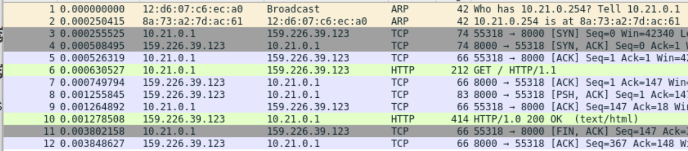
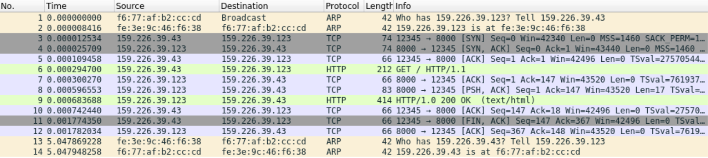
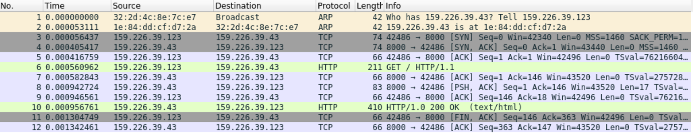
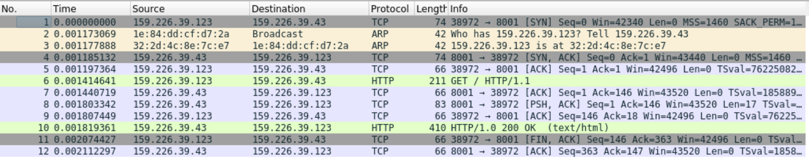
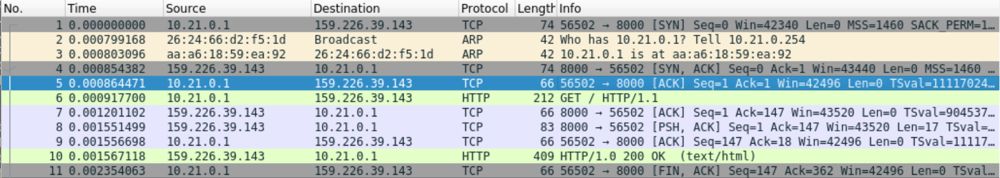
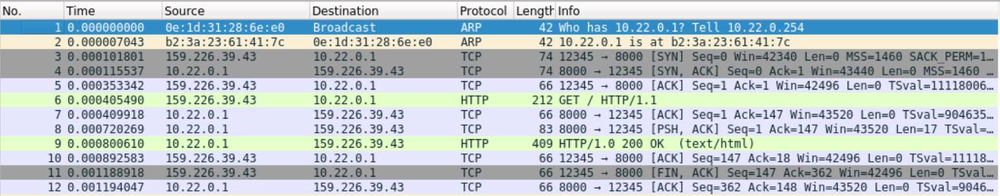

# 网络地址转换实验

<p align="right">学号: 2021E8013282148</p>
<p align="right">姓名: 方浩镭</p>

- [网络地址转换实验](#网络地址转换实验)
  - [一、实验内容](#一实验内容)
    - [(1) 实验内容一](#1-实验内容一)
    - [(2) 实验内容二](#2-实验内容二)
    - [(3) 实验内容三](#3-实验内容三)
  - [二、实验流程](#二实验流程)
    - [(1) nat功能实现](#1-nat功能实现)
      - [映射表管理](#映射表管理)
      - [数据包翻译](#数据包翻译)
    - [(2) 实验一](#2-实验一)
    - [(3) 实验二](#3-实验二)
    - [(4) 实验三](#4-实验三)
  - [三、实验结果及分析](#三实验结果及分析)
    - [(1) 实验一](#1-实验一)
    - [(2) 实验二](#2-实验二)
    - [(3) 实验三](#3-实验三)
## 一、实验内容

### (1) 实验内容一

SNAT实验

- 运行给定网络拓扑(nat_topo.py)
- 在n1, h1, h2, h3上运行相应脚本
  - n1: disable_arp.sh, disable_icmp.sh, disable_ip_forward.sh, disable_ipv6.sh
  - h1-h3: disable_offloading.sh, disable_ipv6.sh
- 在n1上运行nat程序：  n1# ./nat exp1.conf
- 在h3上运行HTTP服务：h3# python ./http_server.py
在h1, h2上分别访问h3的HTTP服务
  - h1# wget http://159.226.39.123:8000
  - h2# wget http://159.226.39.123:8000

### (2) 实验内容二

DNAT实验

- 运行给定网络拓扑(nat_topo.py)
- 在n1, h1, h2, h3上运行相应脚本
  - n1: disable_arp.sh, disable_icmp.sh, disable_ip_forward.sh, disable_ipv6.sh
  - h1-h3: disable_offloading.sh, disable_ipv6.sh
- 在n1上运行nat程序：  n1# ./nat exp2.conf
- 在h1, h2上分别运行HTTP Server：   h1/h2# python ./http_server.py
- 在h3上分别请求h1, h2页面
  - h3# wget http://159.226.39.43:8000
  - h3# wget http://159.226.39.43:8001

### (3) 实验内容三

- 手动构造一个包含两个nat的拓扑
  - h1 <-> n1 <-> n2 <-> h2
  - 节点n1作为SNAT， n2作为DNAT，主机h2提供HTTP服务，主机h1穿过两个nat连接到h2并获取相应页面

## 二、实验流程

### (1) nat功能实现

#### 映射表管理

**get_packet_direction**

```c++
u32 s_addr, d_addr;
struct iphdr* ip_hdr;

ip_hdr = packet_to_ip_hdr(packet);
s_addr = ntohl(ip_hdr->saddr);
d_addr = ntohl(ip_hdr->daddr);


rt_entry_t * s_entry, * d_entry;
s_entry = longest_prefix_match(s_addr);
d_entry = longest_prefix_match(d_addr);

if(s_entry->iface->ip == nat.internal_iface->ip && d_entry->iface->ip == nat.external_iface->ip){
    return DIR_OUT;
}
if(s_entry->iface->ip == nat.external_iface->ip && d_addr = = nat.external_iface->ip){
    return DIR_IN;	
}

return DIR_INVALID;
```

#### 数据包翻译

**do_translation**

```c++
...
if(dir == DIR_IN){
    ...

    struct nat_mapping* nat_temp;
    list_for_each_entry_safe(nat_entry, nat_temp, &(nat.nat_mapping_list[index]), list){
        if(dest_ip == nat_entry->external_ip && dest_port == nat_entry->external_port){
            iphdr->daddr = htonl(nat_entry->internal_ip);
            tcphdr->dport = htons(nat_entry->internal_port);

            iphdr->checksum = ip_checksum(iphdr);
            tcphdr->checksum = tcp_checksum(iphdr, tcphdr);
            
            //update the entry
            nat_entry->update_time = time(NULL);
            if(tcphdr->flags == TCP_FIN)
                nat_entry->conn.external_fin = TCP_FIN;
            if(ntohl(tcphdr->seq) > nat_entry->conn.external_seq_end)
                nat_entry->conn.external_seq_end = ntohl(tcphdr->seq);
            if(ntohl(tcphdr->ack) > nat_entry->conn.external_ack)
                nat_entry->conn.external_ack = ntohl(tcphdr->ack);
            break;
        }
    }
}else {
    ...

    struct nat_mapping* nat_temp;
    list_for_each_entry_safe(nat_entry, nat_temp, &(nat.nat_mapping_list[index]), list){
        if(source_ip == nat_entry->internal_ip && source_port == nat_entry->internal_port){
            exist = 1;
            iphdr->saddr = htonl(nat_entry->external_ip);
            tcphdr->sport = htons(nat_entry->external_port);
            iphdr->checksum = ip_checksum(iphdr);
            tcphdr->checksum = tcp_checksum(iphdr, tcphdr);
            
            nat_entry->update_time = time(NULL);
            if(tcphdr->flags == TCP_FIN)
                nat_entry->conn.internal_fin = TCP_FIN;
            if(ntohl(tcphdr->seq) > nat_entry->conn.internal_seq_end)
                nat_entry->conn.internal_seq_end = ntohl(tcphdr->seq);
            if(ntohl(tcphdr->ack) > nat_entry->conn.internal_ack)
                nat_entry->conn.internal_ack = ntohl(tcphdr->ack);
            break;
        }
    }    
}
...
```

### (2) 实验一

使用 nat_topo.py, exp1.conf 配置进行实验，其中，h1 与 h2 作为内网中的client, 通过nat访问外网中的 h3, 以h1为例，实验中使用wireshark进行网络抓包分析

```shell
$h1 wget http://159.226.39.123:8000 
```

### (3) 实验二

使用 nat_topo.py, exp2.conf 配置进行实验，其中，h1 与 h2 作为内网中的server, 通过设置nat rules使得外网能够通过nat路由器访问到内网的服务中, 以h3进行请求，使用wireshark进行抓包分析

```shell
# 请求h1服务的规则
$h3 wget http://159.226.39.43:8000 

# 请求h2服务的规则
$h3 wget http://159.226.39.43:8001
```

### (4) 实验三

实验topo设计

```python
# topo设计
...
s1 = self.addSwitch('s1')
h1 = self.addHost('h1')
n1 = self.addHost('n1')

s2 = self.addSwitch('s2')
h2 = self.addHost('h2')
n2 = self.addHost('n2')

self.addLink(h1, s1)
self.addLink(n1, s1)

self.addLink(h2, s2)
self.addLink(n2, s2)

self.addLink(n1, n2)
...

# 地址、端口设置
...
h1.cmd('ifconfig h1-eth0 10.21.0.1/16')
h1.cmd('route add default gw 10.21.0.254')

n1.cmd('ifconfig n1-eth0 10.21.0.254/16')
n1.cmd('ifconfig n1-eth1 159.226.39.43/24')


h2.cmd('ifconfig h2-eth0 10.22.0.1/16')
h2.cmd('route add default gw 10.22.0.254')

n2.cmd('ifconfig n2-eth0 10.22.0.254/16')
n2.cmd('ifconfig n2-eth1 159.226.39.143/24') 
...
```
nat配置

```yml
# nat1
internal-iface: n1-eth0
external-iface: n1-eth1

# nat2
internal-iface: n2-eth0
external-iface: n2-eth1

dnat-rules: 159.226.39.143:8000 -> 10.22.0.1:8000
```

内网中的h1请求另一个内网中的h2服务, 并使用wireshark进行抓包分析

```shell
# 请求h1服务的规则
$h1 wget http://159.226.39.123:8000 
```

## 三、实验结果及分析

### (1) 实验一

结果与分析:
- h1首先发送arp找到下一跳即nat路由器的地址
- h1与h3进行tcp三次握手，并在握手成功后发送http请求报文
- 从h1的角度无法显示地看到nat的整个流程，即nat的过程对于内网主机而言，是完全透明的
- 而在h3的角度看，本从h1发送出来的数据包，经过nat之后，saddr已经变成的了nat路由器的ip，h3感知得到连接的存在，但无从获得其真正的来源，http请求实际上是由nat路由器进行"代理"完成



<center>图1: wireshark h1请求h3抓包</center>  
    
&nbsp;

<center>图2: wireshark h3响应抓包</center>

### (2) 实验二

结果与分析:
- 对于内网服务，nat通过配置的rules, 使用"代理"的方式，对外部的请求包进行处理, 整个过程中，h3表现得都像是与nat路由器进行通信，但整个服务处理响应的过程，并没有受到影响



<center>图3: wireshark h3请求内网h1抓包</center>  
    
&nbsp;

<center>图4: wireshark h3请求内网h2</center>

### (3) 实验三

结果与分析:
- 两个内网中的服务，通过两个彼此相连的nat路由器进行通信，表现在h1与h2上，则是分别与内网中的nat通信，再由nat路由器代理的完成数据包的接收与处理



<center>图5: wireshark h1请求h2抓包</center>  
    
&nbsp;


<center>图6: wireshark h2响应h1抓包</center>

