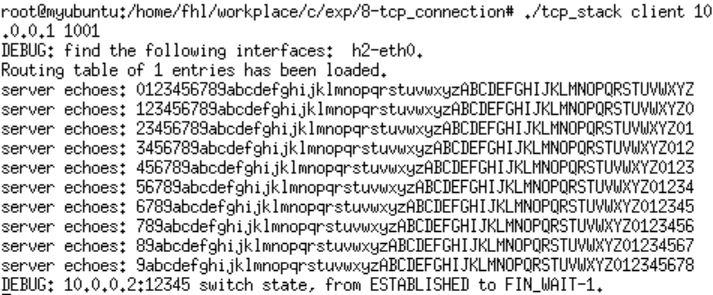
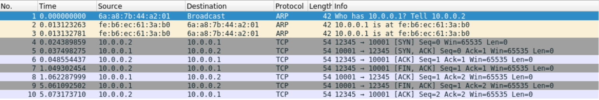
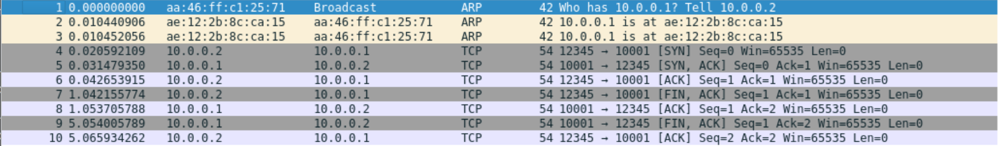

# 网络传输Echo和大文件实验

<p align="right">学号: 2021E8013282148</p>
<p align="right">姓名: 方浩镭</p>

- [网络传输Echo和大文件实验](#网络传输echo和大文件实验)
  - [一、实验内容](#一实验内容)
    - [(1) 实验内容一](#1-实验内容一)
    - [(2) 实验内容二](#2-实验内容二)
  - [二、实验流程](#二实验流程)
    - [(1) 功能实现](#1-功能实现)
    - [(2) 实验一](#2-实验一)
    - [(3) 实验二](#3-实验二)
  - [三、实验结果及分析](#三实验结果及分析)

## 一、实验内容

### (1) 实验内容一

- 运行给定网络拓扑(tcp_topo.py)
- 在节点h1上执行TCP程序
  - 执行脚本(disable_offloading.sh , disable_tcp_rst.sh)
  - 在h1上运行TCP协议栈的服务器模式  (./tcp_stack server 10001)
- 在节点h2上执行TCP程序
  - 执行脚本(disable_offloading.sh, disable_tcp_rst.sh)
  - 在h2上运行TCP协议栈的客户端模式，连接h1并正确收发数据 (./tcp_stack client 10.0.0.1 10001)
    - client向server发送数据，server将数据echo给client
- 使用tcp_stack.py替换其中任意一端，对端都能正确收发数据

### (2) 实验内容二

- 修改tcp_apps.c(以及tcp_stack.py)，使之能够收发文件
- 执行create_randfile.sh，生成待传输数据文件client-input.dat
- 运行给定网络拓扑(tcp_topo.py)
- 在节点h1上执行TCP程序
  - 执行脚本(disable_offloading.sh , disable_tcp_rst.sh)
  - 在h1上运行TCP协议栈的服务器模式  (./tcp_stack server 10001)
- 在节点h2上执行TCP程序
  - 执行脚本(disable_offloading.sh, disable_tcp_rst.sh)
  - 在h2上运行TCP协议栈的客户端模式 (./tcp_stack client 10.0.0.1 10001)
    - Client发送文件client-input.dat给server，server将收到的数据存储到文件- server-output.dat
- 使用md5sum比较两个文件是否完全相同
- 使用tcp_stack.py替换其中任意一端，对端都能正确收发数据

## 二、实验流程

### (1) 功能实现

**tcp_sock_lookup_established**

```c++
int hash = tcp_hash_function(saddr, daddr, sport, dport); 

struct tcp_sock *entry;
list_for_each_entry(entry, &tcp_established_sock_table[hash], hash_list) {
  if (saddr == entry->sk_sip &&
      daddr == entry->sk_dip &&
      sport == entry->sk_sport &&
      dport == entry->sk_dport)
    return entry;
}	
```

**tcp_sock_lookup_listen**

```c++
int hash = tcp_hash_function(0, 0, sport, 0);

struct tcp_sock *entry;
list_for_each_entry(entry, &tcp_listen_sock_table[hash], hash_list){
  if(entry->sk_sport == sport) return entry;
}

return NULL;
``

**tcp_sock_connect**

```c++
rt_entry_t* entry = longest_prefix_match(ntohl(skaddr->ip));

tsk->sk_sip = entry->iface->ip;
tsk->sk_dip = ntohl(skaddr->ip);
tsk->sk_dport = ntohs(skaddr->port);
tsk->sk_sport = tcp_get_port();	
tsk->iss = tcp_new_iss();
tsk->snd_una = tsk->iss - 1;
tsk->snd_nxt = tsk->iss;
tsk->state = TCP_SYN_SENT;

tcp_hash(tsk);
tcp_bind_hash(tsk);

tcp_send_control_packet(tsk, TCP_SYN);
sleep_on(tsk->wait_connect);
return -1;
```

### (2) 实验一

运行实验topo, 并对照地进行网络Echo

- Server:h1 Client:h2

```shell
# h1 作为 server
$h1 ./tcp_stack server 10001

# h2 作为 client
$h2 ./tcp_stack client 10.0.0.1 10001
```

- Server:h2 Client:h1

```shell
# h2 作为 server
$h2 ./tcp_stack server 10001

# h1 作为 client
$h1 ./tcp_stack client 10.0.0.2 10001
```

### (3) 实验二

修改 tcp_apps.c 代码实现文件传输, 数据使用 create_randfile.sh 生成

- Server:h1 Client:h2

```shell
# h1 作为 server
$h1 ./tcp_stack server 10001

# h2 作为 client
$h2 ./tcp_stack client 10.0.0.1 10001
```

- Server:h2 Client:h1

```shell
# h2 作为 server
$h2 ./tcp_stack server 10001

# h1 作为 client
$h1 ./tcp_stack client 10.0.0.2 10001
```
- 文件检查

```shell
$ md5sum client-input.dat

$ md5sum server-output.dat
```

## 三、实验结果及分析

- 以h2请求h1为例, 从h2的log信息中，可以看到来自h1 server 的echo响应
- 同时观察两端wireshark的抓包数据，可以看到TCP建立时的三次握手以及TCP释放时的四次挥手过程


<center>图1: wireshark h2请求h1log</center>

&nbsp;

<center>图2: wireshark h2请求h1抓包</center>

&nbsp;

<center>图2: wireshark h1响应h2抓包</center>


