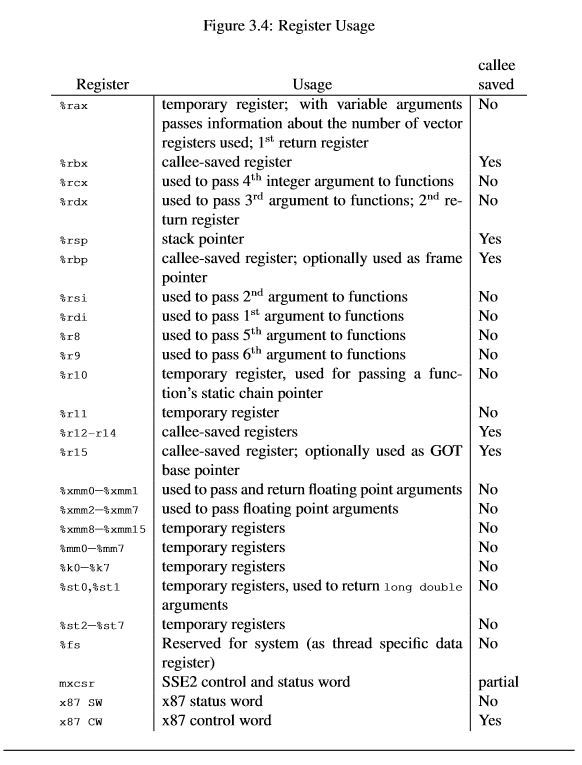
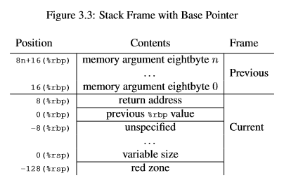

# GreenThread

[intro](https://github.com/cfsamson/example-greenthreadssd)

Green threads, userland threads, gorountines or fibers 都是绿色线程

绿色线程的意义在于更高效的使用资源，而并行的意义在于允许使用更多资源来解决问题

当前存在两类提高CPU效率的方式
- 抢占式多任务
  - 存在一个外部调度器，主动暂停一个任务并唤醒另一个任务，任务本身无法影响调度器的决策
- 非抢占式多任务
  - 任务可以根据运行情况自己决定出让CPU使用权限的时机，从而让CPU有更高的使用效率

## 背景

**寄存器**

>ABI (Application Binary Interface) 是一种标准，它定义了程序在执行时如何与其他程序和系统库互相通信。ABI 规定了函数的参数传递，数据类型的表示方式，以及如何执行内存布局和对齐。ABI 还规定了如何进行系统调用和异常处理。

>psABI (Procedure Specific ABI) 是 ABI 的一种变体，专门针对某一特定程序语言或平台进行了细化。例如，对于 Linux 系统上的 x86-64 架构，有一种称为 System V psABI 的标准。它定义了汇编语言级别的细节，例如如何访问寄存器，如何处理函数调用的栈帧，以及如何使用系统调用等。

>因此，ABI 是一个更宽泛的标准，而 psABI 则是关于某个特定语言或架构的更具体的标准。在一个操作系统上，可能存在多个不同的 psABI，而它们都是基于 ABI 的

[x86 ABI](https://github.com/hjl-tools/x86-psABI/wiki/X86-psABI)



**汇编**

The word size in assembly also has historical reasons. It stems from the time when the CPU had 16 bit data buses, so a word is 16 bits. This is relevant because in the AT&T dialect you will see many instructions suffixed with "q" (quad-word), or "l" (long-word). So a movq would mean a move of 4 * 16 bits = 64 bits.

x86-64 上的栈按 16byte 对齐，否则会出现 segmentation fault
访问未申请但允许访问的内存区域是可行的，但是这样做没有意义

## Example

```rust
const STACK_SIZE: isize = 48;

#[derive(Debug, Default)]
#[repr(C)]
struct ThreadContext {
    rsp: u64,
}

/// 测试程序
fn hello() -> ! {
    println!("I LOVE WAKING UP ON A NEW STACK!");
    loop {}
}

/// gt_switch 替换函数栈并切换控制流
/// 首先将 ThreadContext 中的 rsp 的值 与 当前 rsp 进行替换
/// 栈制作变化后，ret 指令将栈顶处的地址弹出并修改pc为此值
unsafe fn gt_switch(new: *const ThreadContext) {
    // `[]` 意为取出 地址 {0} + 0x00 指向的内存中的内容
    asm!(
        "mov rsp, [{0} + 0x00]",
        "ret",
        in(reg) new,
    );
}

fn main() {
    let mut ctx = ThreadContext::default();
    let mut stack = vec![0_u8; STACK_SIZE as usize];

    unsafe {
        // 计算栈底
        let stack_bottom = stack.as_mut_ptr().offset(STACK_SIZE);
        // 计算 16 byte对齐后的栈底，15 -> 0000...0000_1111, !15 -> 1111...1111_0000
        // 此操作将 stack_bottom 末4位置0， 即 64bit (16byte) 对齐
        // 实际是向下取整，可能导致栈大小不足SSIZE
        let sb_aligned = (stack_bottom as usize & !15) as *mut u8;
        // 将 hello 函数地址写入 -16(stack_bottom) 处
        std::ptr::write(sb_aligned.offset(-16) as *mut u64, hello as u64);
        // 将 -16(stack_bottom) 地址(对应内存保存了 hello 的地址) 赋值给 ctx.rsp
        // 尽管 sb_aligned 也符合16位对齐，但由于其已经是高地址，并不能够保证在stack范围内有足够的空间存放地址
        ctx.rsp = sb_aligned.offset(-16) as u64;
        // 执行 gt_switch 
        // 注意传入的 rsp 地址是 -16(stack_bottom) 而不是 stack_bottom
        // 换栈之后，可以认为新栈从 -16(stack_bottom) 开始，而第一个数据(ra)就是 hello 函数的入口
        // 从而通过换栈实现了任务切换
        gt_switch(&mut ctx);
    }
}
```

### 栈大小

常规现代操作系统中，栈的大小是 8MB, 但是可以通过一些系统工具设置改变栈的大小，如linux中的，使用 `ulimit -s` 可以查看线程默认栈的大小，通过 `ulimit -s 10240` 即可将默认栈大小修改为10MB, [更多配置方法](https://blog.csdn.net/gxw1994/article/details/81035792)

然而，如果用户可以直接控制栈的大小(如控制程序使用用户创建的栈)，则可以自由选择栈的大小。因为很多时候对每个上下文而言 8MB 栈空间大小往往超出运行一些简单函数或web服务的需求。通过减少 stack size 能够在单台机器上运行数百万个Green Threads，而如使用操作系统提供的堆栈则会更快地耗尽内存

### 可增长栈

一些实现使用可增长栈。允许先分配一小部分内存作为栈，栈的大小对大多数任务来说都足够，但当栈空间耗尽时，并不会导致溢出异常，而是申请一片更大的内存作为新的栈，并将
耗尽的栈中的所有内容转移到新的栈中，任务可以继续执行

GO使用了可增长栈，初始有一个8KB的栈，当空间耗尽时，就会重新分配一个更大的栈，但也因此，所有的指针都需要正确更新，这并不容易，[GO处理栈](https://blog.cloudflare.com/how-stacks-are-handled-in-go/)


#### Segmented stacks

协程初始时分配 8KB 大小的栈空间
其中每个go函数在进入之前，会检查已经申请的栈空间是否耗尽，如耗尽则会调用 `morestack` 方法

`morestack` 
1. 申请新的栈空间(大小与原栈相同)
2. 将原有栈相关的信息(栈顶、栈底、栈指针等)保存到 `stack info` 中
3. 继续插入一个 `lessstack` 过程，并通过重试 导致栈耗尽的函数 来重新启动 goroutine

`lessstack` 在 导致栈耗尽的函数 栈的返回的地方，即当从 导致栈耗尽的函数 返回时，会进入 `lessstack` 过程并通过 `stack info` 恢复原有栈，以便正常返回，同时在最后将申请的栈空间进行释放

```
stack split 之后

栈底
  +---------------+
  |               |
  |   unused      |
  |   stack       |
  |   space       |
  +---------------+
  |    Foobar     |
  |               |
  +---------------+
  |               |
  |  lessstack    |
  +---------------+
  | Stack info    |
  |               |-----+
  +---------------+     |
                        |
                        |
  +---------------+     |
  |    Foobar     |     |
  |               | <---+
  +---------------+
  | rest of stack |
  |               |
```

> hot split problem
> 如果 `stack split` 发生在循环之中，则存在频繁内存申请/释放过程，这会导致巨大的性能损失

#### Stack copying

与 `Segmented stack` 类似，但不同于存在一个指向旧栈的结构体，而是创建一个两倍于原栈大小的空间，并对原栈进行拷贝，这使得在缩小栈时，不必进行任何操作，而当空间不够时，由于已申请了两倍的栈空间，因此也不必进行扩容

实际上栈的实现非常复杂，由于堆栈上的变量可以在Go中获取其地址，因此最终会出现堆栈中有指针的情况。移动堆栈时，指向堆栈的任何指针现在都将无效

而幸运的是，唯一可以指向栈上的指针必须位于栈上，这对于内存安全来说非常重要，否则程序将有可能访问栈中不再使用的部分

考虑到go语言存在 garbage collection, 因而能够知道栈上那些部分是指针，因此每当移动栈时，就能够对栈中的指针以及有关的所有指针进行更新。使用这种方式来复制堆栈的前提是栈上任何函数都必须具有可用的信息，但事实上由于 runtime 大部分使用 C 编写，因此许多对于 runtime 的调用都没有指针信息，因此不可复制，当这种情况发生时，则又回到 stack segments, 以及相关的开销

#### Virtual Memory

有一种不同的处理栈的方式，即通过申请一大片虚拟内存的方式，然后让操作系统来处理这部分内存，但是这种方式存在一些不足
- 32位系统只能提供大概 3g 的内存
- 如启用交换内存，则有可能将分配给 goruntime 的内存置换到硬盘上，大大增加延时

### 如何设置栈




clobber_abi（“C”）意味着我们要求编译器将C-abi指定的所有寄存器都视为“不安全的，假设未被我们的函数调用触及”。这意味着编译器将在调用switch之前将这些寄存器的值推送到堆栈中，并在函数返回时将其返回到相同的寄存器中。Windows x86-64上的ABI将是“系统”而不是“C”，因此这将根据操作系统而有所不同。

编译器会处理函数参数在栈上的拜访，而 `#[naked]` 函数则将这个权力交给开发者

[continue](https://cfsamson.gitbook.io/green-threads-explained-in-200-lines-of-rust/an-example-we-can-build-upon)


**函数调用流程**

x86 中，`call` 指令将当前过程的下一条指令地址保存到栈上，并跳转至目标子过程，`ret` 指令则从栈上获得父过程的下一条指令地址，并跳转

riscv 中, 进行子过程调用之前，先保存当前过程的返回地址(寄存器)到栈上，然后调用`call` 指令将当前过程的下一条指令保存到寄存器 ra 中， 并跳转至目标子过程，子过程中执行`ret` 指令则直接跳转至 ra 寄存器中的返回地址, 回到父过程后，再从栈中恢复 ra 寄存器

核心区别在于 x86 中没有 `ra` 寄存器(`rax`寄存器用来保存第一个返回参数)

1. 为函数 A 分配初始栈，rsp指向栈顶
   - A 会进行函数调用，因此会将此时的 ra 保存到栈上 
2. 为函数 A 的局部变量准备栈空间，rsp增长(按增长方向)
3. 在函数 A 调用 B 之前，需要将参数保存在栈上，并将参数的栈上地址作为参数设置到相应的寄存器上(暂不考虑非栈参数以及超过寄存器数量的参数)
4. 调用者A开场
    - 如果有调用者保存寄存器(当A使用到临时寄存器时)，则保存到栈上, 这使得 rsp 增长
    - A存在函数调用，考虑A需要正常返回，因此还需要将 ra 寄存器保存到栈上
5. A 调用 `call` 指令，这会设置 ra 为A过程下一条指令的地址，并修改 pc 为目标过程的第一条指令地址
6. 被调用者B开场: 
    - 根据 被调用者保存寄存器，以及局部变量数量设置栈空间，rsp 增长
    - 如果B中还有函数调用(会覆盖 ra), 则将 ra 保存到栈上
7. 执行函数B
8. 被调用者B收场:
    - 从栈上恢复 被调用者保存寄存器
    - 有需要则恢复 ra 寄存器
    - 恢复栈空间, rsp 减少
9.  B调用 ret 返回
    - 跳转至 ra 所指向的地址，
10. 调用者A收场
    - 如果有调用者保存寄存器 则进行恢复
    - 恢复 ra 寄存器
11. 继续执行A

## GreenThread实现

spawn
- 栈初始化时，将 guard、skip、f 地址依次存放在栈上，并设置 rsp 指向 f 所保存的地址
- thread 被首次调度执行时， switch 函数中将 f 弹出 并跳转至 f, 执行 f过程
- 当 f 执行完毕时，继续弹出 skip 并跳转至 skip 执行，而 skip 本身只是一个 ret，即继续弹出 guard 的地址并继续跳转执行
- guard 中 释放线程 f 所占用的资源，并将 thread 放回线程池

```rust
pub fn spawn(&mut self, f: fn()) {
    // 找到空闲的线程
    let available = self
        .threads
        .iter_mut()
        .find(|t| t.state == State::Available)
        .expect("no available thread.");

    let size = available.stack.len();
    unsafe {
        // 计算栈顶地址
        let s_ptr = available.stack.as_mut_ptr().offset(size as isize);
        let s_ptr = (s_ptr as usize & !15) as *mut u8;

        // 将 guard skip f 放入栈中
        std::ptr::write(s_ptr.offset(-16) as *mut u64, guard as u64);
        std::ptr::write(s_ptr.offset(-24) as *mut u64, skip as u64);
        std::ptr::write(s_ptr.offset(-32) as *mut u64, f as u64);
        available.ctx.rsp = s_ptr.offset(-32) as u64;
    }
    available.state = State::Ready;
}

/// 退出当前任务
/// 设置线程状态为Available，并还执行权限
fn guard() {
    unsafe {
        let rt_ptr = RUNTIME as *mut Runtime;
        (*rt_ptr).t_return();
    }
}

/// 弹出栈上的数据，并进行跳转
/// 当前此方法上是 guard
#[naked]
unsafe extern "C" fn skip() {
    asm!("ret", options(noreturn))
}
```

过程切换

```rust
/// 替换 old 为 new  TaskContext
/// 替换了栈 与 调用者保存寄存器
/// ret 之后，由于栈已经替换，因此可以从栈上恢复调用者保存寄存器
#[naked]
#[no_mangle]
unsafe extern "C" fn switch() {
    asm!(
        "mov [rdi + 0x00], rsp",
        "mov [rdi + 0x08], r15",
        "mov [rdi + 0x10], r14",
        "mov [rdi + 0x18], r13",
        "mov [rdi + 0x20], r12",
        "mov [rdi + 0x28], rbx",
        "mov [rdi + 0x30], rbp",
        "mov rsp, [rsi + 0x00]",
        "mov r15, [rsi + 0x08]",
        "mov r14, [rsi + 0x10]",
        "mov r13, [rsi + 0x18]",
        "mov r12, [rsi + 0x20]",
        "mov rbx, [rsi + 0x28]",
        "mov rbp, [rsi + 0x30]",
        "ret",
        options(noreturn)
    )
}
```

### adjustment for windows

[](https://cfsamson.gitbook.io/green-threads-explained-in-200-lines-of-rust/supporting-windows)
[thread_gorutine_comp](https://shane.ai/posts/threads-and-goroutines/)