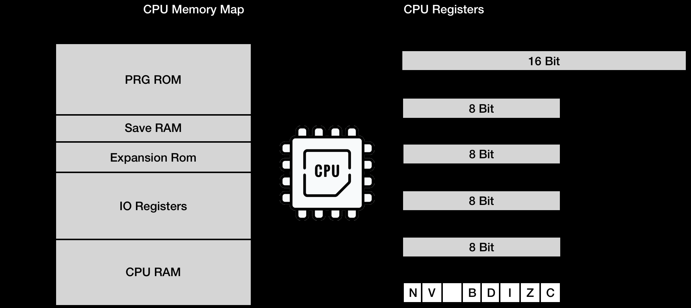

# NES Platform

- [guidence](https://bugzmanov.github.io/nes_ebook)

## Hardware

- CPU
- PPU
  - GPU
- APU
  - Audio
- RAM
  - 2kiB for PPU
  - 2kiB for CPU
- Cartridges
  - two large ROM
    - Character ROM:
      - save video graphics data
    - Program ROM
      - save CPU instructions
  - 在外置卡带中，插入时
    - CHR ROM 直连 PPU
    - RPG ROM 直连 CPU
- GamePad

## Emulating CPU

- NES CPU 地址长度为16
  - 内存按字节编址

