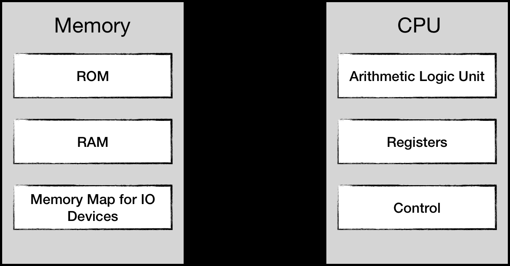

# Memory addressing model

- 指令与数据都存储在内存中，CPU并不能区分两者的区别，但能够通过 program_counter 寄存器追踪指令流中的位置



- Memory Address Space(取前不取后)
  - RAM [0x0000 … 0x2000] 
  - cartridges used [0x4020 .. 0x6000]
  - cartridge RAM [0x6000 .. 0x8000]
  - Program ROM On a cartridge [0x8000 … 0x10000] 

- 当插入新的卡带时，CPU会收到一个 `Reset interrupt` 信号
  - 重置 CPU 寄存器状态
  - 设置 program_counter 的值为内存 `0xFFFC` 处的值

- NES CPU 地址空间为 65536 (2 ^ 16), 每个地址使用 2byte 存储
  - 小端存储，从机器码来看，就是低有效位先于高有效位存储，即先拿到低位，再拿到高位
    - 由于 program_counter  自加，故高有效位放在高地址

```
LDA $8000      <=>    ad 00 80
```
- 高位取法
  - 直接右移
- 低位取法
  - 左移存在溢出，故使用掩码 `0b0000_0000_1111_1111`
  - 使用 `&`, 掩码`0`处相与为0，`1`处相与为原值，故取得低位

```rust
let lo = (data & 0xff) as u8;
```

- load 将程序的起始指令地址存入内存的`0xFFFC`处
  - 为了让 pc 的初值来源为内存


## 寻址模式

- 相同功能，不同的寻址方式会构成多个操作码
  - 6502中，指令长度为 1，2，3

- 寻址模式

```rust
pub enum AddressingMode {
   Immediate,
   ZeroPage,
   ZeroPage_X,
   ZeroPage_Y,
   Absolute,
   Absolute_X,
   Absolute_Y,
   Indirect_X,
   Indirect_Y,
   NoneAddressing,
}
```

- Immediate
  - 立即数寻址: 在指令中直接指定一个 8 位操作数
    - 考虑一次只读取一个字节，因此当前 `pc` 即是该数据的地址 

- Zero Page
  - 指令中指定一个 8 位地址，作为数据的地址
    - 因此当前 `pc` 中的地址即是该数据地址的地址 

- Zero Page,X
  - 指令中指定一个 8 位常量，此常量与寄存器X的和作为数据的地址
    - 从当前`pc`处读出该常量，并与寄存器X求和，即可得到数据的地址

- Zero Page,Y
  - 指令中指定一个 8 位常量，此常量与寄存器Y的和作为数据的地址
    - 从当前`pc`处读出该常量，并与寄存器X求和，即可得到数据的地址

- Relative
  - 指令中指定一个 8 为常量作为偏移，此偏移与 pc 的和作为数据的地址
    - 从当前`pc`处读出该常量，与pc求和

- Absolute
  - 指令中指定 16 位地址
    - 从当前 `pc` 与 `pc+1` 处读出地址

- Absolute X
  - 指令中指定 16 位常量，与寄存器X的和作为数据的地址

- Absolute Y
  - 指令中指定 16 位常量，与寄存器Y的和作为数据的地址

- Indirect(与 zero page类似，不过扩展到整个地址空间)
  - 指令中指定 16 位地址，内存中该地址的数据是数据地址的低有效位
 
- Indirect X
  - 指令中指定 8 位常量，与寄存器X的和是数据地址的地址的低有效位

- Indirect Y
  - 指令中指定 8 位常量，是数据地址的地址的低有效位，与寄存器Y的和作为数据的地址


- [continue](https://bugzmanov.github.io/nes_ebook/chapter_3_1.html)
