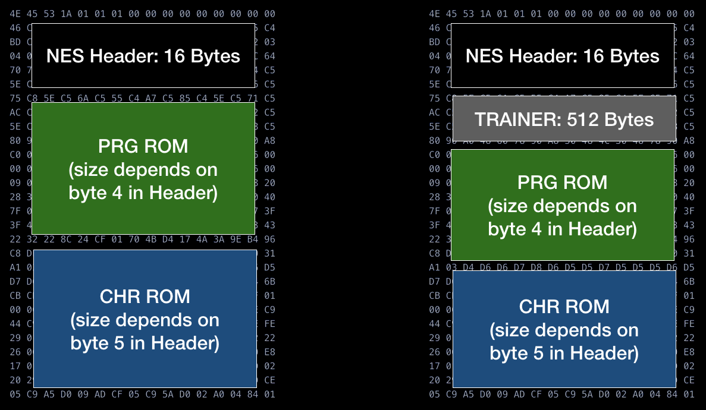
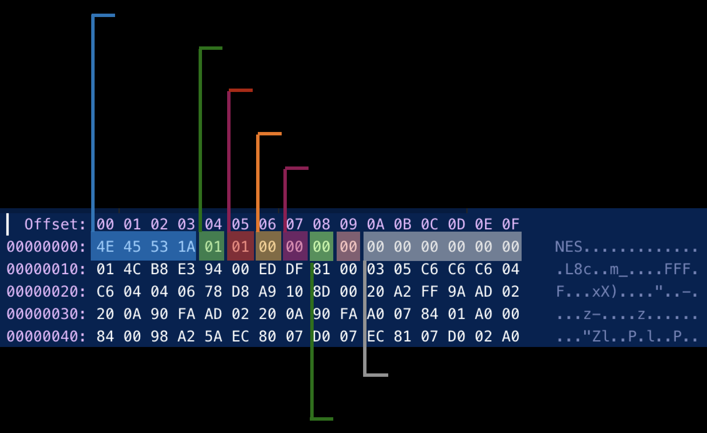
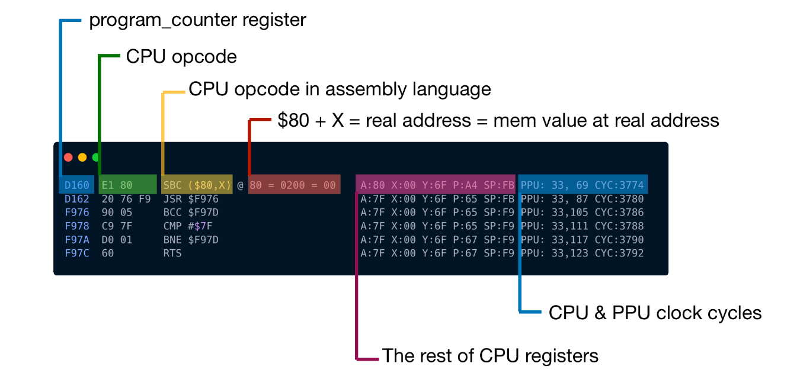

## BUS

- 6502CPU使用三种总线来进行内存的访问
  - 16bit地址总线传输目标地址
  - 1bit控制总线用来区别读与写
  - 8bit数据总线传输要读或写的数据

- Mirroring
  - 由于CPU RAM为2kiB，因此索引地址范围为[0x000...0x0800], 即三个地址都相同，
    - [0x800 .. 0x1000]
    - [0x1000 .. 0x1800]
    - [0x1800 .. 0x2000]

- 由于6502CPU RAM大小仅为2KiB，因此仅索引11位地址
  - 因此，需要对大于11位的地址进行处理

```rust
    let mirror_down_addr = addr & 0b111_11111111;
    self.cpu_vram[mirror_down_addr as usize]
```

## Cartridges

- [guidence](https://bugzmanov.github.io/nes_ebook/chapter_5.html)

- 模拟Cartridges文件通常包含3-4个部分
  - 16-byte header
  - 可选的 512 byte Trainer，由 Famicom 复印机创建的数据部分，用于保存自己的映射
    - 如果存在可以跳过此部分
  - 存储PRG ROM代码的部分
    - Program Rom 连接 CPU
  - 存储CHR ROM数据的部分
    - Character Rom 连接 PPU



### head



- Control Byte 1 与 Control Byte 2 (Byte 06 和 Byte 07)文件中数据的其他信息，被打包成bit


### ROM

- 能够解析`.nes`文件
  - 即将 raw 文件读取，并将代码/数据解析到ROM中

- NES_TAG
  - 0..4
  - `[0x4E, 0x45, 0x53, 0x1A]`
- mapper
  - hi of control byte 1 is lo of mapper
  - hi of control byte 2 is hi of mapper
  - `(raw[7] & 0b1111_0000) | (raw[6] >> 4)`
- iNes version
  - byte 2、3 is the version of iNes
  - `10` is iNES2.0
  - `00` is iNES1.0

- mirroring
  - Four-screen if byte 3 of control byte 1 set
  - Vertical if byte 0 of control byte 1 set
  - Horizontal if byte 0 of control byte 1 clear

### Connect Rom to Bus

- 将rom加入到bus中
- bus在读取内存`0x8000..=0xFFFF`地址时，需映射到prg_rom中
  - PRG Rom 大小通常为 16KiB 或 32KiB
  - 0x8000..=0x10000 寻址空间为 32KiB
  - 因此，若程序只有16KiB，则需要将高16KiB映射到低16KiB
    - `addr % 0x4000`

## Test ROM

- 用来测试模拟器的各种功能
  - 测试用的 iNes 文件
  - 标准输出的 .log 文件
  - 通过比较模拟器的输出与标准输出，测试功能的完备性


### 日志输出

- 第四行数据 `80 = 0200 = 00`
  - 如果基于偏移量请求内存地址，则第一个数字是得到的实际内存引用
    - `0xE1` 为 `Indirect X` 寻址模式，计算`0x80 + x` 得到地址`0x80`
  - 第二个为从`[0x80, 0x81]`处读取的目标地址，此处为`[0x00, 0x02]`
  - 第三个则是从目标地址中读出的数据
    - 即地址`0x200`中的内容
    


### 为CPU增加Trace

- first column
  - program counter
- second column


### 使用 test.nes 与 test.log