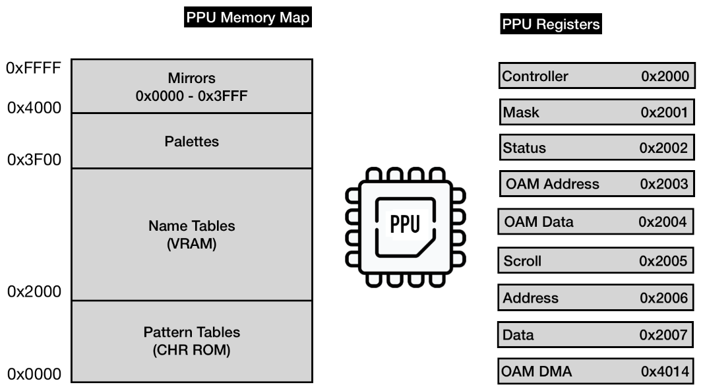
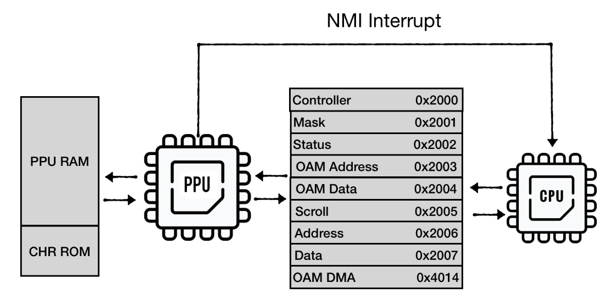

# PPU

- [emulating picture processing unit](https://bugzmanov.github.io/nes_ebook/chapter_6.html)

## Emulating PPU Registers

- PPU有自己的内存映射
  - PPU RAM
  - CHR ROM
  - address space mirrors
- PPU暴露8个I/O寄存器，用于与CPU的通信
  - map to [0x2000 - 0x2007]
  - mirrored every 8 bytes through the region of [0x2008 .. 0x3FFF]
- PPU 有独立的bus用于与RAM和cartidge CHR ROM的通信
  

### PPU I/O 寄存器

> sprite: 精灵
> 游戏里一切能感知时间流逝、具有坐标位置的，都是精灵
> https://www.zhihu.com/question/435692887

- [寄存器说明](http://wiki.nesdev.com/w/index.php/PPU_registers)
- 2个负责访问PPU内存映射的寄存器
  - Address(0x2006) & Data(0x2007) 
    - 两个寄存器提供了可用于PPU的内存映射访问
- 3个控制保持精灵状态的内部存储器（OAM）的寄存器
  - OAM Address(0x2003) & OAM Data(0x2004)
    - 对象属性内存, 负责精灵的存储空间
  - Direct Memory Access(0x4014)
    - 用于从CPU RAM 中快速复制 256byte 到 OAM中
- 3个用于控制PPU行为的只写寄存器
  - Controller(0x2000)
    - 向 PPU 指示一般逻辑流程（使用哪个内存表，PPU 是否应该中断 CPU 等）
  - Mask(0x2001)
    - 指示 PPU 如何渲染精灵和背景
  - Scroll (0x2005)
    - 指示 PPU 如何设置viewport
- 1个用于报告PPU状态的只读寄存器
  - Status 0x2002

### PPU 与 CPU的通信

