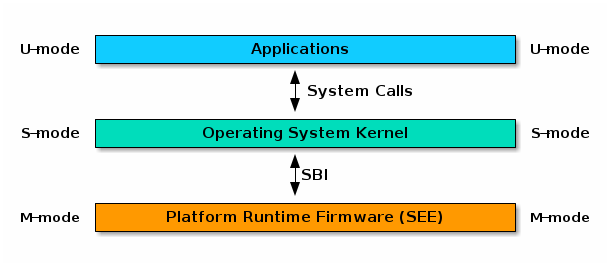
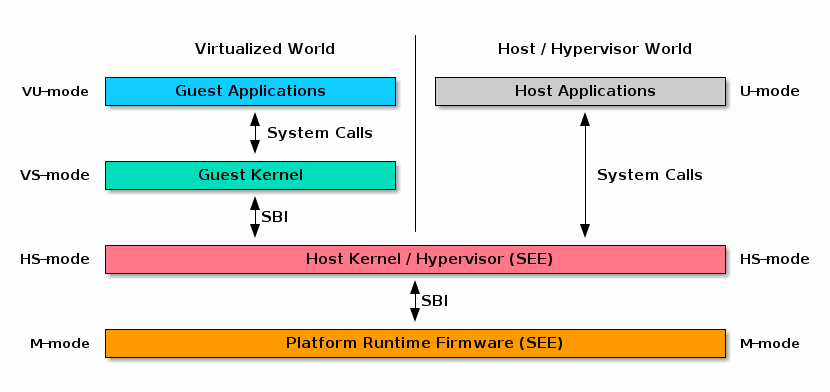

# Supervisor Binary Interface

## intro

作为二进制接口抽象，能够 supervisor-mode(S-mode or VS-mode) 程序提供跨 RISC-V 平台的可移植性，其实现同样采用 一个紧凑的核心 + 一些列可选扩展模块的形式。扩展是可选的，但不允许可选实现，即如果 `sbi_probe_extension()` 表明开启了扩展，则当前版本SBI的所有扩展模块都必须实现，SBI版本可以通s过 `sbi_get_spec_version()` 获得

实现SBI的高权限程序称为 Supervisor Execution Enviroment(SEE)。SBI的实现 或 SEE 可以是平台运行时固件(platform runtime firmware), 也可以是一些在 hypervisor-mode(HS-mode) 的 hypervisor 执行

SBI中没有声明任何硬件发现的方法，supervisor 软件必须依靠其他行业标准的硬件发现方法(Device Tree or AGPI)

## Rust SBI

使用 rust 语言实现的 SEE 程序