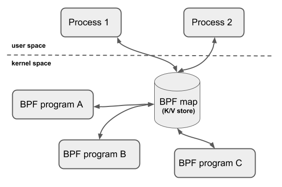
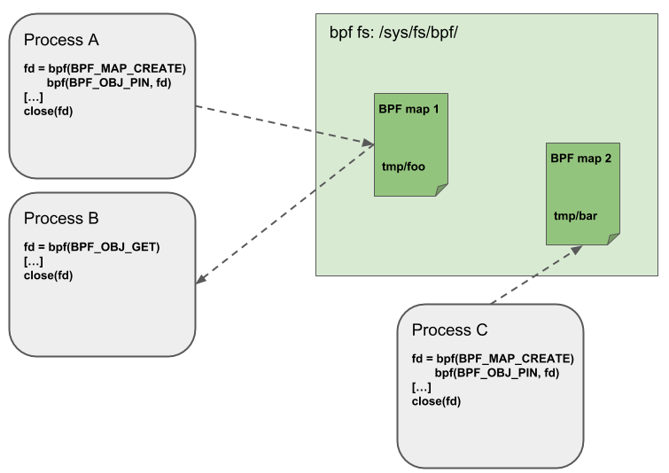
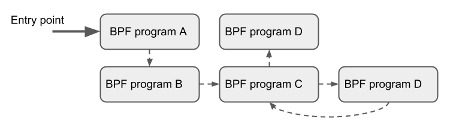

[bpf-cilium](https://docs.cilium.io/en/stable/bpf/)
[ebpf-cilium](https://docs.cilium.io/en/stable/concepts/ebpf/intro/)

[aya](https://aya-rs.dev/book)
[redbpf](https://github.com/foniod/redbpf/blob/main/TUTORIAL.md)
[bpf doc](https://www.kernel.org/doc/html/latest/bpf/index.html)

[bpf blog](https://arthurchiao.art/blog/bpf-advanced-notes-1-zh/)
[ebpf deep](https://www.codenong.com/cs105364645/)
[ebpf tracepoint](https://mozillazg.com/2022/05/ebpf-libbpf-raw-tracepoint-common-questions.html)

## BPF && XDP Reference

- [BPF \&\& XDP Reference](#bpf--xdp-reference)
  - [BPF 架构](#bpf-架构)
  - [BPF 指令集](#bpf-指令集)
    - [指令类别](#指令类别)
  - [Helper Functions](#helper-functions)
  - [Maps](#maps)
  - [Object Pinning](#object-pinning)
  - [Tail Calls](#tail-calls)
  - [BPF to BPF Calls](#bpf-to-bpf-calls)
  - [JIT](#jit)


BPF(Berkeley Packet Filter) 是Linux内核中一个高度灵活且高效的类虚拟机基础设施，允许以安全的方式在丰富的内核钩子中执行字节代码。BPF在内核的许多子系统中使用，特别是网络、追踪与安全子系统中

eBPF(extended Berkeley Packet Filter) 是Linux的现行标准，传统BPF程序(cBPF)会被透明的翻译为eBPF并在内核中执行

BPF起初是为了进行网络包过滤，目前其功能已有更多扩展，不局限于网络

### BPF 架构

BPF组成
- 指令集
- 基于指令集更进一步的基础设置
  - maps: 高效的键值存储
  - helper functions: 与内核交互并使用内核的功能
  - tail calls：用于调用其他BPF程序的尾调用
  - security hardening primitives：安全强化原语
  - pseudo file system：用于固定对象(maps, programs) 的伪文件系统
  - 允许卸载 BPF 程序的基础设施: 如将BPF程序卸载到智能网卡上

利用 BPF 的内核子系统也是 BPF 基础设施的一部分
- XDP BPF 程序挂载点是在网络驱动处理的最早阶段，并在接收到网络分组时出发BPF程序的执行，根据这一定义，这能够实现可能的最佳数据包处理性能，因为数据包无法在软件中更早的时间点进行处理，然而，由于这种处理在发生在网络栈处理的最早阶段，此时网络栈尚未从网络包包中提取元数据
- tc BPF 运行在内核栈的稍后阶段，因此可以访问更多的元数据和内核功能

### BPF 指令集

BPF是一个通用RISC指令集，最初设计的目的是在C的子集中编写程序，可以通过编译器后端编译成BPF指令，内核可以稍后通过内核内JIT编译器将它们映射到本机操作码中，以实现内核内的最佳执行性能

在内核中加入BPF指令集的优势: 
- 无需越过内核/用户空间来使内核可编程化，相比于将数据从内核移动到用户空间再进行处理，可以将处理程序编译为BPF并载入到内核中，避免地址空间的切换，同时仍然能在需要的时候通过 maps 在内核与应用地址空间中共享状态
- 考虑到可编程数据路径的灵活性，还可以通过编译程序解决的用例所不需要的特性来对程序进行性能优化。例如如果一个容器不需要IPv4，那么可以构建BPF程序以仅处理IPv6, 以节省 fast-path 中的资源
- 在网络子系统中（例如tc和XDP），BPF程序可以自动更新，而无需重新启动内核、系统服务或容器，也无需中断通信，此外，还可以通过BPF映射在整个更新过程中维护任何程序状态
- BPF为用户空间提供了稳定的ABI，不需要任何第三方内核模块。BPF是Linux内核的核心部分，它可以保证现有的BPF程序与更新的内核版本一起运行
- BPF程序与内核协同工作，它利用现有的内核基础设施（例如驱动程序、网络设备、隧道、协议栈、套接字）和工具（例如iproute2）以及内核提供的安全保障。与内核模块不同，BPF程序通过内核内验证器进行验证，以确保它们不会导致内核崩溃或始终终止。BPF可以被认为是一种通用的“粘合代码”，用于编写程序以解决特定的用例

内核内BPF程序的执行总是由事件驱动的

BPF资源
- 11 个带 32 bit 子寄存器的 64 bit 寄存器
- pc
- 512 byte BPF 栈空间

**寄存器**

命名为 $r_{0} - r_{10}$, 默认在 64 bit下工作，32位子寄存器只能通过特殊的ALU操作访问，32位低位子寄存器在写入时被 零扩展至 64 bit

$r_{10}$ 是唯一一个只读的寄存器，用来存放栈指针地址，以便访问 BPF 的栈空间，剩下的 $r_{0} - r_{9}$ 是通用寄存器，可读可写


**调用规则**

BPF 程序可以调用内核预定义的 helper function，调用规则如下

- $r_{0}$ 存放 helper function 请求的返回值
- $r_{1} - r_5{}$ 存放调用 helper function 的参数
- $r_{6} - r_{9}$ 是被调者保存寄存器，在hepler function中被保存与恢复

BPF 调用约定足够通用，因此可以直接映射到 x86_64, arm64和其他ABI, 因此所有BPF寄存器都会一对一映射到 HardWare CPU 寄存器，JIT只需要发出调用指令，而无需进行函数参数的移动

此调用约定被建模以涵盖常见的调用情况，而不会造成性能损失，当前不支持具有6个或更多参数的调用，内核中专用于BPF的helper函数（BPF_CALL_0（）到BPF_CALL_5（）函数）是专门按照这种约定设计的

$r_{0}$ 同时也保存BPF程序 exit value ，exit value  的语义由程序类型定义。此外，当将执行交还给内核时，exit value 将作为32位值传递

$r_{1} - r_{5}$ 是临时寄存器，意味着如果要在多个助手函数调用中重用这些参数，BPF程序需要将它们存放到BPF堆栈中，或者将它们移动到被调用方保存的寄存器。spilling/filling 分别对应将零时寄存器中的数据存放到栈上/从栈上取出数据到零时寄存器

在进入BPF程序的执行时，寄存器 $r_{1}$ 初始时包含程序的 context。context 是BPF程序的输入参数。BPF程序被严格控制在 single context 中工作。Context由 BPF 程序的类型决定。例如，网络程序可以将网络包（skb）的内核表示作为输入参数

每个BPF程序指令数量被限制在 4096，这意味着任何BPF程序都会很快的结束。在高于5.1版本的内核中，指令数量限制扩展至 1,000,000。

尽管指令集包含向前和向后跳转的指令，但是内核中的BPF验证器会禁止在BPF程序中出现循环，以便保证BPF程序总是会终止。同时，对应BPF程序直接的尾调用，上限是33个嵌套的尾调用，这通常用于分离部分程序逻辑，如将将程序分为多个阶段(将一个程序拆成多个程序，使用尾调用连接起来)

指令格式为两操作数模型，这有助于在JIT阶段将BPF指令映射到本机指令。指令长度固定，即任何指令都是 64 bit。目前，已经实现了87条指令，并且编码时允许在需要时使用进一步的指令扩展集合

**指令编码**

在大端机器上一个 64 bit 指令的指令编码被定义为一个 比特序列，从最高有效位(MSB)到最低有效位(LSB)
- (op:8, dst_reg:4, src_reg:4, off:16, imm:32)
- off 与 imm 为带符号类型

op 定义要执行的实际操作。op的大部分编码是从cBPF中重用的

操作可以基于寄存器或立即数操作数，而op本身的编码提供了使用哪种模式的信息( **BPF_X** 表示基于寄存器的操作， **BPF_K** 表示基于立即数的操作), 在后一种情况下，目标操作数始终是寄存器。`dst_reg` 和 `src_reg` 都提供操作码要使用的寄存器操作数的信息。

`off` 在某些指令中用于提供相对偏移，如对于栈上数据或其他BPF中可用的缓冲数据(map values, packet data, etc)的寻址, 或者是在跳转指令中寻址跳转地址。`imm` 保存一个 常量/立即值

`op` 可分为各种指令类，这些类别也被编码到 `op` 字段中，`op` 从最高有效位(MSB)到最低有效位(LSB)被分为
- (code:4, source:1, class:3)

`class` 是更通用的指令类，`code` 表示该类中的特定操作代码, `source` 表示源操作数是寄存器还是立即数

#### 指令类别

**BPF_LD， BPF_LDX**

两类指令都是用来加载，`BPF_LD` 用来加载 double word

**BPF_ST, BPF_STX**


两类指令用来存储

**BPF_ALU, BPF_ALU64**

两类都包含ALU操作，两者都支持add（+）、sub（-）和（&）、or（|）、left shift（<<）、right shift（>>）、xor（^）、mul（*）、div（/）、mod（%）、neg（~）操作

**BPF_JMP**

这类指令用来跳转


所有BPF处理（如将程序加载到内核或创建BPF映射）都通过 BPF（）系统调用进行管理，它还用于管理映射条目（查找/更新/删除），并通过 pinning 使程序和映射持久化在BPF文件系统中

### Helper Functions

Helper函数是一个概念，它使BPF程序能够查询内核定义的一组函数调用，以便从内核检索/向内核推送数据。每个BPF程序类型的可用帮助函数可能不同，如与连接到tc层的BPF程序相比，连接到套接字的BPF程序只能调用helpers的子集

每个 helper function 都使用与系统调用类似的公共共享函数签名来实现

```
u64 fn(u64 r1, u64 r2, u64 r3, u64 r4, u64 r5)
```

内核将 helper function 抽象为宏 `BPF_CALL_0()`到 `BPF_CALL_5()`，这些宏与系统调用类似

所有BPF helper function 都是core内核的一部分，不能通过内核模块进行扩展或添加

### Maps
 


maps 是驻留在内核空间中的高效键/值存储, 可以从BPF程序访问它们，以便在多个BPF程序调用之间保持状态。也可以从用户空间通过文件描述符访问，并且可以与其他BPF程序或用户空间应用程序任意共享

共享 maps 的BPF程序不必是相同的类型，如tracing程序可以与networking程序共享同一个 map, 单个BPF程序目前可以访问的map上限是64个

map的实现由 core kernel 提供。具有 per-CPU 和 non-per-CPU 风格的通用映射可以读取/写入任意数据，但也有一些非通用map与help functions一起使用

通用maps有:
- `BPF_MAP_TYPE_HASH`, `BPF_MAP_TYPE_ARRAY`
- `BPF_MAP_TYPE_PERCPU_HASH`,  `BPF_MAP_TYPE_PERCPU_ARRAY`
- `BPF_MAP_TYPE_LRU_HASH`, `BPF_MAP_TYPE_LRU_PERCPU_HASH`
- `BPF_MAP_TYPE_LPM_TRIE`

> per-cpu变量是linux系统一个非常有趣的特性，它为系统中的每个处理器都分配了该变量的副本

非通用maps在当前的kernel中有: `BPF_MAP_TYPE_PROG_ARRAY`,`BPF_MAP_TYPE_PERF_EVENT_ARRAY`, `BPF_MAP_TYPE_CGROUP_ARRAY`,`BPF_MAP_TYPE_STACK_TRACE`, `BPF_MAP_TYPE_ARRAY_OF_MAPS`,`BPF_MAP_TYPE_HASH_OF_MAPS`

`BPF_MAP_TYPE_PROG_ARRAY`: 是一个数组map, 用来保存其他BPF程序
`BPF_MAP_TYPE_ARRAY_OF_MAPS` 和 `BPF_MAP_TYPE_HASH_OF_MAPS` 都保存了指向其他map的指针，以便在运行时可以原子替换整个BPF映射

### Object Pinning



BPF maps 和 程序 表现为内核的一种资源，并且只能通过内核中匿名inode所支持的文件描述符进行访问

用户空间应用程序可以使用大多数与文件描述符相关的API，但同时，文件描述符仅限于进程的生命周期，这使得像map共享很难进行

为了克服这一限制，目前已经实现了一个最小的内核空间BPF文件系统，BPF映射和程序可以通过 Object pining 的过程 pinning 到该文件系统。因此，BPF系统调用扩展了两个新命令，它们可以pin (`BPF_OBJ_pin`) 或 retrieve (`BPF_OBJ_GET`) 先前 pinned 的对象

用这种复方式可以将 ebpf 的状态进行持久化

### Tail Calls



尾部调用可以被视为一种机制，允许一个BPF程序调用另一个，而不返回到旧程序。这样的调用开销最小，因为与函数调用不同，它被实现为一个长跳转，重用相同的堆栈框架

只有相同类型的程序才能被尾部调用，而且它们还需要在JIT编译方面匹配，因此可以调用JIT编译的程序或仅调用解释的程序，但不能混合在一起

todo

### BPF to BPF Calls

todo

### JIT

