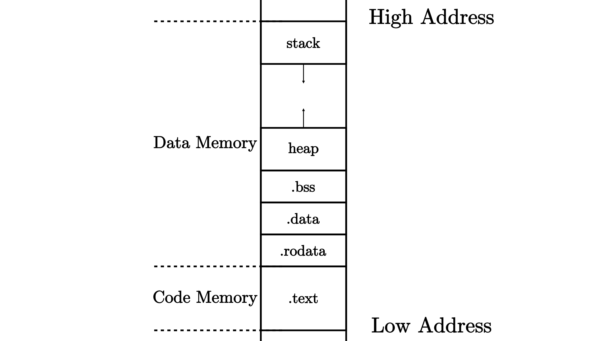
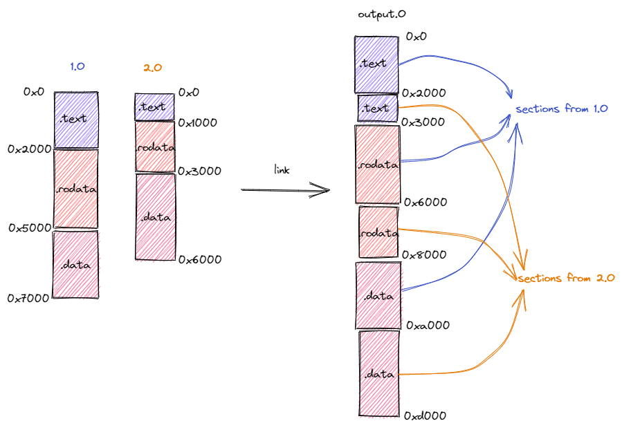

## 内存布局

- 源码编译为可执行文件
  - 至少可以分为两个部分: 数据、代码
  - 同时可以根据功能，将此两部分分为更小的单位: 段(Section)
  - 不同的段会被编译器放置在内存的不同位置上，构成程序的内存布局(Memory Layout)

- 代码
  - `.text`一个段
- 数据
  - `.rodata`: 只读全局数据
    - 常数、常量字符串
  - `.data`: 可修改的全局数据
  - `.bss`: 未初始化的全局数据
    - 通常由程序的加载者代为进行零初始化，即将这块区域逐字节清零
    - 在程序中表现为只声明全局变量，而不同时赋值
  - `heap`: 堆用来存放程序运行时动态分配的数据，向高地址增长
    - 如 C/C++ 中的 malloc/new 分配到的数据本体
  - `stack`: 栈不仅作用函数调用的上下文的保存与恢复，每个函数作用域内的局部变量也被编译器放在他的栈帧内，并向低地址增长

### 局部变量与全局变量

- 在一个函数的视角中，它能够访问的变量包括以下几种
  - 函数的输入参数和局部变量
    - 保存在一些寄存器或是该函数的栈帧里面
    - 如果是在栈帧里面的话是基于当前栈指针加上一个偏移量来访问的
  - 全局变量
    - 保存在数据段 .data 和 .bss 中
    - 某些情况下 gp(x3) 寄存器保存两个数据段中间的一个位置，于是全局变量是基于 gp 加上一个偏移量来访问的
  - 堆上的动态变量
    - 本体被保存在堆上，大小在运行时才能确定
      - 只能`直接`访问栈上或者全局数据段中的`编译期确定大小`的变量
    - 因此需要通过一个运行时分配内存得到的一个指向堆上数据的指针来访问它，指针的位宽确实在编译期就能够确定
    - 该指针即可以作为局部变量放在栈帧里面，也可以作为全局变量放在全局数据段中

## 编译流程

- 从源码得到可执行文件的编译流程可细化为多个阶段
  1. **编译器(Compiler)**将每个源文件从某门高级编程语言转化为汇编语言
     - 此时源文件仍然是一个 ASCII 或其他编码的文本文件
  2. **汇编器(Assembler)**将上一步的每个源文件中的文本格式的指令转化为机器码，得到一个二进制的**目标文件(Object File)**
  3. **链接器(Linker)**将上一步得到的所有目标文件以及一些可能的外部目标文件链接在一起形成一个完整的可执行文件

> 符号与地址: 
> 进行模块化编程的时候，每个模块都会提供一些向其他模块公开的全局变量、函数等供其他模块访问，也会访问其他模块向它公开的内容
> 要访问一个变量或者调用一个函数，在源代码级别我们只需知道它们的名字即可，这些名字被我们称为符号
> 取决于符号来自于模块内部还是其他模块，我们还可以进一步将符号分成内部符号和外部符号
> 然而，在机器码级别（也即在目标文件或可执行文件中）我们并不是通过符号来找到索引我们想要访问的变量或函数，而是直接通过变量或函数的地址
> 例如，如果想调用一个函数，那么在指令的机器码中我们可以找到函数入口的绝对地址或者相对于当前PC的相对地址

- 汇编器输出的每个目标文件都有一个独立的程序内存布局，描述了目标文件各段所在的位置

- 链接器所做的事情是将所有输入的目标文件整合成一个整体的内存布局，在此期间链接器主要完成两件事情: 

1. 第一件事情是将来自不同目标文件的段在目标内存布局中重新排布
  - 同一个地址在不同的内存布局中存放不同的内容, 而在合并后的内存布局中，这些冲突被消除
2. 第二件事情是将符号替换为具体地址
  - 内部符号转化
    - 因为符号对应的变量或函数都是放在某个段里面的固定位置（如全局变量往往放在 .bss 或者 .data 段中，而函数则放在 .text 段中），所以需要等待符号所在的段确定了它们在内存布局中的位置之后才能知道它们确切的地址
      - 当一个模块被转化为目标文件之后，它的内部符号就已经在目标文件中被转化为具体的地址了，因为目标文件给出了模块的内存布局，也就意味着模块内的各个段的位置已经被确定了
    - 然而，此时模块所用到的外部符号的地址无法确定。我们需要将这些外部符号记录下来，放在目标文件一个名为**符号表(Symbol table)**的区域内
      - 由于后续可能还需要重定位，内部符号也同样需要被记录在符号表中
  - 外部符号需要等到链接的时候才能被转化为具体地址
    - 假设模块 1 用到了模块 2 提供的内容，当两个模块的目标文件链接到一起的时候，它们的内存布局会被合并，也就意味着两个模块的各个段的位置均被确定下来
      - 此时，模块 1 用到的来自模块 2 的外部符号可以被转化为具体地址
    - 同时我们还需要注意：两个模块的段在合并后的内存布局中被重新排布，其最终的位置有可能和它们在模块自身的局部内存布局中的位置相比已经发生了变化
      - 因此，每个模块的内部符号的地址也有可能会发生变化，我们也需要进行修正
      - 上面的过程被称为重定位（Relocation），这个过程形象一些来说很像拼图：由于模块 1 用到了模块 2 的内容，因此二者分别相当于一块凹进和凸出一部分的拼图，正因如此我们可以将它们无缝地拼接到一起

### 静态链接与动态链接

- 静态链接与动态链接
  - 静态链接是指程序在编译时就将所有用到的函数库的目标文件链接到可执行文件中，这样会导致可执行文件容量较大，占用硬盘空间
  - 动态链接是指程序在编译时仅在可执行文件中记录用到哪些函数库和在这些函数库中用到了哪些符号，在操作系统执行该程序准备将可执行文件加载到内存时，操作系统会检查这些被记录的信息，将用到的函数库的代码和数据和程序一并加载到内存，并进行一些重定位工作
- 使用动态链接可以显著缩减可执行文件的容量，并使得程序不必在函数库更新后重新链接依然可用