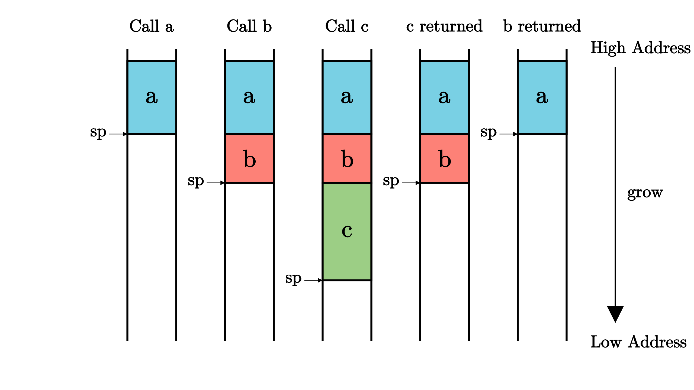
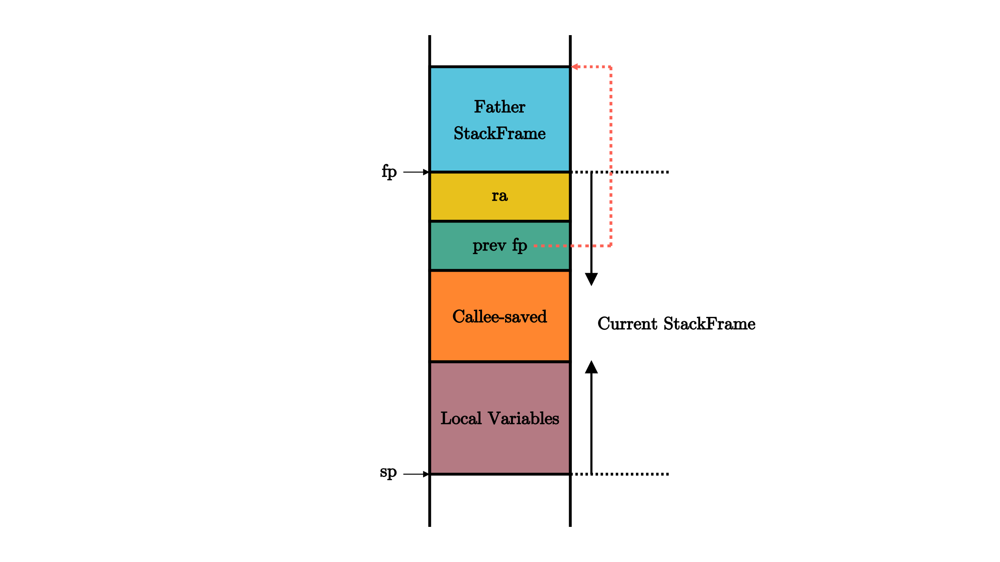

## 函数调用栈

- 函数的调用的返回跳转是跳转到一个`运行时确定`的地`址
- 编译器在函数中插入代码来进行上下文的保存和恢复
- 底层体系结构则提供相应的寄存器、指令来支持函数调用的发起，返回等操作

### risc-v中对函数函数调用的支持

- 指令`jal`, 将当前指令的下一条指令保存在寄存器`rd`中, 同时修改当前pc为`pc+imm`
  - riscv中，rd通常为x1寄存器
- 指令`ret`用于函数返回，通常被汇编器汇编为`jalr x0, 0(x1)`
  - 由于x0为恒零寄存器，因此指令的作用为修改当前pc为x1中的值，即之前保存的下一条指令地址

### 函数上下文

在控制流转移前后，需要保持不变的寄存器集合被称为**函数上下文**，然而由于寄存器数量有限，因此需要物理内存的帮助。在调用子函数之前，需要在物理内存中的一个区域**保存(Save)**函数调用上下文，而在函数执行完毕后，则从内存中同样的区域读取并**恢复(Restore)**函数调用上下文, 这篇物理内存区域就是**栈(stack)**, sp寄存器用来保存栈指针，指向内存中栈顶的位置
在一个函数中，作为起始的开场代码负责分配一块新的栈空间，即将sp的值减小相应的字节数即可，于是物理地址区间`[新sp, 旧sp)`对应的物理内存的一部分便可以被这个函数用来进行函数调用上下文的保存/恢复，这块物理内存被称为这个函数的**栈帧(Stackframe)**, 同时，函数中的结尾代码复制将开场代码分配的栈帧进行回收，也只需将sp的值增加相同的字节数恢复到分配之前的状态，显然sp是一个被调用者保存寄存器, 并且一般而言，当前执行函数的栈帧的两个边界分别由 **栈指针(Stack Pointer)** 寄存器和 **栈帧指针(frame pointer)** 寄存器来限定

函数调用上下文寄存器通常分为两类: 
- 被调用者保存(Callee-Saved)寄存器:  
  - 被调用的函数可能会覆盖这些寄存器，需要被调用的函数来保存的寄存器，即由被调用的函数来保证在调用前后，这些寄存器保持不变
- 调用者保存(Caller-Saved)寄存器:
  - 被调用的函数可能会覆盖这些寄存器，需要发起调用的函数来保存的寄存器，即由发起调用的函数来保证在调用前后，这些寄存器保持不变

 - 函数的**开场**(Prologue)和**结尾**(Epilogue)
   - 调用函数
     - 首先保存不希望在函数调用过程中发生变化的**调用者保存寄存器** ，然后通过 jal/jalr 指令调用子函数，返回之后恢复这些寄存器
   - 被调用函数
     - 在被调用函数的起始，先保存函数执行过程中被用到的**被调用者保存寄存器** ，然后执行函数，最后在函数退出之前恢复这些寄存器

### 调用规范

- **调用规范**(Calling Convention)约定在某个指令集架构上，某种编程语言的函数调用如何实现
  - 函数的输入参数和返回值如何传递
  - 函数调用上下文中调用者/被调用者保存寄存器的划分
  - 其他的在函数调用流程中对于寄存器的使用方法
- 调用规范针对一种特定的函数语言来说的，因此当一种语言想要调用使用另一门语言编写的函数接口时，编译器就必须同时清楚两种语言的调用规范，并对寄存器做出调整

### C语言调用规范

|       寄存器组        |    保存者    |                          功能                          |
| :-------------------: | :----------: | :----------------------------------------------------: |
|    a0~a7(x10~x17)     |  调用者保存  |   用来传递输入参数。其中的 a0 和 a1 还用来保存返回值   |
| t0~t6(x5~x7,x28~x31)  |  调用者保存  |  作为临时寄存器使用，在被调函数中可以随意使用无需保存  |
| s0~s11(x8~x9,x18~x27) | 被调用者保存 | 作为临时寄存器使用，被调函数保存后才能在被调函数中使用 |

- zero(x0)之前提到过，它恒为零，函数调用不会对它产生影响
- ra(x1)是调用者保存的，不过它并不会在每次调用子函数的时候都保存一次，而是在函数的开头和结尾保存/恢复即可。虽然 ra 看上去和其它被调用者保存寄存器保存的位置一样，但是它确实是调用者保存的(调用者使用jal指令，跳转并保存了下一条指令到寄存器ra)
- sp(x2)是被调用者保存的。这个是之后就会提到的栈指针 (Stack Pointer) 寄存器
- fp(s0)，它既可作为s0临时寄存器，也可作为栈帧指针(Frame Pointer)寄存器，表示当前栈帧的起始位置，是一个被调用者保存寄存器
- gp(x3)和tp(x4)在一个程序运行期间都不会变化，因此不必放在函数调用上下文中


### 函数调用与栈帧



**函数栈帧的组成**

- 栈帧的开头和结尾分别在 sp(x2) 和 fp(s0) 所指向的地址
- 按照地址从高到低分别有以下内容，它们都是通过 sp 加上一个偏移量来访问的(Push or Pop)
  1. ra寄存器保存其返回之后的跳转地址，是一个调用者保存寄存器
  2. 父亲栈帧的结束地址fp ，是一个被调用者保存寄存器；
  3. 其他被调用者保存寄存器 s1 ~ s11
  4. 函数所使用到的局部变量



### 分配并使用启动栈

- 在`.bss.stack`段中声明启动栈，其中`boot_stack`标识栈底，`boot_stack_top`标识栈顶
  - 此处"栈底"应当理解为栈的边界，而非栈的起始位置

```asm
    .section .text.entry
    .globl _start
_start:
    la sp, boot_stack_top
    call rust_main

    .section .bss.stack
    .globl boot_stack
boot_stack:
    .space 4096 * 16
    .globl boot_stack_top
boot_stack_top
```

- 使用rust代码进程 .bss 段的清零
  - extern "C" 可以引用一个外部的C函数接口，此处并没有进行函数调用，只是引用位置标志，从而获得.bss段两端的地址，并对其内容进行置空

```rust
fn clear_bss() {
    extern "C" {
        fn sbss();
        fn ebss();
    }
    (sbss as usize..ebss as usize).for_each(|a| {
        unsafe { (a as *mut u8).write_volatile(0) }
    });
}
```