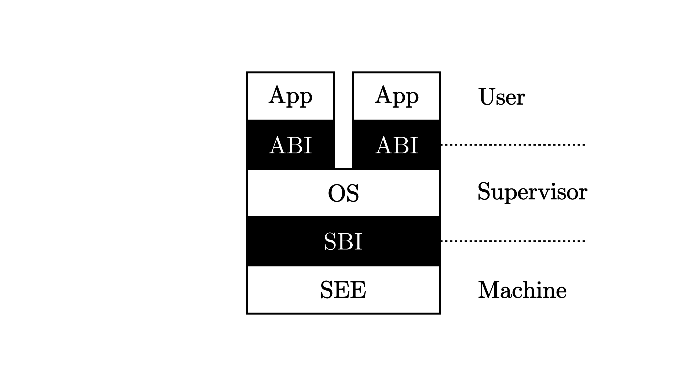
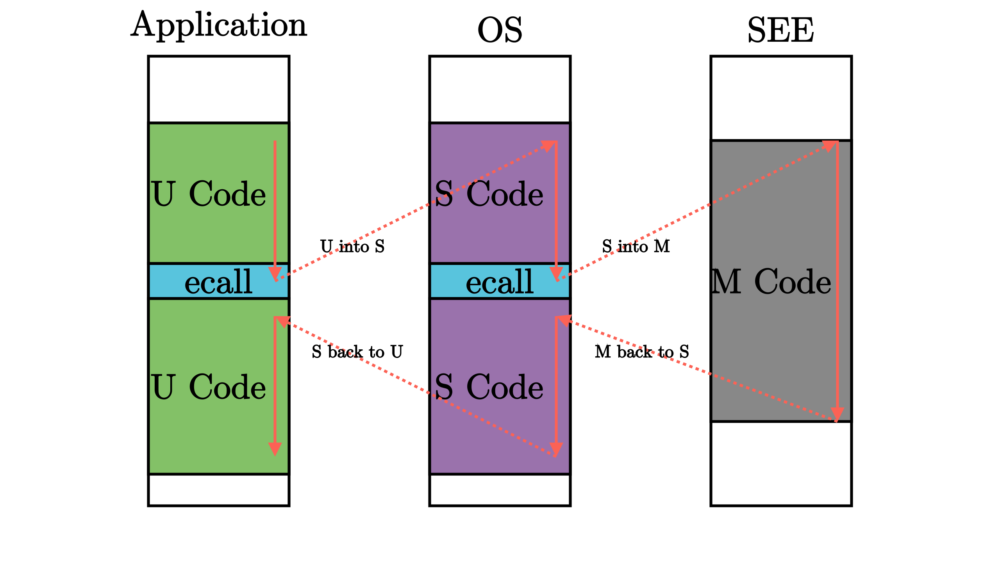

# 特权级机制
 
- 实现特权级机制的根本原因是应用程序运行的安全性不可充分信任
  - 应用本身的错误不会很快被发现，如果把操作系统与应用编译为一个单一执行的程序，当应用出错时，操作系统也会受到牵连

- 因而需要让相对安全可靠的操作系统运行在一个硬件保护的安全执行环境中，不受到应用程序的破坏；而让应用程序运行在另外一个无法破坏操作系统的受限执行环境中，为此需要限制的有两个方面
  - 应用程序不能访问任意的地址空间
  - 应用程序不能执行某些可能破坏计算机系统的指令

- 同时还需要确保应用程序能够得到操作系统的服务，即应用程序和操作系统还需要有交互的手段
  - 使得低特权级软件只能做高特权级软件允许它做的，且超出低特权级软件能力的功能必须寻求高特权级软件的帮助
  - 这样，高特权级软件（操作系统）就成为低特权级软件（一般应用）的软件执行环境的重要组成部分

## 软硬件协同设计

- 为了实现这样的特权级机制，需要进行软硬件协同设计
  - 一个比较简洁的方法就是，处理器设置两个不同安全等级的执行环境
    - 用户态特权级的执行环境和内核态特权级的执行环境
  - 同时明确指出可能破坏计算机系统的内核态特权级指令子集，规定内核态特权级指令子集中的指令只能在内核态特权级的执行环境中执行
  - 处理器在执行指令前会进行特权级安全检查，如果在用户态执行环境中执行这些内核态特权级指令，会产生异常

**硬件基础**

- 为了让应用程序获得操作系统的函数服务, 如果采用传统的函数调用方式将会直接绕过硬件的特权级保护检查，所以可以设计新的机器指令:
  - 执行环境调用(Execution Environment Call，简称 ecall)
  - 执行环境返回(Execution Environment Return，简称 eret)

- `ecall`: 具有用户态到内核态的执行环境切换能力的函数调用指令
- `eret`: 具有内核态到用户态的执行环境切换能力的函数返回指令

**软件基础**

> ecall 和 eret 两条指令分别可以用来让 CPU 从当前特权级切换到比当前高一级的特权级和切换到不高于当前的特权级

- 硬件具有了这样的机制后，还需要操作系统的配合才能最终完成对操作系统自身的保护
  - 首先，操作系统需要提供相应的功能代码，能在执行 eret 前准备和恢复用户态执行应用程序的上下文
  - 其次，在应用程序调用 ecall 指令后，能够检查应用程序的系统调用参数，确保参数不会破坏操作系统

## RISC-V特权级架构

- risc-v中定义了4种特权级
  - 级别数值越大，特权级越高，掌控硬件的能力越大
  - risc-v中，只有M模式是必须的，剩余特权级可以根据跑在 CPU 上应用的实际需求进行调整

| 级别  | 编码  |                名称                 |
| :---: | :---: | :---------------------------------: |
|   0   |  00   | 用户/应用模式 (U, User/Application) |
|   1   |  01   |      监督模式 (S, Supervisor)       |
|   2   |  10   |    虚拟监督模式 (H, Hypervisor)     |
|   3   |  11   |        机器模式 (M, Machine)        |

> 二进制接: 区别与高级程序语言的内部调用接口，是机器/汇编指令级的一种接口 

- 监督模式二进制接口(Supervisor Binary Interface, SBI)
  - M 模式软件 SEE 和 S 模式的内核之间的接口
- 应用程序二进制接口(Application Binary Interface, ABI)
  - 内核和 U 模式的应用程序之间的接口
  - 即系统调用(syscall, System Call)

M/S/U 三个特权级的软件可分别由不同的编程语言实现，即使是用同一种编程语言实现的，其调用也并不是普通的函数调用控制流，而是**陷入异常控制流**，在该过程中会切换CPU特权级，因此只有将接口下降到机器/汇编指令级才能够满足其跨高级语言的通用性和灵活性

每层特权级的软件都只能做高特权级软件允许它做的、且不会产生什么撼动高特权级软件的事情，一旦低特权级软件的要求超出了其能力范围，就必须寻求高特权级软件的帮助，否则就是一种异常行为

其他的异常则一般是在执行某一条指令的时候发生了某种错误（如除零、无效地址访问、无效指令等），或处理器认为处于当前特权级下执行的当前指令是高特权级指令或会访问不应该访问的高特权级的资源（可能危害系统）。碰到这些情况，就需要将控制转交给高特权级的软件（如操作系统）来处理。当错误/异常恢复后，则可重新回到低优先级软件去执行；如果不能恢复错误/异常，那高特权级软件可以杀死和清除低特权级软件，避免破坏整个执行环境

## RISC-V特权指令

- 与特权级无关的一般的指令和通用寄存器x0 ~ x31在任何特权级都可以执行
- 每个特权级都对应一些**特殊指令**和**控制状态寄存器**(CSR, Control and Status Register)，来控制该特权级的某些行为并描述其状态
- 特权指令不仅具有读写 CSR 的指令，还有其他功能的特权指令

**特权级保护机制的作用**

如果处于低特权级状态的处理器执行了高特权级的指令，会产生非法指令错误的异常
这样，位于高特权级的执行环境能够得知低特权级的软件出现了错误，这个错误一般是不可恢复的，此时执行环境会将低特权级的软件终止

### S模式特权指令

- S模式存在两类特权指令
  - 指令本身属于高特权级的指令，如`sret`指令(表示从 S 模式返回到 U 模式)
  - 指令访问了S模式特权级下才能访问的寄存器或内存
    - 如表示S模式系统状态的控制状态寄存器`sstatus`等

|          指令          |                                                      含义                                                      |
| :--------------------: | :------------------------------------------------------------------------------------------------------------: |
|          sret          |                             从 S 模式返回 U 模: 在 U 模式下执行会产生非法指令异常                              |
|          wfi           |                    处理器在空闲时进入低功耗状态等待中断: 在 U 模式下执行会产生非法指令异常                     |
|       sfence.vma       |                                刷新 TLB 缓存: 在 U 模式下执行会产生非法指令异常                                |
| 访问 S 模式 CSR 的指令 | 通过访问 sepc/stvec/scause/sscartch/stval/sstatus/satp 等CSR 来改变系统状态: 在 U 模式下执行会产生非法指令异常 |