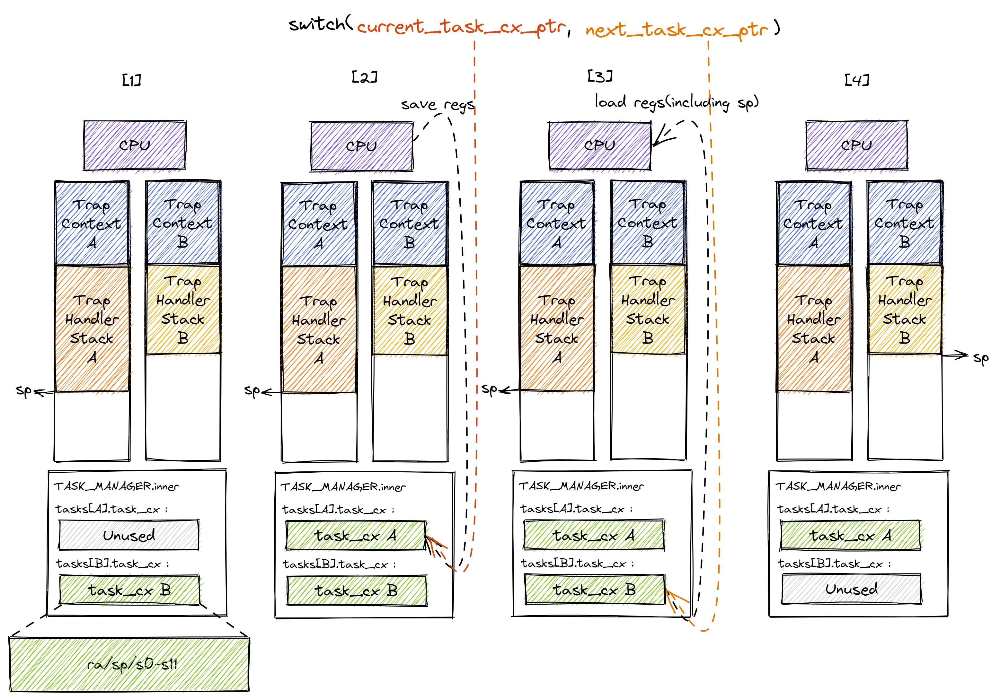
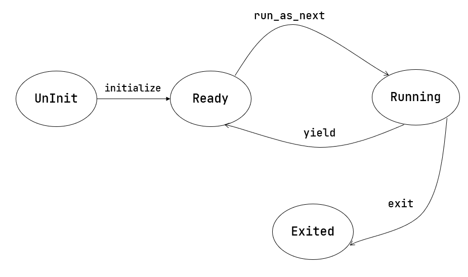

# 多道程序与任务切换


## 多道程序

扩展load模块功能，使得启动时内核就将所有程序载入指定的固定位置，并记录每个程序的起始点，之后不进行load再跳转固定地址的工作，而是然后按照顺序，依次读取程序的起始点并执行

为每个程序分配的空间大小固定，同时依据base地址与appid作为偏移量

```rust
fn get_base_i(app_id: usize) -> usize {
    APP_BASE_ADDRESS + app_id * APP_SIZE_LIMIT
}
```


## 任务切换

### 任务

应用程序的一次执行过程(一段控制流)称为一个`任务`，把应用执行过程中的一个时间片段上的执行片段或空闲片段称为"`计算任务片`"或"`空闲任务片`"。当应用程序的所有任务片都完成后，应用程序的一次任务也就完成了。从一个程序的任务切换到另外一个程序的任务称为`任务切换`, 这需要操作系统提供任务执行的"暂停"和"继续"的功能
同时，还需要保证程序执行的状态(上下文)，即在执行过程中同步变化的资源(如寄存器，栈等)保持不变，或者让其变化落在预期之内。然而并不是所有的资源都需要被保存，事实上只有那些对于程序接下来的正确执行仍然有用，且在它被切换出去的时候有被覆盖风险的那些资源才有被保存的价值，这些需要保存与恢复的资源被称为`任务上下文(Task Context)`

任务切换与Trap都是一种异常控制流，但并不完全相同: 
- 与Trap切换不同，任务切换不涉及特权级切换
- 与Trap切换不同，任务切换的一部分是由编译器帮忙完成的
- 与Trap切换相同，任务切换对应用是透明的

事实上，任务切换是来自两个不同应用在内核中的 Trap 控制流之间的切换
当一个应用Trap到S模式的操作系统内核中进行进一步处理时，其Trap控制流可以调用一个特殊的`__switch`函数，该函数表面上是一个普通的函数调用，即`__switch`返回后，将从调用该函数的位置继续向下执行
然而，在`__switch`过程中，原Trap控制流A会被暂停并切换出去，CPU转而运行另一个应用在内核中的Trap控制流B, 然后在某个合适的时机，原Trap控制流A才会从某一条Trap控制流C(很有可能不是它之前切换到的 B)切换回来继续执行并最终返回
`__switch`函数和一个普通的函数之间的核心差别仅仅是它会`换栈`

由于任务切换之后还需要再切换回来，因此需要保存CPU当前的某些寄存器，称为`任务上下文(Task Context)`, 在当前要实现的系统中，所有要执行的程序的TrapContext与TaskContext都已提前在内核中完成初始化
对于当前正在执行的任务的 Trap 控制流，我们用一个名为`current_task_cx_ptr`的变量来保存放置当前任务上下文的地址；而用`next_task_cx_ptr`的变量来保存放置下一个要执行任务的上下文的地址

```rust
pub struct TaskContext {
    ra: usize,
    sp: usize,
    s: [usize; 12], // 由于`__switch`是汇编代码写的特殊函数，因此不会被rust/C编译器处理，因此需要在`__switch`中手动保存s0-s11(被调用者保存寄存器)
}
```


**`__switch`整体流程**

从栈上内容的角度来看`__switch`的整体流程: 
- 阶段[1]: 在Trap控制流A调用`__switch`之前，A的内核栈上只有Trap上下文和Trap处理函数的调用栈信息，而B是之前被切换出去的
- 阶段[2]: A在A任务上下文空间在里面保存CPU当前的寄存器快照
- 阶段[3]: *读取`next_task_cx_ptr`指向的B任务上下文，根据B任务上下文保存的内容来恢复`ra`寄存器、`s0~s11`寄存器以及`sp`寄存器。只有这一步做完后，`__switch`才能做到一个函数跨两条控制流执行，即通过换栈也就实现了控制流的切换 
- 阶段[4]: 上一步寄存器恢复完成后，可以看到通过恢复`sp`寄存器换到了任务B的内核栈上，进而实现了控制流的切换。这就是为什么`__switch`能做到一个函数跨两条控制流执行。此后，当CPU执行`ret`汇编伪指令完成`__switch`函数返回后，任务B可以从调用`__switch`的位置继续向下执行



`__switch`有`current_task_cx_ptr`和`next_task_cx_ptr`两个参数，分别通过寄存器`a0`与`a1`传入
在rust中通过`extern`读取外部符号，并将`__switch`声明为rust函数，因此在调用前后 Rust 编译器会自动帮助我们插入保存/恢复调用者保存寄存器的汇编代码，不必再手动添加代码

- `switch`函数可以理解为一个没有进行任何实际操作的函数，
- 调用普通函数时，在函数返回之后，会回到原控制流继续执行，一个不进行任何操作的函数，其本身只进行了"保存调用者上下文 -> 恢复调用者上下文"的工作,`switch`函数可以理解为一个不进行任何操作的函数，而是"保存一个调用者的上下文 -> 恢复另一个调用者的上下文", 这两个上下文通过参数进行接收，从而实现了在一个函数中实现跨两条控制流的执行

```S
.altmacro
.macro SAVE_SN n
    sd s\n, (\n+2)*8(a0)
.endm
.macro LOAD_SN n
    ld s\n, (\n+2)*8(a1)
.endm
    .section .text
    .globl __switch
__switch:
    # 阶段 [1]
    # __switch(
    #     current_task_cx_ptr: *mut TaskContext,
    #     next_task_cx_ptr: *const TaskContext
    # )
    # 阶段 [2]
    # save kernel stack of current task
    sd sp, 8(a0)
    # save ra & s0~s11 of current execution
    sd ra, 0(a0)
    .set n, 0
    .rept 12
        SAVE_SN %n
        .set n, n + 1
    .endr
    # 阶段 [3]
    # restore ra & s0~s11 of next execution
    ld ra, 0(a1)
    .set n, 0
    .rept 12
        LOAD_SN %n
        .set n, n + 1
    .endr
    # restore kernel stack of next task
    ld sp, 8(a1)
    # 阶段 [4]
    ret
```


## 多道程序与协作式系统

- 任务运行状态：任务从开始到结束执行过程中所处的不同运行状态：未初始化、准备执行、正在执行、已退出
- 任务控制块：管理程序的执行过程的任务上下文，控制程序的执行与暂停
- 任务相关系统调用：应用程序和操作系统直接的接口，用于程序主动暂停`sys_yield`和主动退出`sys_exit`

### 系统调用yield(用户)

提供用户程序主动交出CPU使用权的能力

```rust
/// 功能：应用主动交出 CPU 所有权并切换到其他应用。
/// 返回值：总是返回 0。
/// syscall ID：124
fn sys_yield() -> isize;

// user/src/syscall.rs

pub fn sys_yield() -> isize {
    syscall(SYSCALL_YIELD, [0, 0, 0])
}

// user/src/lib.rs

pub fn yield_() -> isize { sys_yield() }
```

### 任务控制块

通过 #[derive(...)] 可以让编译器为你的类型提供一些 Trait 的默认实现
- 实现了 Clone Trait 之后就可以调用 clone 函数完成拷贝
- 实现了 PartialEq Trait 之后就可以使用 == 运算符比较该类型的两个实例，从逻辑上说只有 两个相等的应用执行状态才会被判为相等，而事实上也确实如此
- Copy 是一个标记 Trait，决定该类型在按值传参/赋值的时候采用移动语义还是复制语义

```rust
// os/src/task/task.rs
#[derive(Copy, Clone, PartialEq)]
pub enum TaskStatus {
    UnInit, // 未初始化
    Ready, // 准备运行
    Running, // 正在运行
    Exited, // 已退出

// os/src/task/context.rs
#[derive(Copy, Clone)]
#[repr(C)]
pub struct TaskContext {
    ra: usize,
    sp: usize,
    s: [usize; 12],
}

// os/src/task/task.rs
#[derive(Copy, Clone)]
pub struct TaskControlBlock {
    pub task_status: TaskStatus,
    pub task_cx: TaskContext,
}
```

### 任务管理器

代码中需要一个全局的任务管理器来管理这些用任务控制块描述的应用
- 使用`UPSafeCell`以获取其内部可变性以及单核上安全的运行时借用检查能力
- `current_task`仅标识当前正在执行的任务

```rust
// os/src/task/mod.rs

pub struct TaskManager {
    num_app: usize,
    inner: UPSafeCell<TaskManagerInner>,
}

struct TaskManagerInner {
    tasks: [TaskControlBlock; MAX_APP_NUM],
    current_task: usize,
}
```

**任务管理器的初始化**


初始化应用TrapContext与内核栈

```rust
pub fn init_app_cx(app_id: usize) -> usize { // 返回应用内核栈地址(sp)
    KERNEL_STACK[app_id].push_context(TrapContext::app_init_context( // 初始化应用的TrapContext
        get_base_i(app_id), // 计算应用的入口地址
        USER_STACK[app_id].get_sp(), // 获取用户栈指针
    )) // 将应用TrapContext写入应用的内核栈
}
```

初始化任务上下文

```rust
pub fn goto_restore(kstack_ptr: usize) -> Self {
    extern "C" {
        fn __restore(); // __restore 函数能够从TrapContext恢复应用程序上下文并转入用户态执行用户程序
    }
    Self {
        ra: __restore as usize,
        sp: kstack_ptr,
        s: [0; 12],
    }
}
```

```rust
lazy_static! {
    pub static ref TASK_MANAGER: TaskManager = {
        let num_app = get_num_app(); // 从loader模块中获得已载入的用户应用数量
        let mut tasks = [TaskControlBlock { 
            task_cx: TaskContext::zero_init(),
            task_status: TaskStatus::UnInit,
        }; MAX_APP_NUM]; 
        for (i, task) in tasks.iter_mut().enumerate() { // 初始化各个应用的任务控制块
            task.task_cx = TaskContext::goto_restore(init_app_cx(i));  // 初始化任务上下文
            task.task_status = TaskStatus::Ready;
        } 
        TaskManager {
            num_app,
            inner: unsafe {
                UPSafeCell::new(TaskManagerInner {
                    tasks,
                    current_task: 0,
                })
            },
        }
    };
}
```

### 系统调用yield(内核)

`sys_yield`用于应用主动放弃CPU的使用权，`sys_exit`用于退出当前应用并切换到下一个应用

```rust
// os/src/syscall/process.rs

pub fn sys_yield() -> isize {
    suspend_current_and_run_next();
    0
}

pub fn sys_exit(exit_code: i32) -> ! {
    println!("[kernel] Application exited with code {}", exit_code);
    exit_current_and_run_next();
    panic!("Unreachable in sys_exit!");
}

// os/src/task/mod.rs

pub fn suspend_current_and_run_next() {
    mark_current_suspended(); // 标记当前应用暂停
    run_next_task();
}

pub fn exit_current_and_run_next() {
    mark_current_exited(); // 标记当前应用终止
    run_next_task();
}

fn mark_current_suspended() {
    TASK_MANAGER.mark_current_suspended();
}

fn mark_current_exited() {
    TASK_MANAGER.mark_current_exited();
}
```

应用状态变更, 核心逻辑均为获得当前执行的应用的控制块，并对状态进行修改

```rust
fn mark_current_suspended(&self) {
    let mut inner = self.inner.exclusive_access();
    let current = inner.current_task;
    inner.tasks[current].task_status = TaskStatus::Ready;
}

fn mark_current_exit(&self) {
    let mut inner = self.inner.exclusive_access();
    let current = inner.current_task;
    inner.tasks[current].task_status = TaskStatus::Exited;
}
```

### 执行下一个应用

1. 将任务数组视为一个循环队列, 从当前任务的下一个任务开始遍历所有任务一次，直到找到一个状态为Ready的任务，返回其id号
   - 当前任务状态为Ready，若遍历一次之后未找到其他任务，则仍会执行当前任务
2. 如果系统中没有任务，则所有任务执行完毕，退出内核
3. 如果找到状态为Ready的任务，则将其作为下一个要执行的任务，修改其状态为`Running`，最后将当前任务与下一个任务的任务上下文指针作为参数交给`__switch`函数进行执行

```rust
fn find_next_task(&self) -> Option<usize> {
    let inner = self.inner.exclusive_access();
    let current = inner.current_task;
    (current + 1..current + self.num_app + 1)
        .map(|id| id % self.num_app)
        .find(|id| inner.tasks[*id].task_status == TaskStatus::Ready)
}

fn run_next_task(&self) {
    if let Some(next) = self.find_next_task() {
        let mut inner = self.inner.exclusive_access();
        let current = inner.current_task;
        inner.tasks[next].task_status = TaskStatus::Running;
        inner.current_task = next;
        let current_task_cx_ptr = &mut inner.tasks[current].task_cx as *mut TaskContext;
        let next_task_cx_ptr = &mut inner.tasks[next].task_cx as *mut TaskContext;
        drop(inner);
        unsafe { __switch(current_task_cx_ptr, next_task_cx_ptr) }
    } else {
        panic!("All applications completed!");
    }
}
```



### 首次进入用户态

`__restore`不必需要开头的`mv sp, a0`，因为首次执行用户程序时，同样通过`__switch`调用，而此时sp就已经指向正确的TrapContext地址，不必通过传参来获取内核栈地址


```rust
fn run_first_task(&self) -> ! {
    let mut inner = self.inner.exclusive_access();
    let task0 = &mut inner.tasks[0]; // 取出第一个任务
    task0.task_status = TaskStatus::Running; // 设置其状态为running
    let next_task_cx_ptr = &task0.task_cx as *const TaskContext; // 将该任务作为下一个执行的任务
    drop(inner);
    let mut _unused = TaskContext::zero_init(); // 给出空的TaskContext，假设其为正在执行的任务
    unsafe { __switch(&mut _unused as *mut TaskContext, next_task_cx_ptr) } // 从"空"任务切换到第一个任务，而`_unused`在函数推出后被释放
    panic!("unreachable in run_first_task!");
}
```