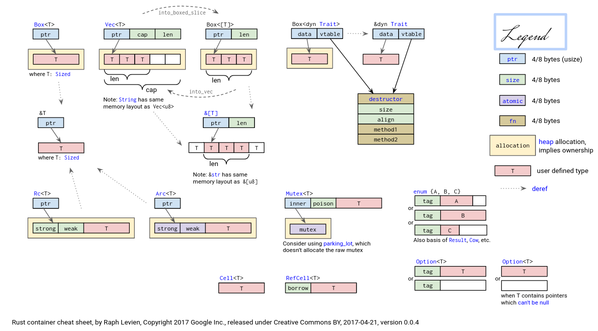

## 概述

应用视角中，动态内存分配中的内存，即时操作系统管理的"堆"，实现动态内存分配的能力，需要操作系统提供如下功能
- 初始时能提供一块大内存空间作为初始的"堆"
  - 在没有分页机制情况下，这块空间是物理内存空间，否则就是虚拟内存空间
- 提供在堆上分配和释放内存的函数接口
  - 这样函数调用方通过分配内存函数接口得到地址连续的空闲内存块进行读写，也能通过释放内存函数接口回收内存，以备后续的内存分配请求
- 提供空闲空间管理的连续内存分配算法
  - 相关算法能动态地维护一系列空闲和已分配的内存块，从而有效地管理空闲块
- (可选)提供建立在堆上的数据结构和操作
  - 有了上述基本的内存分配与释放函数接口，就可以实现类似动态数组，动态字典等空间灵活可变的堆数据结构，提高编程的灵活性

## 静态与动态内存分配

### 静态分配

某一时刻查看一个应用的地址空间，可以看到若干个内存块，每一块都对应于一个生命周期尚未结束的变量
- 局部变量，来自于正在执行的当前函数调用栈上，即分配在栈上
- 全局变量，一般被分配在数据段中
两者的共同点是, 在编译器编译程序时已经知道这些变量所占的字节大小，于是给它们分配一块固定的内存将它们存储其中，这样变量在栈帧/数据段中的位置就被固定了下来。这些变量是被 **静态分配(Static Allocation)** 的，这一过程来源于我们在程序中对变量的声明，在编译期由编译器完成

### 动态分配

对于其它情况，如某些数据结构需求的内存大小取决于程序的实际运行情况，静态分配就不够灵活，而**动态分配(Dynamic Allocation)**则可以解决上述问题。应用另外放置了一个大小可以随着应用的运行动态增减的内存空间 – **堆(Heap)**。同时，应用还要能够将这个堆管理起来，即支持在运行的时候从里面分配一块空间来存放变量，而在变量的生命周期结束之后，这块空间需要被回收以待后面的使用。如果堆的大小固定，那么这其实就是一个连续内存分配问题，可以使用操作系统课上所介绍到的各种连续内存分配算法
一般情况下，应用所依赖的基础系统 **(如 Linux 中的 glibc 库等)** 会直接通过系统调用(如类Unix内核提供的sbrk系统调用)来向内核请求增加/缩减应用地址空间内堆的大小，之后应用就可以基于基础系统库提供的内存分配/释放函数来获取和释放内存了。应用进行多次不同大小的内存分配和释放操作后，会产生内存空间的浪费，即存在无法被应用使用的空闲内存碎片

事实上在程序中能够 **直接** 看到的变量都是被静态分配在栈或者全局数据段上的，它们大小在编译期已知。比如把固定大小的指针放到栈(局部变量)或数据段(全局变量)上，然后通过指针来指向运行时才确定的堆空间上的数据，并进行访问。这样就可以通过确定大小的指针来实现对编译时大小不确定的堆数据的访问

除了可以灵活利用内存之外，动态分配还允许我们以尽可能小的代价灵活调整变量的生命周期。一个局部变量被静态分配在它所在函数的栈帧中，一旦函数返回，这个局部变量的生命周期也就结束了；而静态分配在数据段中的全局变量则是在应用的整个运行期间均存在。动态分配允许我们构造另一种并不一直存在也不绑定于函数调用的变量生命周期：以 C 语言为例，可以说自 malloc 拿到指向一个变量的指针到 free 将它回收之前的这段时间，这个变量在堆上存在。由于需要跨越函数调用，我们需要作为堆上数据代表的变量在函数间以参数或返回值的形式进行传递，而这些变量一般都很小（如一个指针），其拷贝开销可以忽略

而动态内存分配的缺点在于：它背后运行着连续内存分配算法，相比静态分配会带来一些额外的开销。如果动态分配非常频繁，可能会产生很多无法使用的内存碎片，甚至可能会成为应用的性能瓶颈

## Rust中的堆数据结构

智能指针(Smart Pointer)和 Rust 中的其他两类指针：裸指针 `*const T/*mut T` 和引用 `&T/&mut T` 一样，都指向地址空间中的另一个区域并包含它的位置信息。但它们携带的信息数量不等，需要经过编译器不同等级的安全检查，所以它们在可靠性和灵活程度也有所不同

- 裸指针`*const T/*mut T`基本等价于 C/C++ 里面的普通指针`T*`，它自身的内容仅仅是一个地址。它最为灵活，但是也最不安全。编译器只能对它进行最基本的可变性检查(只读的数据不能写)，通过裸指针解引用来访问数据的行为是 unsafe 行为，需要被包裹在 unsafe 块中
- 引用`&T/&mut T`实质上只是一个地址范围，但是 Rust 编译器会在编译的时候进行比较严格的借用检查 (Borrow Check)，来确保在编译期就解决掉很多内存不安全问题
- 智能指针不仅包含它指向区域的地址范围，还含有一些额外的信息，因此这个类型的大小大于裸指针的大小，属于一种"胖"指针。从用途上看，它不仅可以作为一个媒介来访问它指向的数据，还能在这个过程中起到管理和控制的功能

Rust中，与动态内存分配相关的智能指针如下:
- `Box<T>` 在创建时会在堆上分配一个类型为 `T` 的变量，它自身也只保存在堆上的那个变量的位置。而和裸指针或引用不同的是，当 `Box<T>` 被回收的时候，它指向的那个变量(位于堆上)也会被回收。`Box<T>` 可以对标 C++ 的 `std::unique_ptr`
- `Rc<T>` 是一个单线程上使用的引用计数类型，它提供了多所有权支持，即可同时存在多个智能指针指向同一个堆上变量的 `Rc<T>` ，它们都可以拿到指向变量的不可变引用来访问这同一个变量。而它同时也是一个引用计数，事实上在堆上的另一个位置维护了这个变量目前被引用的次数 `N` ，即存在 `N` 个 `Rc<T>` 智能指针。这个计数会随着 `Rc<T>` 智能指针的创建或复制而增加，并在 `Rc<T>` 智能指针生命周期结束时减少。当这个计数变为零之后，这个智能指针变量本身以及被引用的变量都会被回收。 `Arc<T>` 与 `Rc<T>` 功能相同，只是`Arc<T>` 可以在多线程上使用。 `Arc<T>` 类似于 C++ 的 `std::shared_ptr`
- `RefCell<T>` 与 `Box<T>` 等智能指针不同，其 `借用检查` 在运行时进行。对于 `RefCell<T>`，如果违反借用规则，程序会编译通过，但会在运行时 `panic` 并退出。使用 `RefCell<T>` 的好处是，可在其自身是不可变的情况下修改其内部的值。在Rust语言中，在不可变值内部改变值是一种 `内部可变性` 的设计模式
- `Mutex<T>` 是一个互斥锁，在多线程中使用。它可以保护里层的堆上的变量同一时间只有一个线程能对它进行操作，从而避免数据竞争，这是并发安全的问题，会在后面详细说明。同时，它也能够提供 `内部可变性` 。`Mutex<T>` 时常和 `Arc<T>` 配套使用，因为它是用来保护多线程(线程概念在后面会讲，这里可简单理解为运行程序)可同时访问的数据，其前提就是多个线程都拿到指向同一块堆上数据的 `Mutex<T>` 。于是，要么这个 `Mutex<T>` 作为全局变量被分配到数据段上，要么将 `Mutex<T>` 包裹上一层多所有权 `Arc` ，变成 `Arc<Mutex<T>>` 这种经典组合结构，让最里层基于泛型 `T` 数据结构的变量可以在线程间安全传递。可以将 `Mutex<T>` 看成 `RefCell<T>` 的多线程版本， 因为 `RefCell<T>` 是只能在单线程上使用的。而且 `RefCell<T>` 并不会在堆上分配内存，它仅用于基于数据段的 `静态内存` 分配

基于上述智能指针，可形成更强大的 `集合 (Collection)` 或称 `容器 (Container)` 类型，它们负责管理一组数目可变的元素，这些元素的类型相同或是有着一些同样的特征。在 `C++/Python/Java` 等高级语言中我们已经对它们的使用方法非常熟悉了，对于 Rust 而言，我们可以直接使用以下容器: 
- 向量 `Vec<T>` 类似于 C++ 中的 `std::vector`
- 键值对容器 `BTreeMap<K, V>` 类似于 C++ 中的 `std::map`
- 有序集合 `BTreeSet<T>` 类似于 C++ 中的 `std::set`
- 链表 `LinkedList<T>` 类似于 C++ 中的 `std::list`
- 双端队列 `VecDeque<T>` 类似于 C++ 中的 `std::deque`
- 变长字符串 `String` 类似于 C++ 中的 `std::string`

### 其他语言使用动态内存的方式

- C 语言仅支持 malloc/free 这一对操作，它们必须恰好成对使用，否则就会出现各种内存错误
  - 比如分配了之后没有回收，则会导致内存泄漏；回收之后再次 free 相同的指针，则会造成 Double-Free 问题；又如回收之后再尝试通过指针访问它指向的区域，这属于 Use-After-Free 问题。总之，这样的内存安全问题层出不穷，毕竟人总是会犯错的。
- Python/Java 通过 **引用计数 (Reference Counting)** 对所有的对象进行运行时的动态管理
  - 一套 **垃圾回收 (GC, Garbage Collection)** 机制会被自动定期触发，每次都会检查所有的对象，如果其引用计数为零则可以将该对象占用的内存从堆上回收以待后续其他的对象使用
  - 这样做完全杜绝了内存安全问题，但是性能开销则很大，而且 GC 触发的时机和每次 GC 的耗时都是无法预测的，还使得软件的执行性能不够确定。
- C++ 的智能指针 (shared_ptr、unique_ptr、weak_ptr、auto_ptr等) 和 资源获取即初始化 (RAII, Resource Acquisition Is Initialization，指将一个使用前必须获取的资源的生命周期绑定到一个变量上，变量释放时，对应的资源也一并释放。) 风格都是致力于解决内存安全问题。但这些编程方式是"建议"而不是"强制"

在动态内存分配方面， Rust 和 C++ 很像，事实上 Rust 有意从 C++ 借鉴了这部分优秀特性，并强制Rust编程人员遵守 **借用规则** 。以 Box<T> 为例，在它被创建的时候，会在堆上分配一块空间保存它指向的数据；而在 Box<T> 生命周期结束被回收的时候，堆上的那块空间也会立即被一并回收。这也就是说，我们无需手动回收资源，它和绑定的变量会被自动回收；同时，由于编译器清楚每个变量的生命周期，则变量对应的资源何时被回收是完全可预测的，回收操作的开销也是确定的。在 Rust 中，不限于堆内存，将某种资源的生命周期与一个变量绑定的这种 RAII 的思想无处不在，甚至这种资源可能只是另外一种类型的变量。

## 在内核中支持动态内存分配

要在操作系统内核中支持动态内存分配，需要实现一系列功能: 初始化堆、分配/释放内存块的函数接口、连续内存分配算法。相对于 C 语言而言，Rust语言在 `alloc` crate 中设定了一套简洁规范的接口，只要实现了这套接口，内核就可以很方便地支持动态内存分配了