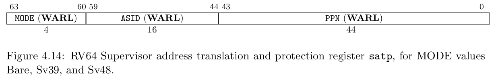

CPU 访问数据和指令的内存地址是虚地址，通过硬件机制（比如 MMU +页表查询）进行地址转换，找到对应的物理地址。为此，计算机科学家提出了 地址空间（Address Space） 抽象，并在内核中建立虚实地址空间的映射机制，给应用程序提供一个基于地址空间的安全虚拟内存环境，让应用程序简单灵活地使用内存。

## 虚拟地址和物理地址

通过修改 S 特权级的一个名为 `satp` 的 CSR 来启用分页模式，在这之后 S 和 U 特权级的访存地址会被视为一个虚拟地址，它需要经过 MMU 的地址转换变为一个物理地址，再通过它来访问物理内存；而 M 特权级的访存地址，我们可设定是内存的物理地址

- `MODE` 控制 CPU 使用哪种页表实现
- `ASID` 表示地址空间标识符，这里还没有涉及到进程的概念，我们不需要管这个地方
- `PPN` 存的是根页表所在的物理页号。这样，给定一个虚拟页号，CPU 就可以从三级页表的根页表开始一步步的将其映射到一个物理页号

当 `MODE` 设置为 0 的时候，代表所有访存都被视为物理地址
而设置为 8 的时候，SV39 分页机制被启用
- 所有 S/U 特权级的访存被视为一个 39 位的虚拟地址，它们需要先经过 MMU 的地址转换流程，如果顺利的话，则会变成一个 56 位的物理地址来访问物理内存；否则则会触发异常，这体现了分页机制的内存保护能力