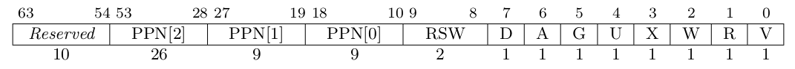

CPU 访问数据和指令的内存地址是虚地址，通过硬件机制（比如 MMU +页表查询）进行地址转换，找到对应的物理地址。为此，计算机科学家提出了 地址空间（Address Space） 抽象，并在内核中建立虚实地址空间的映射机制，给应用程序提供一个基于地址空间的安全虚拟内存环境，让应用程序简单灵活地使用内存。

## 虚拟地址和物理地址

通过修改 S 特权级的一个名为 `satp` 的 CSR 来启用分页模式，在这之后 S 和 U 特权级的访存地址会被视为一个虚拟地址，它需要经过 MMU 的地址转换变为一个物理地址，再通过它来访问物理内存；而 M 特权级的访存地址，我们可设定是内存的物理地址

- `MODE` 控制 CPU 使用哪种页表实现
- `ASID` 表示地址空间标识符，这里还没有涉及到进程的概念，我们不需要管这个地方
- `PPN` 存的是根页表所在的物理页号。这样，给定一个虚拟页号，CPU 就可以从三级页表的根页表开始一步步的将其映射到一个物理页号

当 `MODE` 设置为 0 的时候，代表所有访存都被视为物理地址
而设置为 8 的时候，SV39 分页机制被启用
- 所有 S/U 特权级的访存被视为一个 39 位的虚拟地址，它们需要先经过 MMU 的地址转换流程，如果顺利的话，则会变成一个 56 位的物理地址来访问物理内存；否则则会触发异常，这体现了分页机制的内存保护能力

### 数据结构与抽象定义

物理页号/物理地址与`usize`的转换，只需要进行左移/右移
物理页号与物理地址之间的转化则稍有不同:
- 从物理页号到物理地址的转换只需左移12位即可
- 从物理地址到物理页号转换时，需要保证物理地址与页面对齐
  - 此时假定物理页号与物理地址等价，即两者可认为是同一事物相互转化，因而必须保证物理地址的page_offset为0，否则则是单纯的从物理地址中求出页号

### 页表项

利用虚拟页号在页表中查到的结果中，物理页号和全部的标志位以某种固定的格式保存在一个结构体中，它被称为 `页表项`(PTE, Page Table Entry)

SV39 分页模式下的页表项，其中 `[53:10]` 这 `44` 位是物理页号，最低的 `8` 位 `[7:0]` 则是标志位，它们的含义如下
- V(Valid): 仅当位 V 为 1 时，页表项才是合法的
- R(Read)/W(Write)/X(eXecute): 分别控制索引到这个页表项的对应虚拟页面是否允许读/写/执行
- U(User): 控制索引到这个页表项的对应虚拟页面是否在 CPU 处于 U 特权级的情况下是否被允许访问
- G: 暂且不理会
- A(Accessed): 处理器记录自从页表项上的这一位被清零之后，页表项的对应虚拟页面是否被访问过
- D(Dirty): 处理器记录自从页表项上的这一位被清零之后，页表项的对应虚拟页面是否被修改过

除了 `G` 外的上述位可以被操作系统设置，只有 `A` 位和 `D` 位会被处理器动态地直接设置为 `1` ，表示对应的页被访问过或修过
- A 位和 D 位能否被处理器硬件直接修改，取决于处理器的具体实现