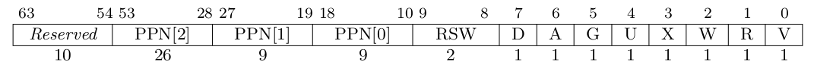
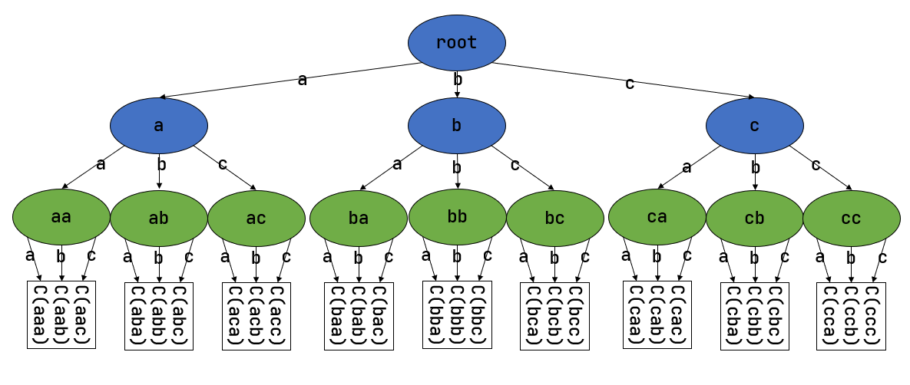
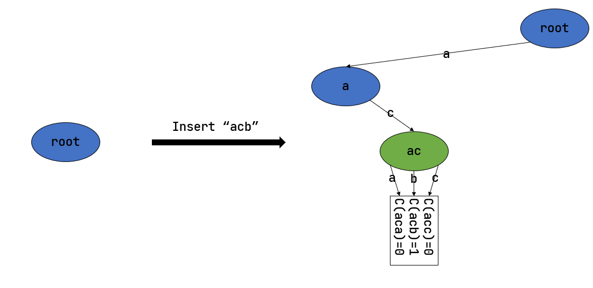
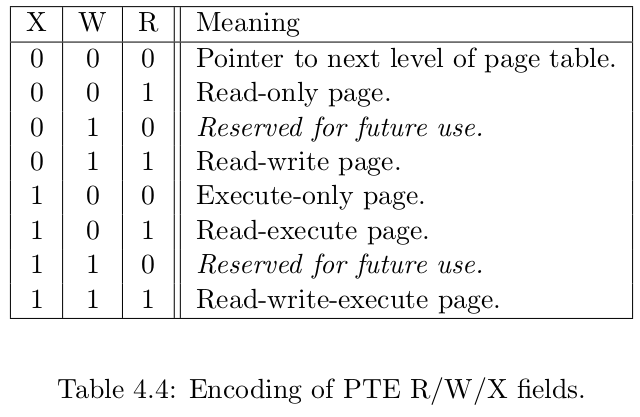
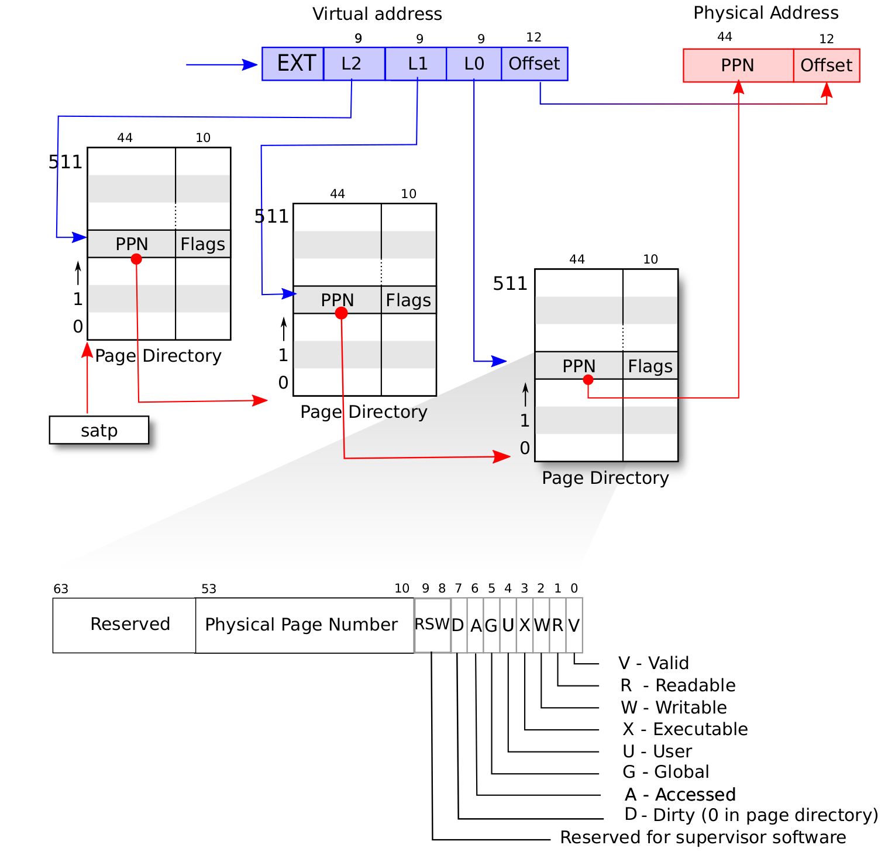

CPU 访问数据和指令的内存地址是虚地址，通过硬件机制（比如 MMU +页表查询）进行地址转换，找到对应的物理地址。为此，计算机科学家提出了 地址空间（Address Space） 抽象，并在内核中建立虚实地址空间的映射机制，给应用程序提供一个基于地址空间的安全虚拟内存环境，让应用程序简单灵活地使用内存。

## 虚拟地址和物理地址

通过修改 S 特权级的一个名为 `satp` 的 CSR 来启用分页模式，在这之后 S 和 U 特权级的访存地址会被视为一个虚拟地址，它需要经过 MMU 的地址转换变为一个物理地址，再通过它来访问物理内存；而 M 特权级的访存地址，我们可设定是内存的物理地址

- `MODE` 控制 CPU 使用哪种页表实现
- `ASID` 表示地址空间标识符，这里还没有涉及到进程的概念，我们不需要管这个地方
- `PPN` 存的是根页表所在的物理页号。这样，给定一个虚拟页号，CPU 就可以从三级页表的根页表开始一步步的将其映射到一个物理页号

当 `MODE` 设置为 0 的时候，代表所有访存都被视为物理地址
而设置为 8 的时候，SV39 分页机制被启用
- 所有 S/U 特权级的访存被视为一个 39 位的虚拟地址，它们需要先经过 MMU 的地址转换流程，如果顺利的话，则会变成一个 56 位的物理地址来访问物理内存；否则则会触发异常，这体现了分页机制的内存保护能力

### 数据结构与抽象定义

物理页号/物理地址与`usize`的转换，只需要进行左移/右移
物理页号与物理地址之间的转化则稍有不同:
- 从物理页号到物理地址的转换只需左移12位即可
- 从物理地址到物理页号转换时，需要保证物理地址与页面对齐
  - 此时假定物理页号与物理地址等价，即两者可认为是同一事物相互转化，因而必须保证物理地址的page_offset为0，否则则是单纯的从物理地址中求出页号

### 页表项

利用虚拟页号在页表中查到的结果中，物理页号和全部的标志位以某种固定的格式保存在一个结构体中，它被称为 `页表项`(PTE, Page Table Entry)

SV39 分页模式下的页表项，其中 `[53:10]` 这 `44` 位是物理页号，最低的 `8` 位 `[7:0]` 则是标志位，它们的含义如下
- V(Valid): 仅当位 V 为 1 时，页表项才是合法的
- R(Read)/W(Write)/X(eXecute): 分别控制索引到这个页表项的对应虚拟页面是否允许读/写/执行
- U(User): 控制索引到这个页表项的对应虚拟页面是否在 CPU 处于 U 特权级的情况下是否被允许访问
- G: 暂且不理会
- A(Accessed): 处理器记录自从页表项上的这一位被清零之后，页表项的对应虚拟页面是否被访问过
- D(Dirty): 处理器记录自从页表项上的这一位被清零之后，页表项的对应虚拟页面是否被修改过

除了 `G` 外的上述位可以被操作系统设置，只有 `A` 位和 `D` 位会被处理器动态地直接设置为 `1` ，表示对应的页被访问过或修过
- A 位和 D 位能否被处理器硬件直接修改，取决于处理器的具体实现

### 多级页表

**线性页表**

页表的简单实现是一个线性表，对应一个大小为长度为 $2^{27}$ (虚拟页号的大小)的数组，每个虚拟页号为数组的下标，对应一个8byte页表项，其中存储了数据实际保存的物理页号，以及相关的权限信息。然而这种页表的实现方式，需要 $2^{30}$ byte的存储空间，即对于每个应用而言，需要消耗1GiB以上的内存，因而这种实现方式在空间占用的角度上来说是不可行的。

对线性页表优化的核心思想在于`按需分配`,即有多少合法的虚拟页号，就维护一个多大的映射，并为此使用多大的内存用来保存映射
- 每个应用的地址空间最开始都是空的，或者说所有的虚拟页号均不合法，那么这样的页表自然不需要占用任何内存， `MMU` 在地址转换的时候无需关心页表的内容而是将所有的虚拟页号均判为不合法即可
- 而在后面，内核已经决定好了一个应用的各逻辑段存放位置之后，它就需要负责从零开始以虚拟页面为单位来让该应用的地址空间的某些部分变得合法，反映在该应用的页表上也就是一对对映射顺次被插入进来，自然页表所占据的内存大小也就逐渐增加

**多重集维护**

> 多重集: 在集合的基础上进行推广,允许重复并以重数标定

以维护一个字符串多重集为例(字符串 + 重数count)
- 字符集为 $\mathbf{\alpha} = \{a, b, c\}$, 长度为常数n
- 字符串集合开始为空，需支持一个字符串(基于字符集，长度n)的插入，以及查询一个字符串在当前集合中出现的次数

若 $n=3$ , 则能得到如下 `字典树(Trie)`

字典树由若干个节点（图中用椭圆形来表示）组成，从逻辑上而言每个节点代表一个可能的字符串前缀。每个节点的存储内容都只有三个指针: 
- 对于蓝色的非叶节点来说，它的三个指针各自指向一个子节点
- 而对于绿色的叶子节点来说，它的三个指针不再指向任何节点，而是具体保存一种可能的长度为n的字符串的计数

对于查询的操作,只需根据输入的字符串在字典树上自上而下走出对应一步,就能够找到字典树中维护的计数

如果某些字符串自始至终没有被插入,那么一些节点没有存在的必要, 因而可以设置一开始仅存在一个根节点: 
- 插入字符串 `acb` 的过程中，只需要分配 `a` 和 `ac` 两个节点
  - 注意 ac 是一个叶节点，它的 b 指针不再指向另外一个节点而是保存字符串 acb 的计数
  - 此时我们无法访问到其他未分配的节点，如根节点的 b/c 或是 a 节点的 a/b 均为空指针
- 后续再插入一个字符串，那么 `至多分配两个新节点`, 因为如果走的路径上有节点已经存在，就无需重复分配了

这可以说明，字典树中节点的数目（或者说字典树消耗的内存）是随着插入字符串的数目逐渐线性增加的

**SV39多级页表**

SV39 分页机制等价于一颗字典树
- 27位的的虚拟页号可以看成是一个是一个长度 $n = 3$ 的字符串
- 字符集为  $\mathbf{\alpha} = \{0, 1, 2,..., 511\}$ (3 个 $2^{9}$),
- 所维护/查询的是一个页表项而非计数

因此在SV39 多级页表的实现中
- 每个叶节点都需要保存 512 个 8 byte的页表项, 总共 4KiB, 可以直接放在一个物理页帧中
- 对于非叶节点来说，从功能上它只需要保存 512 个指向下级节点的指针即可，但在实际实现中,则像叶节点那样也保存 512 个页表项，这样所有的节点都可以被放在一个物理页帧内,它们的位置可以用一个物理页号来代替
  - 当想从一个非叶节点向下走时，只需找到当前字符对应的页表项的物理页号字段，它就指向了下一级节点的位置，这样非叶节点中转的功能也就实现了

每个节点的内部是一个线性表，也就是将这个节点起始物理地址加上字符对应的偏移量就找到了指向下一级节点的页表项（对于非叶节点）或是能够直接用来地址转换的页表项（对于叶节点）

SV39 中虚拟页号被分为三级 `页索引(Page Index)`，因此是一种三级页表，而非叶节点（页目录表，非末级页表）的表项标志位含义和叶节点（页表，末级页表）相比有一些不同:
- 当 `V` 为 `0` 的时候，代表当前指针是一个空指针，无法走向下一级节点，即该页表项对应的虚拟地址范围是无效的
- 只有当 `V` 为1 且 `R/W/X` 均为 0 时，表示是一个合法的页目录表项，其包含的指针会指向下一级的页表
- 注意: 当 V 为1 且 R/W/X 不全为 0 时，表示是一个合法的页表项，其包含了虚地址对应的物理页号

SV39中，`R/W/X`组合的含义

使用SV39多级页表, 相较于纯线性页表, 对于一个应用而言, 假设其地址空间实际使用的区域总大小为S字节,则地址空间对应的多级页表消耗内存为 $\frac{S}{512}$ 左右
- 多级页表的内存占用取决于节点的数目, 每个节点需要分配一个大小为 4KiB 的物理页帧
- 在某一程序的地址空间中, 除根节点的一个物理页帧外, 地址空间中每个实际用到的大小为 T 字节的连续区间会让多级页表额外消耗不超过 ${4KiB}\times{({\lceil{\frac{T}{2MiB}}\rceil} + {\lceil{\frac{T}{1GiB}}\rceil})}$, 这是因为括号中的两项分别对应为了映射这段连续区间所需要新分配的最深层和次深层节点的数目
  - 前者（对应第二级页表）每连续映射 2MiB 才会新分配一个 4KiB 的第一级页表，而后者（对应根页表，第三级页表）每连续映射 1GiB 才会新分配一个 4KiB 的第二级页表
- 由于后者远小于前者，可以将后者忽略，最后得到的结果近似于 $\frac{S}{512}$

**大页**

大页即某些页的大小(2MiB, 1GiB)大于常规缺省页的大小

RISC-V 64处理器在地址转换过程中，只要表项中的 V 为 1 且 R/W/X 不全为 0 就会直接从当前的页表项中取出物理页号，再接上页内偏移，就完成最终的地址转换注意这个过程可以发生在多级页表的**任意一级**。如果这一过程并没有发生在多级页表的最深层，那么在地址转换的时候，物理页号对应的物理页帧的起始物理地址的位数与页内偏移的位数都和按缺省页处理时的情况不同了。我们需要按 **大页** 的地址转换方式来处理

将物理页号和页内偏移“接起来”这一行为本质是将物理页号对应的 **物理页帧的起始物理地址** 和 **页内偏移** 进行求和, 物理页帧的起始物理地址是将物理页号左移上页内偏移的位数得到，因此看上去恰好就是将物理页号和页内偏移接在一起

如果在从多级页表往下走的中途停止，未用到的页索引会和虚拟地址的12位缺省页内偏移一起形成一个位数更多的 **大页** 页内偏移。即对应于一个大页，在转换物理地址的时候，其算法仍是上述二者求和，只是物理页帧的起始物理地址和页内偏移的位数不同了

在 SV39 中，如果使用了一级页索引就停下来，则它可以涵盖虚拟页号的高 **9** 位为某一固定值的所有虚拟地址，对应于一个 1GiB ($ 2^{27 - 9 + 12} = 2^{30} $) 的大页；如果使用了二级页索引就停下来，则它可以涵盖虚拟页号的高 **18** 位为某一固定值的所有虚拟地址，对应于一个 2MiB 的大页。以同样的视角，如果使用了所有三级页索引才停下来，它可以涵盖虚拟页号的高 **27** 为某一个固定值的所有虚拟地址，自然也就对应于一个大小为 4KiB 的虚拟页面
- 注意转换过程中, 页表仍然为 512 个 8byte的页表项, 即页表仍然为4KiB, 而页面/页帧大小发生了变化

使用大页的优点在于，当地址空间的大块连续区域的访问权限均相同的时候，可以直接映射一个大页，从时间上避免了大量页表项的读写开销，从空间上降低了所需节点的数目。但是，从内存分配算法的角度，这需要内核支持从物理内存上分配三种不同大小的连续区域（ 4KiB 或是另外两种大页），便不能使用更为简单的插槽式管理

### SV39 地址转换过程

在 SV39 模式中我们采用三级页表，即将 27 位的虚拟页号分为三个等长的部分，第 26-18 位为三级索引 $VPN_{2}$ ，第 17-9 位为二级索引 $VPN_{1}$ ，第 8-0 位为一级索引 $VPN_{0}$

三级页表的每个页表项中的物理页号可描述一个二级页表; 二级页表的每个页表项中的物理页号可描述一个一级页表; 一级页表中的页表项内容则和我们刚才提到的页表项一样，其内容包含物理页号，即描述一个要映射到的物理页

具体来说, 假设有虚拟地址 $(VPN_{2}, VPN_{1}, VPN_{0}, offset)$

1. 首先会记录装载「当前所用的三级页表的物理页」的页号到 **satp** 寄存器中
2. 把 $VPN_{2}$ 作为偏移在第三级页表的物理页中找到第二级页表的物理页号
   - 考虑到每个页表项都是8byte, 故可以简单的将偏移理解为 $ satp  << 12 + VPN_{2} << 3$
3. 把 $VPN_{1}$ 作为偏移在第二级页表的物理页中找到第一级页表的物理页号
4. 把 $VPN_{0}$ 作为偏移在第一级页表的物理页中找到要访问位置的物理页号
5. 物理页号对应的物理页基址（即物理页号左移12位）加上 offset 就是虚拟地址对应的物理地址

### 快表TLB

实践表明绝大部分应用程序的虚拟地址访问过程具有时间局部性和空间局部性的特点。因此，在 CPU 内部，使用MMU中的 快表（TLB, Translation Lookaside Buffer） 来作为虚拟页号到物理页号的映射的页表缓存。

每个应用的地址空间可以用包含了它多级页表根节点所在物理页号的 satp CSR 代表。在切换任务的时候， satp 也必须被同时切换。如果修改了 satp 寄存器，说明内核切换到了一个与先前映射方式完全不同的页表, 此时快表里面存储的映射已经失效了，这种情况下内核要在修改 satp 的指令后面马上使用 **sfence.vma** 指令刷新清空整个 TLB

同样，我们手动修改一个页表项之后，也修改了映射，但 TLB 并不会自动刷新清空，我们也需要使用 sfence.vma 指令刷新整个 TLB
- 注：可以在 sfence.vma 指令后面加上一个虚拟地址，这样 sfence.vma 只会刷新TLB中关于这个虚拟地址的单个映射项