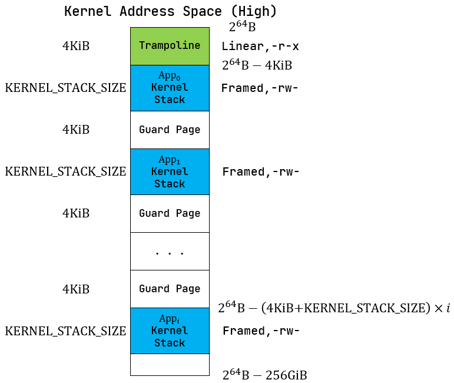
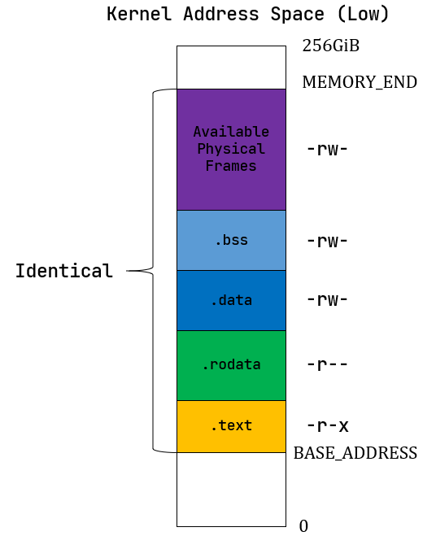
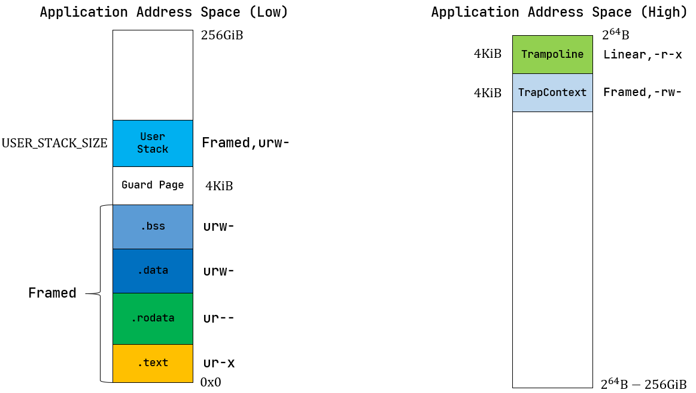

PageTable 只能以页为单位来维护一个虚拟内存到物理内存的地址转化关系，本身并不能对计算机的虚拟/物理内存空间进行掌控。
操作系统通过对不同页表的管理，来完成对不同应用和操作系统自身所在的虚拟内存，以及虚拟内存与物理内存映射关系的全面管理
## 实现地址空间抽象

### 逻辑段

逻辑段：一段连续地址的虚拟内存
- 使用逻辑段来描述一段连续地址的虚拟内存
- 指地址区间中的一段实际可用（即 MMU 通过查多级页表可以正确完成地址转换）的地址连续的虚拟地址区间，该区间内包含的所有虚拟页面都以一种**相同**的方式映射到物理页帧，具有可读/可写/可执行等属性

```rust
pub struct MapArea {
    // 描述一段虚拟页号的连续区间，表示该逻辑段在地址区间中的位置和长度
    // 本身是一个迭代器，迭代对象是VirtPageNum
    vpn_range: VPNRange,

    // 描述该逻辑段内所有虚拟页面映射到物理页帧的方式
    map_type: MapType,

    // 逻辑段采用 Framed 方式映射内存时，data_frame保存了该逻辑段内的每个虚拟页面和其被映射到的物理页帧的一个键值对容器
    // 这些物理页帧的用来存放实际的数据而非多级页表中的中间节点
    // 这些物理页帧的生命周期绑定到 MapArea中
    data_frame: BTreeMap<VirtPageNum, FrameTracker>,

    // 控制该逻辑段的访问方式，仅保留 U/R/W/X 四个标志位
    map_perm: MapPermission,
}
```

**映射方式**

Identical：恒等映射
- 用在启用多级页表之后，内核仍能够在虚存地址空间中访问一个特定的物理地址指向的物理内存
Framed：每个虚拟页面都有一个新分配的物理页帧与之对应，虚拟地址与物理地址的映射关系是相对随机的

```rust
pub enum MapType {
    Identical,
    Framed,
}
```

#### 逻辑段操作

创建时，对下届进行 floor, 上界进行 ceil，以通过虚拟地址转化出的页号，能够包含期望的虚拟地址范围i

```rust
pub fn new(
    start_va: VirtAddr,
    end_va: VirtAddr,
    map_type: MapType,
    map_perm: MapPermission
) -> Self {
    let start_vpn: VirtPageNum = start_va.floor();
    let end_vpn: VirtPageNum = end_va.ceil();
    Self {
        vpn_range: VPNRange::new(start_vpn, end_vpn),
        data_frames: BTreeMap::new(),
        map_type,
        map_perm,
    }
}

// 将切片 data 中的数据拷贝到当前逻辑段实际被内核放置在的各物理页帧上，从而在地址空间中通过该逻辑段就能访问这些数据
// 需要保证，切片 data 中的数据大小不超过当前逻辑段的总大小
// 各物理页帧在页表中有效，即物理页帧已经被创建且完成映射
pub fn copy_data(&mut self, page_table: &mut PageTable, data: &[u8])
```

建立虚拟地址到物理地址的映射

```rust
// ？如何保证 Identical 与 Framed 分配的ppn之间的隔离
// ？Identical 的物理地址不受 frame_alloc 的管理
// 内核的逻辑段使用 Identical 进行映射
// 应用程序结束时，应当回收其物理页，显然，当操作系统结束时，无需这种操作，因此操作系统的物理页由自己进行管理，frame_alloc仅针对应用程序的物理页
// 从内核地址空间布局上来看，Framed 分配的物理页为 Available Physical Frames,显然与 Identical 映射的操作系统自己的物理页隔离
pub fn map_one(&mut self, page_table: &mut PageTable, vpn: VirtPageNum) {
    let ppn: PhysPageNum;
    match self.map_type {
        MapType::Identical => {
            ppn = PhysPageNum(vpn.0);
        }
        MapType::Framed => {
            let frame = frame_alloc().unwrap();
            ppn = frame.ppn;
            self.data_frame.insert(vpn, frame);
        }
    }
    let pte_flags = PTEFlags::from_bits(self.map_perm.bits).unwrap();
    page_table.map(vpn, ppn, pte_flags);
}
```

### 地址空间

地址空间: 一系列有关联的逻辑段
地址空间是一系列有关联的不一定连续的逻辑段，这种关联一般是指这些逻辑段组成的虚拟内存空间与一个运行的程序绑定，即这个运行的程序对代码和数据的直接访问范围限制在它关联的虚拟地址空间之内

```rust
pub struct MemorySet {
    page_table: PageTable,
    areas: Vec<MapArea>,
}
```


**PageTable** 挂着所有多级页表的节点所在的物理页帧
**MapArea** 挂着对应逻辑段中的数据所在的物理页帧, `Vec<MapArea>` 包含了程序所有逻辑段的物理页帧
两部分合在一起构成了一个地址空间所需的所有物理页帧, 当一个地址空间 `MemorySet` 生命周期结束后，这些物理页帧都会被回收

#### 地址空间操作

```rust
// 创建一个地址空间
pub fn new_bare() -> Self

// 向地址空间中增加一个逻辑段
// 如果是以 Framed 的方式映射，则可以可选地在那些被映射到的物理页帧上写入一些初始化数据 data
fn push(&mut self, mut map_area: MapArea, data: Option<&[u8]>){
    // 将 MemorySet的 page table 传入 map 函数中，为 map_area 中的连续页创建页目录及页表项，从而能使得MMU进行虚拟地址到物理地址的转划
    map_area.map(&mut self.page_table);
    
    // data将对齐到map_area的开头
    // 传入 page_table 用来进行地址转化(手动MMU), 传入只读引用即可
    if let Some(data) = data {
        map_area.copy_data(&mut self.page_table, data)
    }
    self.areas.push(map_area)
}

// 在当前地址空间插入一个 Framed 方式映射到物理内存的逻辑段，内部调用push
pub fn insert_framed_area(
        &mut self,
        start_va: VirtAddr,
        end_va: VirtAddr,
        permission: MapPermission,
    )

// 产生内核的地址空间
pub fn new_kernel() -> Self

// 分析应用的 ELF 文件格式的内容，解析出各数据段并生成对应的地址空间
pub fn from_elf(elf_data: &[u8]) -> (Self, usize, usize)
```

### 内核地址空间

地址空间抽象的重要意义在于 隔离 (Isolation) ，当内核让应用执行前，内核需要控制 MMU 使用这个应用的多级页表进行地址转换。由于每个应用地址空间在创建的时候也顺带设置好了多级页表，使得只有那些存放了它的代码和数据的物理页帧能够通过该多级页表被映射到，这样它就只能访问自己的代码和数据而无法触及其他应用或内核的内容

#### 内核空间布局

启用分页模式下，内核代码的访存地址也会被视为一个虚拟地址并需要经过 MMU 的地址转换，因此我们也需要为内核对应构造一个地址空间，它除了仍然需要允许内核的各数据段能够被正常访问之外，还需要包含所有应用的内核栈以及一个 跳板 (Trampoline) 


跳板放在最高的一个虚拟页面中。接下来则是从高到低放置每个应用的内核栈，内核栈的大小由 config 子模块的 KERNEL_STACK_SIZE 给出。它们的映射方式为 MapPermission 中的 rw 两个标志位，意味着这个逻辑段仅允许 CPU 处于内核态访问，且只能读或写



相邻两个内核栈之间会预留一个 保护页面 (Guard Page) ，它是内核地址空间中的空洞，多级页表中并不存在与它相关的映射。它的意义在于当内核栈空间不足（如调用层数过多或死递归）的时候，代码会尝试访问空洞区域内的虚拟地址，然而它无法在多级页表中找到映射，便会触发异常，此时控制权会交给内核 trap handler 函数进行异常处理

由于编译器会对访存顺序和局部变量在栈帧中的位置进行优化，因此难以确定一个已经溢出的栈帧中的哪些位置会先被访问，但总的来说，空洞区域被设置的越大，就能越早捕获到这一可能覆盖其他重要数据的错误异常

由于当前内核非常简单且内核栈的大小设置比较宽裕，在当前的设计中我们仅将空洞区域的大小设置为单个页面



内核的四个逻辑段 `.text/.rodata/.data/.bss` 被**恒等映射**到物理内存，这使得无需调整内核内存布局 os/src/linker.ld 的情况下就仍能像启用页表机制之前那样访问内核的各个段

注意此时借用页表机制对这些逻辑段的访问方式做出了限制，这都是为了在硬件的帮助下能够尽可能发现内核中的 bug ，在这里：
- 四个逻辑段的 U 标志位均未被设置，使得 CPU 只能在处于 S 特权级（或以上）时访问它们
- 代码段 `.text` 不允许被修改
- 只读数据段 `.rodata` 不允许被修改，也不允许从它上面取指执行
- `.data/.bss` 均允许被读写，但是不允许从它上面取指执行

Available Physical Frames：
内核地址空间中需要存在一个恒等映射到内核数据段之外的可用物理页帧的逻辑段，这样才能在启用页表机制之后，内核仍能以纯软件的方式读写这些物理页帧
- 它们的标志位仅包含 rw ，意味着该逻辑段只能在 S 特权级以上访问，并且只能读写

**内核地址空间创建**

```rust
// 设置跳板
memory_set.map_tempoline();
...

// 设置 .text section
// 从外部符号中(链接脚本中定义)获得 .text 段的起始地址与结束地址
// 使用 Identical 映射，即操作的虚拟地址会转化到一个相等的物理地址上
// 根据内存布局设置逻辑段权限
debug!("mapping .text section");
memory_set.push(
    MapArea::new(
        (stext as usize).into(),
        (etext as usize).into(),
        MapType::Identical,
        MapPermission::R | MapPermission::X,
    ),
    None,
);

```

### 应用地址空间



因为 `.text` 和 `.rodata`， 以及 `.data` / `.bss` 存在三种不同的逻辑段访问限制，因此需要在 `.text` 与 `.rodata` 之间， `.rodata` 与 `.data` 段之间，进行4K(页大小)对齐，使得这些段，能够被对应的 MapArea 包含

这些逻辑段都以 Framed 方式映射到物理内存，从访问方式上来说都加上了 U 标志位代表 CPU 可以在 U 特权级也就是执行应用代码的时候访问它们

#### 载入ELF格式的应用

> elf格式的应用二进制将被连接到操作系统的 .data 段, 内核中该段是恒等映射的 

不再将丢弃了所有符号的应用二进制镜像链接进内核，而直接使用保存了逻辑段信息的ELF格式的应用可执行文件

创建应用地址空间时，需要对得到的 ELF 格式数据进行解析，找到各个逻辑段所在的位置和访问限制并插入进来，并最终得到一个完整的应用地址空间

应用程序的内存布局并未发很大变化, 应用仍然依据 "地址" 来索引其代码或数据, 只不过此时的地址是 虚拟地址, 数据也被存放到 物理页帧中, 同时应用对于其内存的访问也被 安全 地包裹起来了
> 设置正确的地址,原版应用一样能够运行, 其并不关心访问的地址是虚拟地址还是物理地址,在应用眼里,认为从给出地址,能拿到期望的数据,而操作系统也只需保证,能满足应用对于内存/存储访问的这一目的即可
> 地址空间是操作系统提供给应用,对于基于地址的存储系统的抽象, 无论该地址是 cache, 主存, 还是 硬盘
> 应用程序依然是执行着 存储程序 的逻辑, 只不过是基于一个操作系统提供对于存储的地址空间的抽象

```rust
pub fn from_elf(elf_data: &[u8]) -> (Self, usize, usize) {
    let mut memory_set = Self::new_bare();

    // map trampoline
    memory_set.map_tempoline();

    // 解析 elf 文件
    let elf = xmas_elf::ElfFile::new(elf_data).unwrap();

    // 获得 elf 头
    let elf_header = elf.header;

    // 读取魔数，判断是否一个合法的elf文件
    let magic = elf_header.pt1.magic;
    assert_eq!(magic, [0x7f, 0x45, 0x4c, 0x46], "invalid elf!");
   
    // 获得 program header count，即程序头的数量
    let ph_count = elf_header.pt2.ph_count();

    // 记录当前地址空间的最大虚拟页号
    let mut max_end_vpn = VirtPageNum(0);

    // 遍历所有程序头，并将合适的区域加入到应用地址空间中
    for i in 0..ph_count {
        let ph = elf.program_header(i).unwrap();

        // 当前只有类型是 Load 的程序头才有被加载的必要
        if ph.get_type().unwrap() == xmas_elf::program::Type::Load {
            // 读取程序头中的起始、结尾的虚拟地址，并转化为 VirtAddr类型
            let start_va: VirtAddr = (ph.virtual_addr() as usize).into();
            let end_va: VirtAddr = ((ph.virtual_addr() + ph.mem_size()) as usize).into();
            
            // 读取程序头中声明的权限flag，默认设置 U
            let mut map_perm = MapPermission::U;
            let ph_flags = ph.flags();
            if ph_flags.is_read() {
                map_perm |= MapPermission::R
            };
            if ph_flags.is_write() {
                map_perm |= MapPermission::W
            };
            if ph_flags.is_execute() {
                map_perm |= MapPermission::X
            };

            // 根据从程序头中获取的信息，创建逻辑段，使用Framed模式
            let map_area = MapArea::new(start_va, end_va, MapType::Framed, map_perm);

            // 更新结尾虚拟页号
            max_end_vpn = map_area.vpn_range.get_end();

            // 拷贝数据到应用程序的地址空间中
            memory_set.push(
                map_area,
                Some(&elf.input[ph.offset() as usize..(ph.offset() + ph.file_size()) as usize]),
            );
        }
    }

    // 载入 .bss .data .rodata .text四个段之后, 从最后的虚拟页号开始
    // 初始化用户程序栈
    let max_end_va: VirtAddr = max_end_vpn.into();
    let mut user_stack_bottom: usize = max_end_va.into();

    // 设置 guard page(不必进行映射)
    user_stack_bottom += PAGE_SIZE;
    let user_stack_top = user_stack_bottom + USER_STACK_SIZE;
    
    // 地址空间中创建并加入 用户栈 逻辑段
    memory_set.push(
        MapArea::new(
            user_stack_bottom.into(),
            user_stack_top.into(),
            MapType::Framed,
            MapPermission::R | MapPermission::W | MapPermission::U,
        ),
        None,
    );

    // 在高地址位置插入 TrapContext
    memory_set.push(
        MapArea::new(
            TRAP_CONTEXT.into(), // trap_context 的起始地址
            TRAMPOLINE.into(), // trampoline 的起始地址, 即 trap_context的结束地址
            MapType::Framed,
            MapPermission::R | MapPermission::W,
        ),
        None,
    );
    (
        memory_set,
        user_stack_top,
        elf.header.pt2.entry_point() as usize, // 从elf中获得程序的入口虚拟地址
    )
}
```

 注意当存在一部分零初始化的时候， ph.file_size() 将会小于 ph.mem_size() ，因为这些零出于缩减可执行文件大小的原因不应该实际出现在 ELF 数据中, 而使用 ph.mem_size 进行逻辑段的初始化, 使用 ph.file_size() 进行应用的拷贝, 能够保证应用的正常运行


 #### 内核访问应用的数据

 应用应该不能直接访问内核的数据，但内核可以访问应用的数据，这是如何做的？由于内核要管理应用，所以它负责构建自身和其他应用的多级页表。如果内核获得了一个应用数据的虚地址，内核就可以通过查询应用的页表来把应用的虚地址转换为物理地址，内核直接访问这个地址（注：内核自身的虚实映射是恒等映射），就可以获得应用数据的内容了