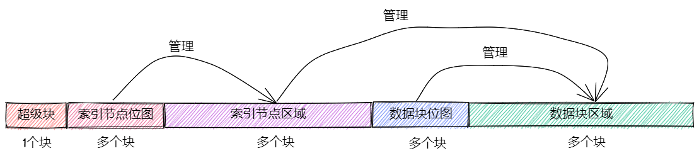

# Easy FS

`easy-fs crate` 自下而上大致可以分成五个不同的层次：
- 磁盘块设备接口层：定义了以块大小为单位对磁盘块设备进行读写的trait接口
- 块缓存层：在内存中缓存磁盘块的数据，避免频繁读写磁盘
- 磁盘数据结构层：磁盘上的超级块、位图、索引节点、数据块、目录项等核心数据结构和相关处理
- 磁盘块管理器层：合并了上述核心数据结构和磁盘布局所形成的磁盘文件系统数据结构，以及基于这些结构的创建/打开文件系统的相关处理和磁盘块的分配和回收处理
- 索引节点层：管理索引节点（即文件控制块）数据结构，并实现文件创建/文件打开/文件读写等成员函数来向上支持文件操作相关的系统调用

## 块设备接口层

需要实现两个抽象方法：
- read_block 将编号为 block_id 的块从磁盘读入内存中的缓冲区 buf ；
- write_block 将内存中的缓冲区 buf 中的数据写入磁盘编号为 block_id 的块

需要由文件系统的使用者（比如操作系统内核或直接测试 easy-fs 文件系统的 easy-fs-fuse 应用程序）提供并接入到 easy-fs 库

easy-fs 库的块缓存层会调用这两个方法，进行块缓存的管理。这也体现了 easy-fs 的泛用性：它可以访问实现了 BlockDevice Trait 的块设备驱动程序

## 块缓存层

当要读写一个块的时候，首先就是去全局管理器中查看这个块是否已被缓存到内存缓冲区中。如果是这样，则在一段连续时间内对于一个块进行的所有操作均是在同一个固定的缓冲区中进行的，这解决了同步性问题。此外，通过 read/write_block 进行块实际读写的时机完全交给块缓存层的全局管理器处理，上层子系统无需操心。全局管理器会尽可能将更多的块操作合并起来，并在必要的时机发起真正的块实际读写

### 块缓存

```rust
// easy-fs/src/lib.rs

pub const BLOCK_SZ: usize = 512;

// easy-fs/src/block_cache.rs

pub struct BlockCache {
    cache: [u8; BLOCK_SZ],
    block_id: usize,
    block_device: Arc<dyn BlockDevice>,
    modified: bool,
}
```

- cache 是一个 512 字节的数组，表示位于内存中的缓冲区；
- block_id 记录了这个块缓存来自于磁盘中的块的编号；
- block_device 是一个底层块设备的引用，可通过它进行块读写；
- modified 记录这个块从磁盘载入内存缓存之后，它有没有被修改过


在 BlockCache 被 drop 的时候，它会首先调用 sync 方法，如果自身确实被修改过的话才会将缓冲区的内容写回磁盘。事实上， sync 并不是只有在 drop 的时候才会被调用。在 Linux 中，通常有一个后台进程负责定期将内存中缓冲区的内容写回磁盘。另外有一个 sys_fsync 系统调用可以让应用主动通知内核将一个文件的修改同步回磁盘。由于我们的实现比较简单， sync 仅会在 BlockCache 被 drop 时才会被调用

### 块全局管理器

为了避免在块缓存上浪费过多内存，我们希望内存中同时只能驻留有限个磁盘块的缓冲区

块缓存全局管理器的功能是：当我们要对一个磁盘块进行读写时，首先看它是否已经被载入到内存缓存中了，如果已经被载入的话则直接返回，否则需要先读取磁盘块的数据到内存缓存中。此时，如果内存中驻留的磁盘块缓冲区的数量已满，则需要遵循某种缓存替换算法将某个块的缓存从内存中移除，再将刚刚读到的块数据加入到内存缓存中。我们这里使用一种类 FIFO 的简单缓存替换算法，因此在管理器中只需维护一个队列

## 磁盘布局及磁盘上数据结构

对于一个文件系统而言，最重要的功能是如何将一个逻辑上的文件目录树结构映射到磁盘上，决定磁盘上的每个块应该存储文件相关的哪些数据。为了更容易进行管理和更新，我们需要将磁盘上的数据组织为若干种不同的磁盘上数据结构，并合理安排它们在磁盘中的位置

### easy-fs 磁盘布局描述



在 easy-fs 磁盘布局中，按照块编号从小到大顺序地分成 5 个不同属性的连续区域：
- 最开始的区域的长度为一个块，其内容是 easy-fs 超级块 (Super Block)。超级块内以魔数的形式提供了文件系统合法性检查功能，同时还可以定位其他连续区域的位置
- 第二个区域是一个索引节点位图，长度为若干个块。它记录了后面的索引节点区域中有哪些索引节点已经被分配出去使用了，而哪些还尚未被分配出去
- 第三个区域是索引节点区域，长度为若干个块。其中的每个块都存储了若干个索引节点
- 第四个区域是一个数据块位图，长度为若干个块。它记录了后面的数据块区域中有哪些数据块已经被分配出去使用了，而哪些还尚未被分配出去
- 最后的区域则是数据块区域，顾名思义，其中的每一个已经分配出去的块保存了文件或目录中的具体数据内容

索引节点 (Inode, Index Node) 是文件系统中的一种重要数据结构。逻辑目录树结构中的每个文件和目录都对应一个 inode ，我们前面提到的文件系统实现中，文件/目录的底层编号实际上就是指 inode 编号。在 inode 中不仅包含了我们通过 stat 工具能够看到的文件/目录的元数据（大小/访问权限/类型等信息），还包含实际保存对应文件/目录数据的数据块（位于最后的数据块区域中）的索引信息，从而能够找到文件/目录的数据被保存在磁盘的哪些块中。从索引方式上看，同时支持直接索引和间接索引

每个区域中均存储着不同的磁盘数据结构， easy-fs 文件系统能够对磁盘中的数据进行解释并将其结构化。下面我们分别对它们进行介绍

**easy-fs 超级块**

SuperBlock 是一个磁盘上数据结构，它就存放在磁盘上编号为 0 的块的起始处

**位图**

在 easy-fs 布局中存在两类不同的位图，分别对索引节点和数据块进行管理

每个位图都由若干个块组成，每个块大小为 512 bytes，即 4096 bits。每个 bit 都代表一个索引节点/数据块的分配状态， 0 意味着未分配，而 1 则意味着已经分配出去。位图所要做的事情是通过基于 bit 为单位的分配（寻找一个为 0 的bit位并设置为 1）和回收（将bit位清零）来进行索引节点/数据块的分配和回收

bitmap在内存中表现为一个 block_id 区间, 其中的每一个 block_id 对应于磁盘上的一个块, 其被解释为一个 `[u64;64]` 数组(BitmapBlock), 大小为 4096 bit (512byte)

bitmap 只保存了位图块的 block_id, 实际分配的信息保存在磁盘中(索引节点/数据块的block_id)

```rust
pub struct Bitmap {
    start_block_id: usize,
    blocks: usize,
}

type BitmapBlock = [u64; 64];
```

**位图分配**

>此处 block_id 实为 inner_id, 即 bitmap 中的位的下标, 与 start_block_id 相加即可得到可被驱动操作的 block_id

u64::trailing_ones 用于计算给出的 u64 中, 从低位开始的连续 1 的数量, 初始时全0, 因此返回 0, 在 modify 中相当于为 u64 末尾置1, 之后, 则会返回 1, 而在 modify 中, 相当于将 u64 的低 2 位置1, 由此进行位图的分配

block id 计算
- bitmap_block_id * BLOCK_BITS + bits64_pos * 64 + inner_pos as usize
- {在bitmap中的偏移} + {在`[u64;64]`及bitmap_block中的偏移} + {在 u64 中的偏移(从右往左)}

```rust
// 遍历 bitmap 中的所有 BitmapBlock
for block_id in 0..self.blocks {
    // 获取硬盘中对应 block id 的 block cache, 将其解释为 bitmapblock 来进行进一步的操作
    let pos = get_block_cache(block_id + self.start_block_id, Arc::clone(block_device))
        .lock()
        .modify(0, |bitmap_block: &mut BitmapBlock| {
            if let Some((bits64_pos, inner_pos)) = bitmap_block
                .iter()
                .enumerate()
                .find(|(_, bits64)| **bits64 != u64::MAX) // 过滤已全部分配的
                .map(|(bits64_pos, bits64)| (bits64_pos, bits64.trailing_ones() as usize))
            // `trailing_ones` 计算从末尾开始的连续 1 的数量
            {
                // 修改 block 分配状态
                bitmap_block[bits64_pos] |= 1u64 << inner_pos;
                // 计算 block id
                Some(block_id * BLOCK_BITS + bits64_pos * 64 + inner_pos as usize)
            } else {
                None
            }
        });

    if pos.is_some() {
        return pos;
    }
}
```

**位图释放**

decomposition 函数将bit编号 bit 分解为区域中的块编号 block_pos 、块内的组编号 bits64_pos 以及组内编号 inner_pos 的三元组，这样就能精确定位待回收的bit，随后将其清零即可

```rust
fn decomposition(mut bit: usize) -> (usize, usize, usize) {
    let block_pos = bit / BLOCK_BITS;
    bit = bit % BLOCK_BITS;
    (block_pos, bit / 64, bit % 64)
}
```

### 磁盘上的索引节点

每个文件/目录在磁盘上均以一个 DiskInode 的形式存储

考虑对齐, DiskInode 大小为 sizeof::u32() * 28 + sizeof::u32() * 4 = 32 * sizeof::u32() = 32 * 4B = 128B

为了充分利用空间，我们将 DiskInode 的大小设置为 128 字节，每个块正好能够容纳 4 个 DiskInod

```rust
#[repr(C)]
pub struct DiskInode {
    pub size: u32,
    pub direct: [u32; INODE_DIRECT_COUNT],
    pub indirect1: u32,
    pub indirect2: u32,
    type_: DiskInodeType,
}

#[derive(PartialEq)]
pub enum DiskInodeType {
    File,
    Directory,
}
```

为了尽可能节约空间，在进行索引的时候，块的编号用一个 u32 存储。索引方式分成直接索引和间接索引两种：
- 当文件很小的时候，只需用到直接索引， direct 数组中最多可以指向 INODE_DIRECT_COUNT 个数据块，当取值为 28 的时候，通过直接索引可以找到 14KiB (28 * 512B)的内容(记录了28个 block_id)。
- 当文件比较大的时候，不仅直接索引的 direct 数组装满，还需要用到一级间接索引 indirect1 。它指向一个一级索引块，这个块也位于磁盘布局的数据块区域中。这个一级索引块中的每个 u32 都用来指向数据块区域中一个保存该文件内容的数据块，因此，最多能够索引 $\frac{512}{4} = 128$ 个数据块，对应 64KiB 的内容。
- 当文件大小超过直接索引和一级索引支持的容量上限 78KiB 的时候，就需要用到二级间接索引 indirect2 。它指向一个位于数据块区域中的二级索引块。二级索引块中的每个 u32 指向一个不同的一级索引块，这些一级索引块也位于数据块区域中。因此，通过二级间接索引最多能够索引 $\times{128}{64KiB} = 8 MiB$ 的内容

为了充分利用空间，我们将 DiskInode 的大小设置为 128 字节，每个块正好能够容纳 4 个 DiskInode 。在后续需要支持更多类型的元数据的时候，可以适当缩减直接索引 direct 的块数，并将节约出来的空间用来存放其他元数据，仍可保证 DiskInode 的总大小为 128 字节

**思考**

每个文件对应的数据可以理解为一个超大的 [u8] 数组, 通过 offset 与 len 在文件中读取指定位置的数据, 这个 [u8] 数据用 block 来组织, 每个 block 中保存 512Byte 的数据, 即[u8;512], ?实际中, block并不是顺序摆放的(类似于内存)?, 而为维护用户读取文件的 offset 到实际block_id的映射, 需要为每个文件维护一个索引块, 用来保存这些数据块的 block_id (通过这个block_id可以找到对应的数据块), 因而索引块可以理解为一个 [u32] 数组 (多极索引也是对于此概念的扩展)

将文件以 block 划分, 计算offset可以知道数据落在那些 block 中(block顺序排列), 这个即是 inner_id(即对于当前文件而言，数据在第几个block中), 作为索引块中 [u32] 的下标, 可以得到实际的 block_id 

inner_id 是索引块中对于 block_id 的下标,可以类别 inner_id 为虚拟地址， 通过索引块(页表), 翻译得到 block_id(物理地址)， 而存储这一映射关系的不是一个页表项，而是通过一个 index map 实现

write_at 的实现思路基本上和 read_at 完全相同。但不同的是 write_at 不会出现失败的情况；只要 Inode 管理的数据块的大小足够，传入的整个缓冲区的数据都必定会被写入到文件中。当从 offset 开始的区间超出了文件范围的时候，就需要调用者在调用 write_at 之前提前调用 increase_size ，将文件大小扩充到区间的右端，保证写入的完整性

### 数据块与目录项


## 磁盘块管理器 EFS

实现 easy-fs 的整体磁盘布局，将各段区域及上面的磁盘数据结构结构整合起来就是简易文件系统 EasyFileSystem 的职责。它知道每个布局区域所在的位置，磁盘块的分配和回收也需要经过它才能完成，因此某种意义上讲它还可以看成一个磁盘块管理器

从这一层开始的所有数据结构都存放在内存上


?因此数据块位图区域最合理的大小是剩余的块数除以 4097 再上取整，因为位图中的每个块能够对应 4096 个数据块。其余的块就都作为数据块使用
- 剩余 n 个数据块, 其中一部分作为 数据位图块, 另一部分作为 数据块, 数据位图块中的每个bit都应当对于一个 数据块
- 令数据位图块为 x, 则数据块为 4096 * x, 故有总块数为 4097 * x 块, 则 x = n/4097, 而考虑到x向下取整时会导致有些数据块永远不会使用, 因此应当向上取整, 尽管这会导致位图中存在对应不到的块


EasyFileSystem 知道整个磁盘布局，即可以从 inode位图 或数据块位图上分配的 bit 编号，来算出各个存储inode和数据块的磁盘块在磁盘上的实际位置

## 索引节点

EasyFileSystem 实现了磁盘布局并能够将磁盘块有效的管理起来。但是对于文件系统的使用者而言，他们往往不关心磁盘布局是如何实现的，而是更希望能够直接看到目录树结构中逻辑上的文件和目录。为此需要设计索引节点 Inode 暴露给文件系统的使用者，让他们能够直接对文件和目录进行操作。 Inode 和 DiskInode 的区别从它们的名字中就可以看出： DiskInode 放在磁盘块中比较固定的位置，而 Inode 是放在内存中的记录文件索引节点信息的数据结构

`inode_id` 指示了index node的编号，通过这个编号可以计算得到index nodex的block id

### 获取根目录 inode

## 文件索引

## 文件列举

## 文件创建

disk inode 存储在 inode area 中， 而用于间接索引的索引块存放在 data area 中

## 用户态进行测试

## 打包应用为 easy-fs 镜像

efs基于块设备的抽象进行工作，而linux中的普通文件就可以当作是一个块设备, 因而打包easy-fs镜像的过程即是在linux环境中初始化 efs, 创建文件 `fs.img` 作为块设备，并将其传入 efs 中，
1. 清空 `fs.img` 文件，初始化文件系统，将文件以block的形式组织起来，完成 super_block, inode_bitmap, inode_area, data_bitmap, data_area 的初始布局
2. 以字节流的方式读入程序的 elf 文件， 保存到根目录的文件中
3. 然后在系统启动时，便可以直接从 `fs.img` 还原对应的efs, 并操作相关文件
