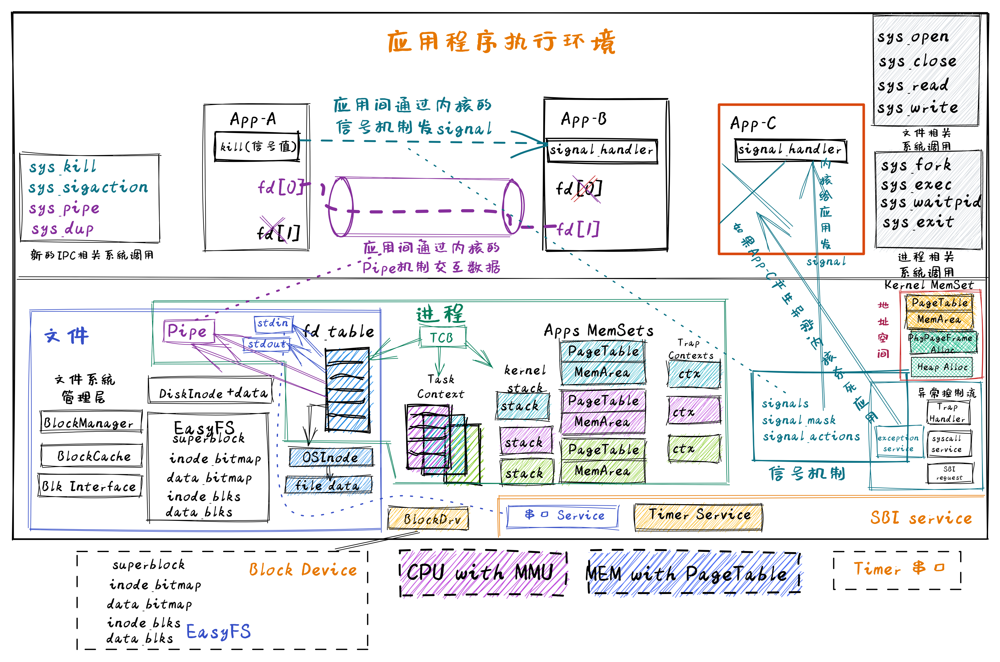
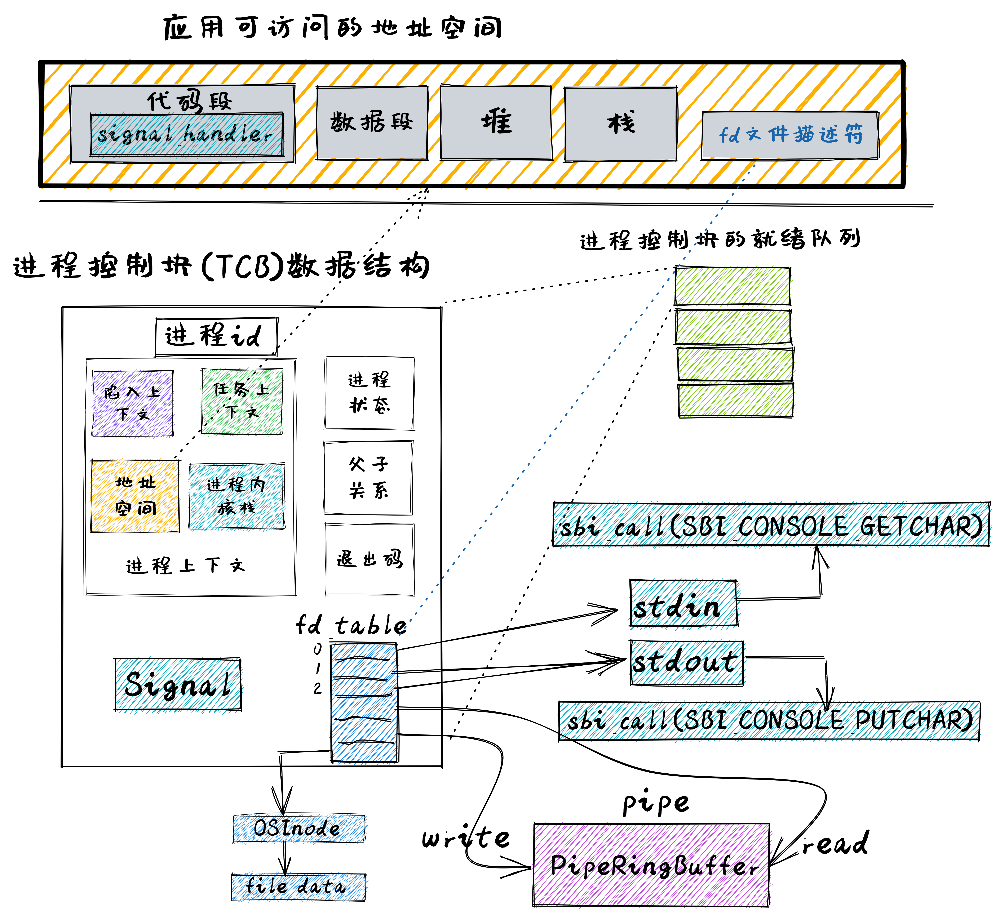

# 进程间通信

IPCOS 架构



通信机制
- 交换数据的管道（Pipe）机制
- 发送异步通知事件的信号（signal）机制



这里把管道看成是一种特殊的内存文件，并在进程的打开文件表 fd_talbe 中被管理，而且进程通过文件读写系统调用就可以很方便地基于管道实现进程间的数据交换

而信号是进程管理的一种资源，发送信号的进程可以通过系统调用给接收信号的目标进程控制块中的 signal 结构更新所发信号信息，操作系统再通过扩展 trap_handler 中从内核态返回到用户态的处理流程， 改变了接收信号的目标进程的执行上下文，从而让接收信号的目标进程可以优先执行处理信号事件的预设函数 signal_handler ，在处理完信号后，再继续执行之前暂停的工作

## 基于文件的标准输入输出

## 管道

管道是一种进程间通信机制，由操作系统提供，并可通过直接编程或在shell程序的帮助下轻松地把不同进程（目前是父子进程之间或子子进程之间）的输入和输出对接起来

我们也可以将管道看成一个有一定缓冲区大小的字节队列，它分为读和写两端，需要通过不同的文件描述符来访问

读端只能用来从管道中读取，而写端只能用来将数据写入管道。由于管道是一个队列，读取数据的时候会从队头读取并弹出数据，而写入数据的时候则会把数据写入到队列的队尾

由于管道的缓冲区大小是有限的，一旦整个缓冲区都被填满就不能再继续写入，就需要等到读端读取并从队列中弹出一些数据之后才能继续写入。当缓冲区为空的时候，读端自然也不能继续从里面读取数据，需要等到写端写入了一些数据之后才能继续读取

### 管道系统调用

`pipe[0]` 将会保存管道读端的文件描述符，`pipe[1]` 将会保存管道写端的文件描述符，用户程序可基于这两个描述符来对管道进行读取/写入操作

```rust
/// 功能：为当前进程打开一个管道。
/// 参数：pipe 表示应用地址空间中的一个长度为 2 的 usize 数组的起始地址，内核需要按顺序将管道读端
/// 和写端的文件描述符写入到数组中。
/// 返回值：如果出现了错误则返回 -1，否则返回 0 。可能的错误原因是：传入的地址不合法。
/// syscall ID：59
pub fn sys_pipe(pipe: *mut usize) -> isize;
```

### 基于文件的管道

**管道数据结构**

pipe 是管道端口，可作为写端或读端，真正进行读写的是 ringbuffer，当一个 pipeRingBuffer 所有的写端和读端均被关闭时，ringbuffer的资源会被自动释放

ringbuffer 在保存了对 写端 的引用计数，用来确认管道写端是否都关闭

**创建管道**

**管道读写**


